# 前言

**学习网站**:[Starrycoding](https://www.starrycoding.com/)

**常用算法wiki**:[OI wiki](https://oi-wiki.org/)


## 动态规划入门

动态规划是一种通过把原问题分解为相对简单的子问题的方式求解复杂问题的方法。

由于动态规划并不是某种具体的算法，而是一种解决特定问题的方法，因此它会出现在各式各样的数据结构中，与之相关的题目种类也更为繁杂。


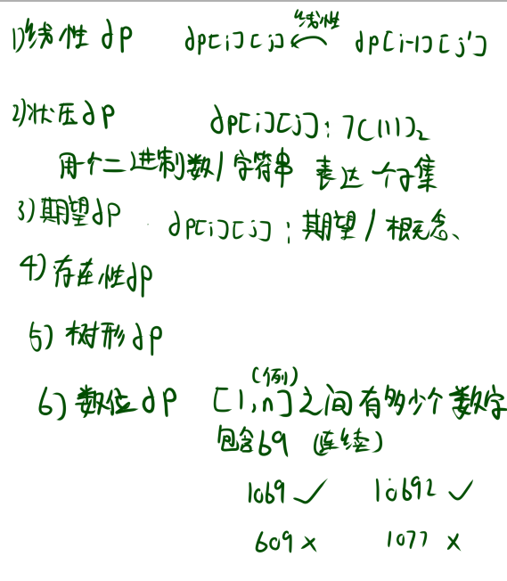

入门的dp有以下几种：

1. 线性dp  
2. 状压dp
3. 期望dp
4. 存在性dp
5. 树形dp
6. 数位dp


入门的dp大部分都是线性的.


关于dp题目，我们一般用以下步骤来解决：

1. 确定状态
2. 确定状态转移方程
3. 确定边界条件和初始化


## 组合数

组合数是指从n个不同元素中取出m个元素（不分顺序）的所有可能情况的总数。

组合数的公式为：

$$
C_n^m=\frac{n!}{m!(n-m)!}
$$


### 例题1

[P45 求组合数（1）](https://www.starrycoding.com/problem/45)


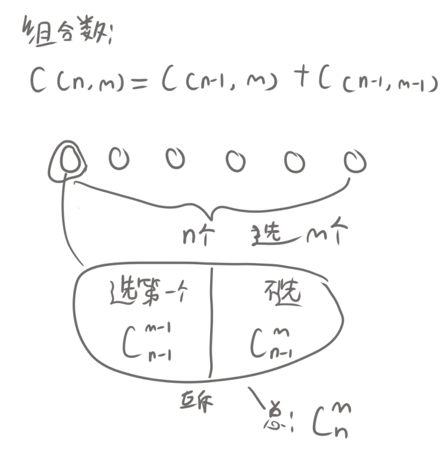


根据组合数的结论,即

$$
C_n^m=C_{n-1}^{m-1}+C_{n-1}^m
$$

我们可以画个图来理解，假设我们要在n个数中选m个数，那么我们可以将选取分为两种情况，一种是**选择第一个**，那么我们就需要在剩下的**n-1**个数中选**m-1**个数，另一种是**不选择**第一个，那么我们就需要在剩下的**n-1**个数中选**m**个数。

由此我们可以得出状态转移方程：

$$
f(n,m)=f(n-1,m-1)+f(n-1,m)
$$


那么我们可以开一个二维数组$C[i][j]$，表示从$i$个数中选$j$个数的方案数。

接着我们再来看边界条件和初始化：

显而易见，当从$i$个数选0个数时，C[i][0]=1.

并且，j始终要**小于等于**i,否则就越界。

所以我们可以得出以下代码：

```cpp
#include <bits/stdc++.h>
using namespace std;
typedef long long ll;
const ll p = 1e9 + 7;
const int N = 1e3 + 10;
ll c[N][N];

int main()
{
    ios::sync_with_stdio(0);
    cin.tie(0);
    cout.tie(0);
    int n, m;
    cin >> n >> m;

    // 初始化
    for (int i = 0; i < n; i++)
    {
        c[i][0] = 1ll;
    }
    // 转移方程
    for (int i = 1; i < n; i++)
    {
        for (int j = 1; j <= i; j++)
        {
            c[i][j] = (c[i - 1][j - 1] + c[i - 1][j]) % p;
        }
    }
    for (int i = 0; i < n; i++)
    {
        for (int j = 0; j < m; j++)
        {
            cout << c[i][j] << " ";
        }
        cout << "\n";
    }
    return 0;
}
```

### 例题2

[P46 求组合数（2）](https://www.starrycoding.com/problem/46)

上述状态转移方程时间复杂度为$O(n^2)$，数据范围变大后我们要优化。

我们观察题目可以发现这题有**取模**的操作，那么我们可以考虑用**逆元**来优化

回顾上文中组合数的公式:

$$
C_n^m=\frac{n!}{m!(n-m)!}
$$

结合我们之前学过的快速幂和乘法逆元


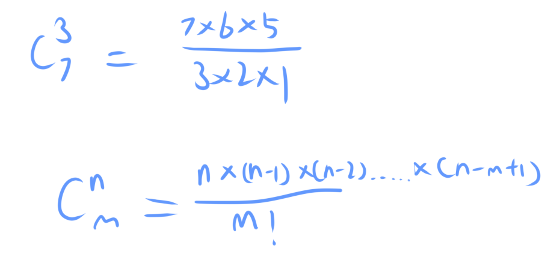


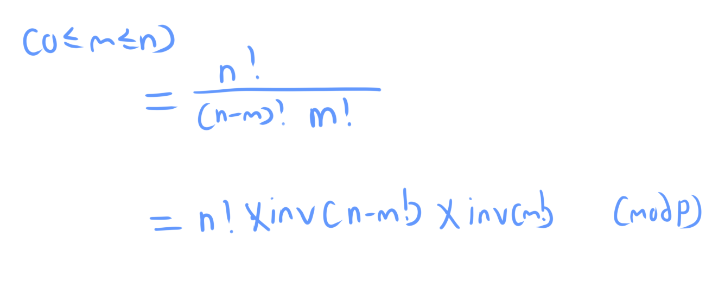


如图，我们可以将公式转化为:

$$
C_n^m=n!\times inv((n-m)!) \times inv(m!) \bmod p
$$

通过快速幂和逆元，我们可以把时间复杂度优化到$O(n \log n)$。

这里阶乘可以预处理一下，减少时间复杂度。

代码如下：

```cpp
#include <bits/stdc++.h>
using namespace std;
typedef long long ll;
const int N = 1e7 + 10;
const ll p = 1e9 + 7;

ll fac[N];

void init(int n)
{
    fac[0] = 1;
    for (int i = 1; i <= n; i++)
    {
        fac[i] = fac[i - 1] * i % p;
    }
}

ll qmi(ll a, ll b)
{
    ll res = 1;
    while (b)
    {
        if (b & 1)
        {
            res = res * a % p;
        }
        a = a * a % p;
        b >>= 1;
    }
    return res;
}

ll inv(ll x)
{
    return qmi(x, p - 2);
}

ll C(ll n, ll m)
{
    if (n < 0 || m < 0 || n < m)
    {
        return 0;
    }
    ll res = fac[n] * inv(fac[n - m] * fac[m] % p) % p;
    return res;
}

int main()
{
    ios::sync_with_stdio(0);
    cin.tie(0);
    cout.tie(0);
    init(1e7);
    int q;
    cin >> q;
    while (q--)
    {
        ll n, m;
        cin >> n >> m;
        ll ans = C(n, m);
        cout << ans << "\n";
    }
    return 0;
}

```

但是这种方法其实还可以优化。

[P73 求组合数-进阶](https://www.starrycoding.com/problem/73)

观察前面的代码，我们可以发现，当**询问次数达到一定程度时**，就会TLE了。

我们观察下我们的C函数，它每次都要调用inv函数，带来了$O(\log n)$的时间复杂度。

那么，其实我们连**逆元也是可以预处理**一下的，这样就可以将时间复杂度优化到$O(n)$。

逆元的预处理过程如下:

$$
invfac[i]=\frac{1}{1\times 2 \times 3 ... \times x}
$$

$$
invfac[i+1]=\frac{1}{1\times 2 \times 3... \times x \times (x+1)}
$$

$$
invfac[i]=\frac{1}{1\times 2 \times 3... \times x} \times \frac{x+1}{x+1}=invfac[i+1] \times (x+1)
$$

即

$$
invfac[i]=invfac[i+1] \times (i+1)
$$


于是我们可以将我们的初始化过程写为: （倒序求逆元）

```cpp
void init(int n)
{
    fac[0] = 1;
    for (ll i = 1; i <= n; i++)
    {
        fac[i] = fac[i - 1] * i % p;  //初始化阶乘
    }
    invfac[n] = inv(fac[n]);
    for (ll i = n - 1; i >= 0; i--)
    {
        invfac[i] = invfac[i + 1] * (i + 1) % p; //初始化逆元
    }
}
```

之后要调用逆元就直接用这个数组即可

```cpp
#include <bits/stdc++.h>
using namespace std;
typedef long long ll;
const int N = 1e7 + 10;
const ll p = 1e9 + 7;

ll fac[N], invfac[N]; // 预处理阶乘，逆元

ll qmi(ll a, ll b)
{
    ll res = 1;
    while (b)
    {
        if (b & 1)
        {
            res = res * a % p;
        }
        a = a * a % p;
        b >>= 1;
    }
    return res;
}

ll inv(ll x)
{
    return qmi(x, p - 2);
}

void init(int n)
{
    fac[0] = 1;
    for (ll i = 1; i <= n; i++)
    {
        fac[i] = fac[i - 1] * i % p;
    }
    invfac[n] = inv(fac[n]);
    for (ll i = n - 1; i >= 0; i--)
    {
        invfac[i] = invfac[i + 1] * (i + 1) % p;
    }
}

ll C(ll n, ll m)
{
    if (n < 0 || m < 0 || n < m)
    {
        return 0;
    }
    ll res = fac[n] * invfac[n - m] % p * invfac[m] % p;
    // 直接调用预处理好的阶乘数组和逆元数组
    return res;
}

int main()
{
    ios::sync_with_stdio(0);
    cin.tie(0);
    cout.tie(0);
    init(1e7);
    ll q, a, b, c, n, m;
    cin >> q >> a >> b >> c;
    cin >> n >> m;
    ll ans = 0;
    for (int i = 1; i <= q; i++)
    {
        ans = (ans + C(n, m)) % p;   
        //这里根据题目就是用一种类似种子的样子得到不同的n,m
        n = (n * a % c + b) % c;
        m = (m * b % c + a) % c;
    }
    cout << ans << "\n";
    return 0;
}
```


## 背包dp

背包问题是动态规划中最基础的问题之一，根据条件不同，背包问题可以分为以下几种类型：

1. 01背包问题：每个物品只能选择**一次**，即要么选，要么不选。
2. 完全（无穷）背包问题：每个物品可以选择**无限**次。
3. 多重背包问题：每个物品可以选择**有限**次。


### 01背包问题

[P74 采药](https://www.starrycoding.com/problem/74)

对于01背包问题，我们用三种逐渐优化的方法来讲解。

需要注意的是，这三种方法都只是对**空间复杂度**有所优化，时间复杂度并没有太大的变化。都是$O(n^2)$的。

**方法1**:二维dp


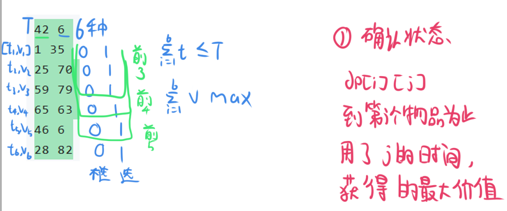

第一步，确定状态，我们可以开一个二维数组dp[i][j],表示到第i个物品为止，用了j的时间，所能获得的最大价值。


第二步，确定状态转移方程，对于每个物品，我们要么选，要么不选，所以我们可以得出以下状态转移方程：


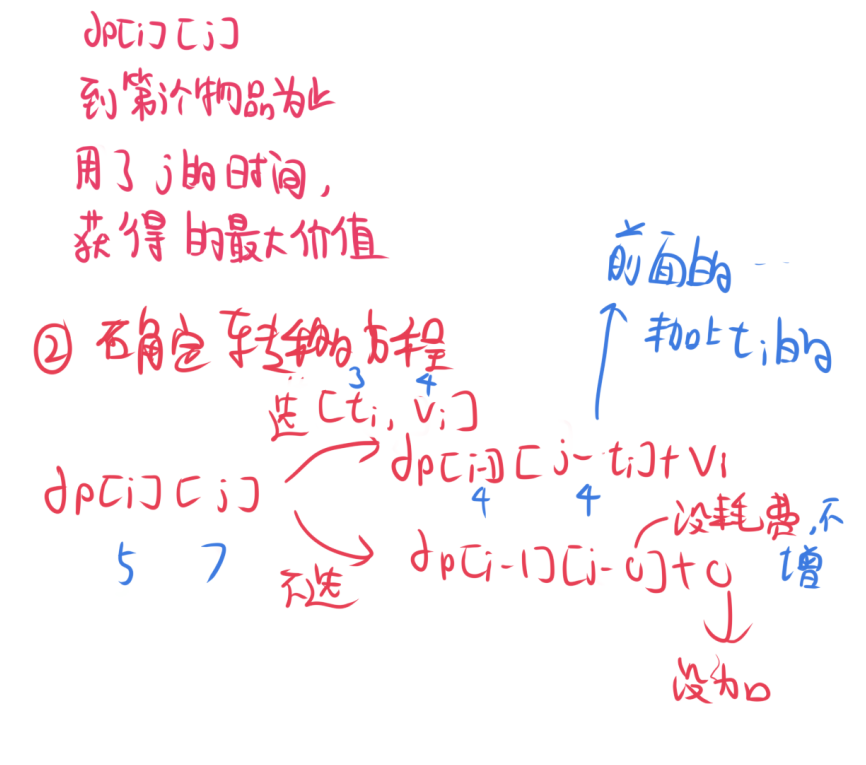

如图，我们可以得出以下公式:

选择**第i个**物品:

$$
dp[i][j]=dp[i-1][j-w[i]]+v[i]
$$

不选择**第i个**物品:

$$
dp[i][j]=dp[i-1][j]
$$

分析公式，我们可以发现，对于当前的状态，我们需要上一个状态的信息，所以我们需要从小到大枚举


第三步，我们要确认边界条件和进行初始化

显而易见，当**j<w[i]时，这个物品是不能选的**，否则就越界

然后，假如我们选了0个物品，那么价值就是0，即dp[0][j]=0


总结代码如下：

```cpp
// 初始化
    for (int i = 0; i <= T; i++)
    {
        dp[0][i] = 0;
    }
// 转移方程
    for (int i = 1; i <= M; i++)
    {
        for (int j = 0; j <= T; j++)
        {
            if (j >= t[i])
            {
                dp[i][j] = max(dp[i - 1][j], dp[i - 1][j - t[i]] + v[i]);
            }
            else
            {
                dp[i][j] = dp[i - 1][j];
            }
        }
    }
```


```cpp
#include <bits/stdc++.h>
using namespace std;
typedef long long ll;
const int N = 1e3 + 10;
ll T, M;
ll dp[110][1010]; // dp[i][j]表示前i个物品，花费了j的时间，所能获得的最大价值
ll t[N], v[N];

void solve()
{
    // 初始化
    for (int i = 0; i <= T; i++)
    {
        dp[0][i] = 0;
    }
    for (int i = 1; i <= M; i++)
    {
        cin >> t[i] >> v[i];
    }
    // 转移方程
    for (int i = 1; i <= M; i++)
    {
        for (int j = 0; j <= T; j++)
        {
            if (j >= t[i])
            {
                dp[i][j] = max(dp[i - 1][j], dp[i - 1][j - t[i]] + v[i]);
            }
            else
            {
                dp[i][j] = dp[i - 1][j];
            }
        }
    }
    cout << dp[M][T] << "\n";
}

int main()
{
    ios::sync_with_stdio(0);
    cin.tie(0);
    cout.tie(0);
    while (cin >> T >> M)
    {
        if (T == 0 && M == 0)
            break;
        solve();
    }
    return 0;
}
```


方法2:滚动数组


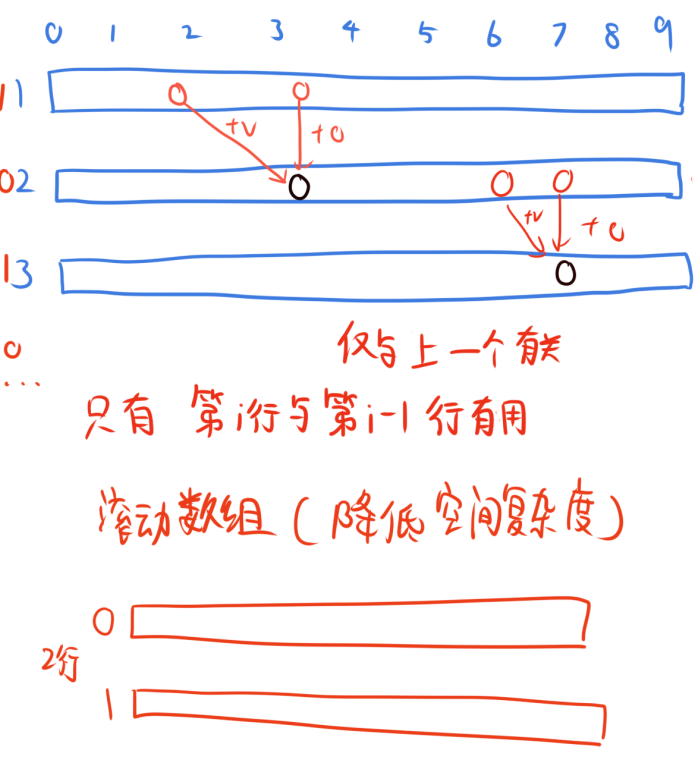


观察状态转移方程，我们可以发现，对于当前的状态，我们只需要上一个状态的信息，所以我们可以用个滚动数组，与普通二维数组不同的是，它只需两个一维数组，即$dp[2][j]$。这大大减少了空间复杂度。

我们可以用奇偶来表示状态的顺序，1,2,3,4,5如此往下。

我们要如何表示出奇偶性呢，可以用二进制来，即&1。假如当前的i是奇数，那么**i&1=1**,如果当前的i是偶数，那么**i&1=0**。

```cpp
#include <bits/stdc++.h>
using namespace std;
typedef long long ll;
const int N = 1e3 + 10;
ll T, M;
ll dp[2][1010]; // 使用滚动数组优化
ll t[N], v[N];

void solve()
{
    // 初始化
    for (int i = 0; i <= T; i++)
    {
        dp[0][i] = 0;
    }
    for (int i = 1; i <= M; i++)
    {
        cin >> t[i] >> v[i];
    }
    // 转移方程
    for (int i = 1; i <= M; i++)
    {
        int y = i & 1; // 使用二进制来体现奇偶性
        for (int j = 0; j <= T; j++)
        {
            if (j >= t[i])
            {
                dp[y][j] = max(dp[y ^ 1][j], dp[y ^ 1][j - t[i]] + v[i]); // y^1代表另一行
            }
            else
            {
                dp[y][j] = dp[y ^ 1][j];
            }
        }
    }
    cout << dp[M & 1][T] << "\n";  //M&1代表最后一行,即最后一行的最后一个元素，绝对是最大的
}

int main()
{
    ios::sync_with_stdio(0);
    cin.tie(0);
    cout.tie(0);
    while (cin >> T >> M)
    {
        if (T == 0 && M == 0)
            break;
        solve();
    }
    return 0;
}
```

方法3:一维dp

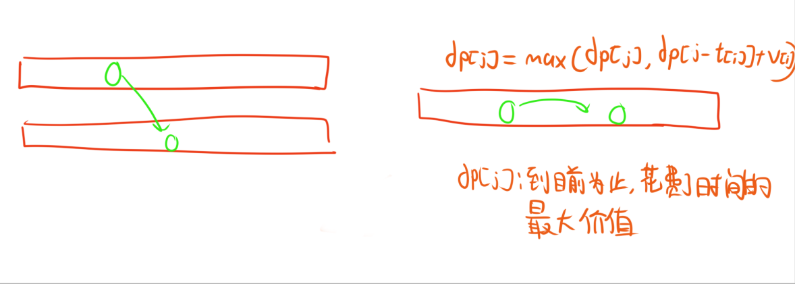


对于01背包问题，由于他的特殊性质，我们可以用一维dp来解决（大部分dp更常用滚动数组来优化空间）。

我们开一个一维数组dp[j],表示到目前为止，用了j的时间，所能获得的最大价值。

那么我们就省去了不选择第i个物品的情况，我们只开了一个数组，想要**继承**上一个状态的信息直接**覆盖**即可。

这里需要注意的是，我们需要**从大到小**枚举j,这样才能完整的继承上一个状态的信息。

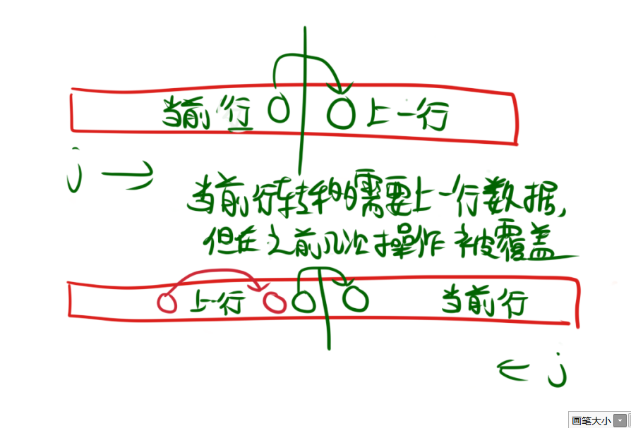


如图，我们设想一下，假如我们从小到大枚举j，那么在过程中间肯定是有一条分界线，分界线左边是我们现在枚举过的，**已经更新了的新状态**，而分界线右边是我们没有枚举过的，**还没有更新的旧状态**。根据我们的状态转移方程，我们需要用到**旧状态**的信息，当我们到达分界线右边，要更新那些旧状态时，我们**拿来用的信息已经被更新了**，这样就会导致出错

反之，从大到小枚举j，就不会出现这种情况了。


```cpp
#include <bits/stdc++.h>
using namespace std;
typedef long long ll;
const int N = 1e3 + 10;
ll T, M;
ll dp[1010]; // 一维dp  dp[j]表示到目前为止，花费了j的时间，所能获得的最大价值
ll t[N], v[N];

void solve()
{
    memset(dp, 0, sizeof(dp));
    for (int i = 1; i <= M; i++)
    {
        cin >> t[i] >> v[i];
    }
    // 转移方程
    for (int i = 1; i <= M; i++)
    {
        for (int j = T; j >= t[i]; j--)
        {
            dp[j] = max(dp[j], dp[j - t[i]] + v[i]);
        }
    }
    cout << dp[T] << "\n";
}

int main()
{
    ios::sync_with_stdio(0);
    cin.tie(0);
    cout.tie(0);
    while (cin >> T >> M)
    {
        if (T == 0 && M == 0)
            break;
        solve();
    }
    return 0;
}
```

### 无穷背包问题

[P47 无穷背包](https://www.starrycoding.com/problem/47)

无穷背包问题与01背包问题的区别在于，每个物品可以选择无限次。

它与01背包区别不大，我们只需要把01背包的状态转移方程稍微改一下即可。

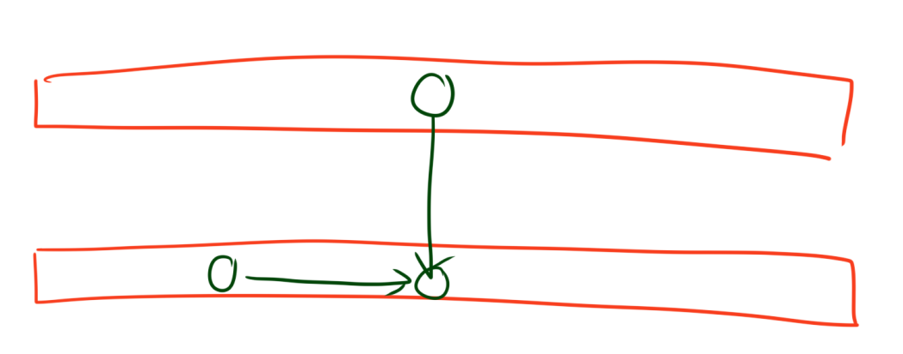

如图，和01背包不同，我们可以选择无限次，就等于在第i个物品时，**当前状态可以转移到当前状态**，增加时间和价值

则状态转移方程为:(这里先用二维)

```cpp
// 转移方程
    for (int i = 1; i <= M; i++)
    {
        for (int j = 0; j <= T; j++)
        {
            if (j >= t[i])
            {
                dp[i][j] = max(dp[i - 1][j], dp[i][j - t[i]] + v[i]);
            }   //注意这里的dp[i][j-t[i]]
            else
            {
                dp[i][j] = dp[i - 1][j];
            }
        }
    }
```

接着我们就可以写出来，这里我们直接优化到一维

这里要注意，对于无穷背包的一维dp，我们需要**从小到大**枚举j，这样才能满足**新状态从新状态**转移过来的性质。

还有边界条件也是一样，**j<v[i]时，这个物品是不能选的**，否则就越界

```cpp
#include <bits/stdc++.h>
using namespace std;
typedef long long ll;
const int N = 505;

ll n, m;
ll dp[100005]; // 一维
ll v[N], w[N];

int main()
{
    ios::sync_with_stdio(0);
    cin.tie(0);
    cout.tie(0);
    cin >> m >> n;

    for (int i = 1; i <= n; i++)
    {
        cin >> w[i] >> v[i];
    }
    for (int i = 1; i <= n; i++)
    {
        for (int j = v[i]; j <= m; j++)
        {
            dp[j] = max(dp[j], dp[j - v[i]] + w[i]);
        }
    }
    cout << dp[m] << "\n";
    return 0;
}
```


### 多重背包问题


[P75 多重背包](https://www.starrycoding.com/problem/75)


多重背包的每个物品可以选择有限次。

我们可以把它转化为01背包问题，每个物品可以选择有限次，那么我们可以把他们展开**分成1份1份**，就相当于多个**不同物品**，但是他们的**价值和重量是一样的**。

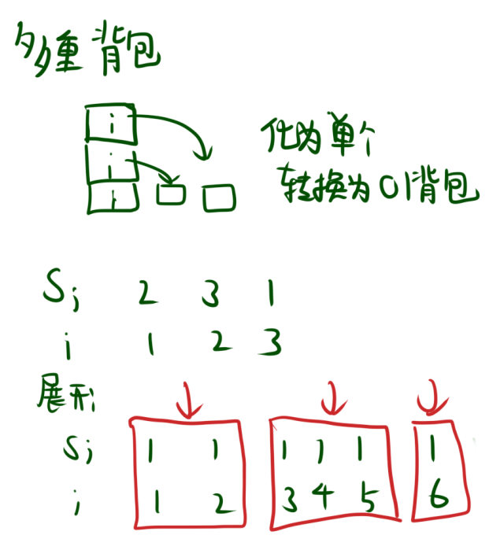


如此，我们可以把多重背包问题转化为01背包问题。

```cpp
#include <bits/stdc++.h>
using namespace std;
const int N = 109;
typedef long long ll;

ll dp[N * N];

int main()
{
    ios::sync_with_stdio(0);
    cin.tie(0);
    cout.tie(0);
    int m, n;
    cin >> m >> n;
    for (int i = 1; i <= n; i++)
    {
        ll s, w, v;
        cin >> s >> w >> v;
        while (s--) // 跑s次01背包
        {
            for (int j = m; j >= v; j--)
            {
                dp[j] = max(dp[j], dp[j - v] + w);
            }
        }
    }
    cout << dp[m] << "\n";
    return 0;
}
```

这里每次输入就跑s次01背包，和全部输入完再一起跑01背包是一样的，复杂度都是$O(n\times m \times s)$。即一个三次方的复杂度


**优化**

[P76 多重背包二周目](https://www.starrycoding.com/problem/76)

对于数据范围增大的多重背包问题，我们就需要优化了。


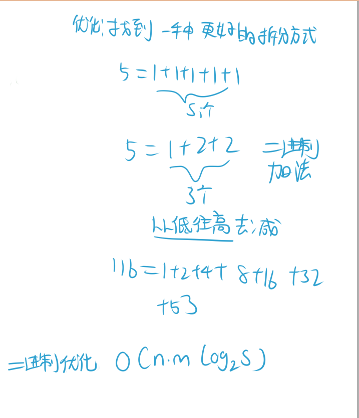


在这里，优化的方式是**对s进行优化**，使用二进制优化法，将s拆分为**1,2,4,8,16,32...**，然后再跑01背包。

对于二进制拆分，我们要从**低到高开始拆**，即1,2,4,8,16,32...

这样才能保证我们的选择是**最优的**。

这样可以将时间复杂度优化到$O(n\times m \times \log s)$。

```cpp
#include <bits/stdc++.h>
using namespace std;
const int N = 2010;
typedef long long ll;

ll dp[N];

int main()
{
    ios::sync_with_stdio(0);
    cin.tie(0);
    cout.tie(0);
    int m, n;
    cin >> m >> n;
    for (int i = 1; i <= n; i++)
    {
        ll s, w, v;
        cin >> s >> w >> v;
        vector<ll> arr;
        ll x = 1;
        while (s >= x)  //拆分
        {
            arr.push_back(x);  //arr存储拆分的结果
            s -= x;
            x <<= 1;
        }
        if (s > 0)
        {
            arr.push_back(s);
        }
        for (auto &k : arr)
        {
            for (ll j = m; j >= k * v; j--)
            {
                dp[j] = max(dp[j], dp[j - k * v] + k * w);
            }
        }  //跑01背包
    }
    cout << dp[m] << "\n";
    return 0;
}
```

