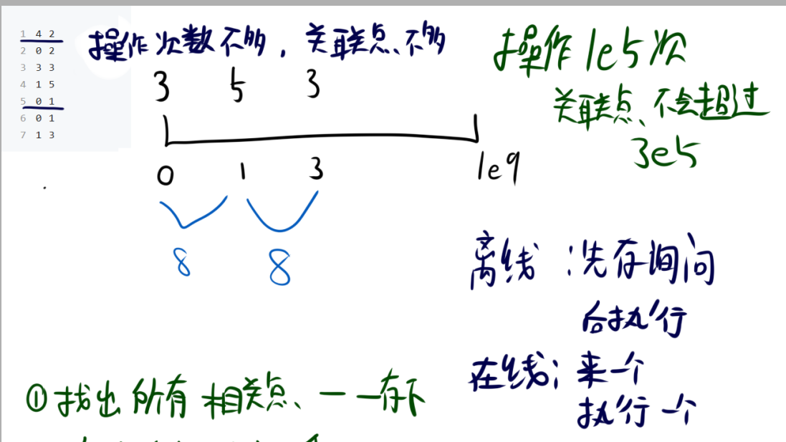
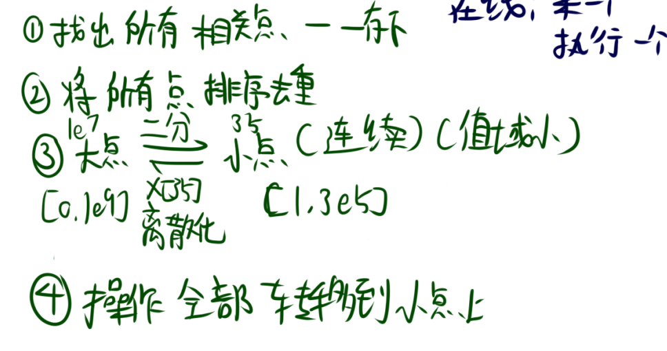
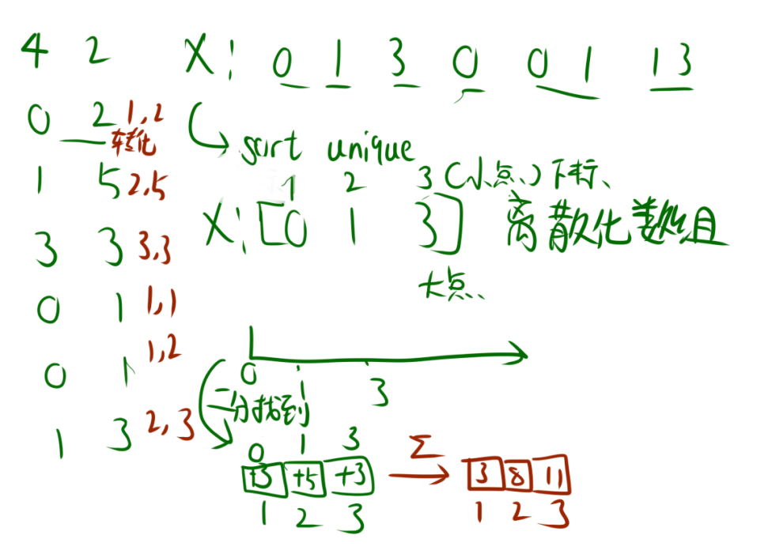
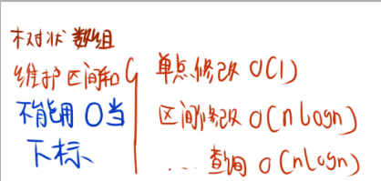
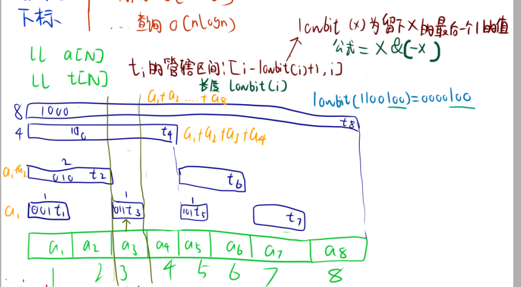
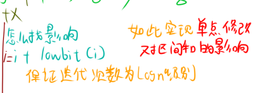
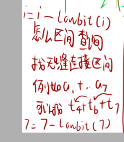
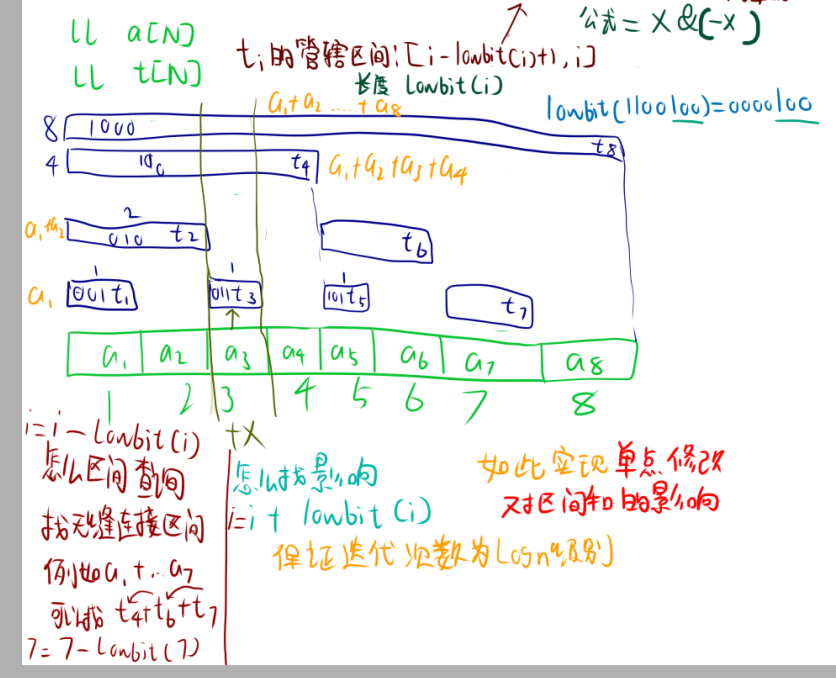
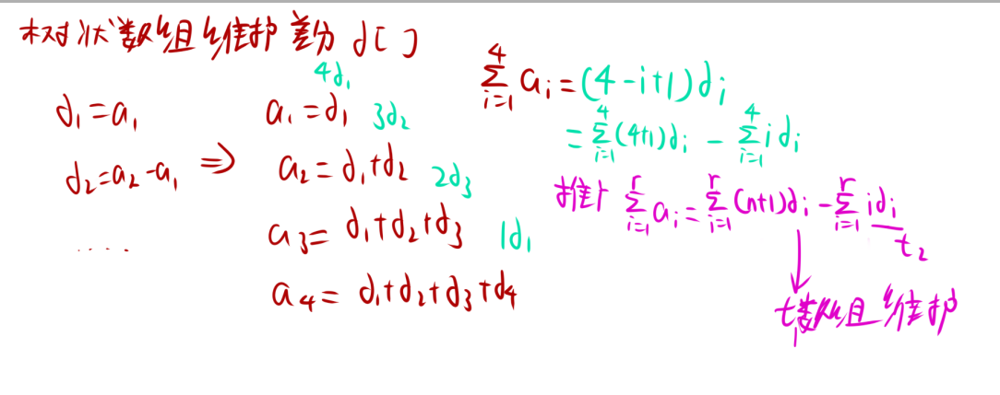
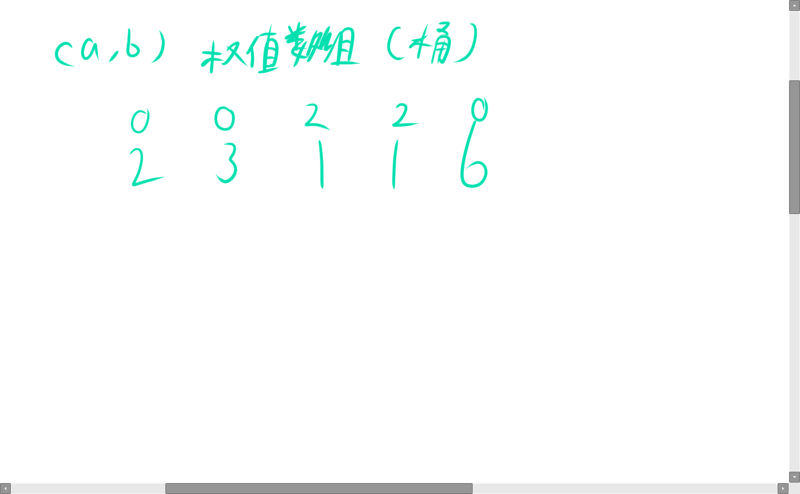

# 前言

**学习网站**:[Starrycoding](https://www.starrycoding.com/)

## 离散化

离散化是一种处理数据的技巧,通俗地讲就是当我们需要处理的数据范围很大,但是数据的个数很少时,我们可以将数据的范围进行压缩,从而减少空间的占用。离散化是一种**映射**的思想。

将一个**数组**离散化，并进行查询是比较常用的应用场景。

离散化的步骤如下：
1. 选择好**相关点**，创建原数组的副本。
2. 将副本中的值从小到大**排序**。
3. 将排序好的副本**去重**。
4. 查找原数组的每一个元素在副本中的位置，位置即为排名，将其作为离散化后的值。（我们一般用**二分**查找）


### 例题

[P63 我的很长，你算一下](https://www.starrycoding.com/problem/63)

分析：

根据题目，数组的下标范围是$[1,10^9]$，这么大的范围如果我们直接用数组来存储会爆内存，根本连暴力都用不了。

但是看到数据，个数只有$10^5$个，那么如果把**下标作为值存储在数组中**呢？

我们把这个数组叫做**X**,这些**下标**叫做**相关点**,X的**下标**叫做**排名**。接着**我们再开一个数组Y**，Y的下标和X的下标**一一对应**，而**Y的值**存储的是**原数组的值**,也可以用来加减了。





这样通过两个数组，我们就可以通过**排名**来**查询**原数组的值了。

总结得到这样的**映射关系**:**排名-->原数组的下标-->原数组的值**

所以我们可以将数组的**下标**进行离散化，然后用数组来存储。那么我们就有办法**存储相关点**了，也可以再用二分得到**相关点**的**排名**。





这里要注意，既然离散化的是**下标**，那么q次询问中的**l和r**也要记录进X中.这样才能得到**排名**。





```cpp
#include <bits/stdc++.h>
using namespace std;
typedef long long ll;
const int N = 3e5 + 9;
ll arr[N];
vector<int> X;
struct Q // 存放操作和询问
{
    ll a, b;
} add[N], que[N];

ll getidx(int x)
{
    /*lower_bound下边界 up_bound 上边界
    由于计算机区间习惯左闭右开，所以lower_bound返回第一个等于x的元素（假如有），up_bound返回第一个大于x的元素
    <x, <x, <x, [x, x, x, >x) ,>x
    lower_bound找出数组中第一个大于等于x元素的迭代器,up_bound返回的是第一个严格大于给定值的元素的迭代器。*/
    return lower_bound(X.begin(), X.end(), x) - X.begin() + 1;
    // 返回值范围是[1,X.size()]
}

int main(void)
{
    ios::sync_with_stdio(0);
    cin.tie(0);
    cout.tie(0);
    int n, q;
    cin >> n >> q;
    for (int i = 1; i <= n; i++)
    {
        ll x, w;
        cin >> x >> w;
        X.push_back(x);
        add[i] = {x, w};
    }
    for (int i = 1; i <= q; i++)
    {
        ll l, r;
        cin >> l >> r;
        X.push_back(l);
        X.push_back(r);
        que[i] = {l, r};
    }
    // 排序去重
    sort(X.begin(), X.end());
    X.erase(unique(X.begin(), X.end()), X.end());

    for (int i = 1; i <= n; i++)
    {
        ll x = getidx(add[i].a);
        ll w = add[i].b;
        arr[x] += w;
    }

    // 前缀和

    for (int i = 1; i <= X.size(); i++)
    {
        arr[i] += arr[i - 1];
    }

    for (int i = 1; i <= q; i++)
    {
        ll l = getidx(que[i].a);
        ll r = getidx(que[i].b);
        cout << arr[r] - arr[l - 1] << "\n";
    }
    return 0;
}
```


## 树状数组




树状数组是一种支持**单点修改**,**区间查询**和**区间修改**（区间修改运用了**差分**）的，代码量小的数据结构。树状数组简单来说，算是一种**高级前缀和**。

假如有个数组$a$，我们想得到这个数组的前缀和很简单，只需要用一个数组$sum$来存储前缀和就可以了。但是，如果我们要修改数组$a$中的一个元素，然后**马上查询那个区间的和**，那么我们$sum$就要重新进行前缀和再输出，这样的话，时间复杂度就会很高。

想解决这种在线的单点修改，就得使用树状数组。





如图，开一个数组$t$视为树状数组，$t_1$存的是$a_1$，$t_2$存的是$a_1+a_2$,$t_4$存的是$a_1+a_2+a_3+a_4$，$t_8$存的是$a_1+a_2+a_3+a_4+a_5+a_6+a_7+a_8$。别的也是如图一一对应的。

这样存储会带来什么性质?

我们把$t$存的数的区间称为管辖区间。**这个管辖区间为$[t-lowbit(t)+1,t]$**。长度为**lowbit(t)**。

什么是lowbit(i)?

lowbit(i)是**i的二进制表示中最低位的1所代表的数值**。

例子:lowbit(1100**100**)=0000**100**

lowbit公式:**lowbit(i)=i&(-i)**

我们把这个公式代入到例子看，$t_8$长度就为8，它的管辖区间为$[8-lowbit(8)+1,8]=[1,8]$。因此他是$a_1+a_2+a_3+a_4+a_5+a_6+a_7+a_8$。

那么我们如何进行单点修改呢?

可以看出，如果我们对$a_3$进行修改，那么$t_3,t_4,t_8$都要进行修改。这样的影响是有规律的。

我们可以发现,**3+lowbit(3)=4,4+lowbit(4)=8**，所以我们可以用一个循环来实现单点修改。





那么接下来我们就要实现区间查询了。

虽然$t_8$把全部元素包括了，但假如我们要的和是部分的话该怎么办呢？例如，我们要的是$a_1$到$a_7$的和。观察一下，可以发现$a_1$到$a_7$可以分为$t_4$+$t_6$+$t_7$。

这种无缝连接的块也是有规律的。

我们可以发现，**7-lowbit(7)=6,6-lowbit(6)=4**，所以我们可以用一个循环来实现区间查询。




最后，如何初始化树状数组呢?

我们可以把$t$数组初始化为0，然后用单点修改来实现初始化，就可以了。（和差分的思想有点类似）。





### 例题1

[P40 【模板】树状数组（单点修改）](https://www.starrycoding.com/problem/40)

```cpp
#include <bits/stdc++.h>
using namespace std;
const int N = 2e5 + 9;
typedef long long ll;
ll a[N], t[N];
int n, q;

int lowbit(int x)
{
    return x & -x;
}

void update(int k, ll x)//单点修改，也负责初始化
{
    for (int i = k; i <= n; i += lowbit(i))
    {
        t[i] += x;
    }
}

ll getsum(int k)//区间查询求前缀和
{
    ll ans = 0;
    for (int i = k; i > 0; i -= lowbit(i))
    {
        ans += t[i];
    }
    return ans;
}

int main(void)
{
    ios::sync_with_stdio(0);
    cin.tie(0);
    cout.tie(0);
    cin >> n >> q;
    for (int i = 1; i <= n; i++)
    {
        cin >> a[i];
    }
    // 初始化树状数组
    for (int i = 1; i <= n; i++)
    {
        update(i, a[i]);
    }
    // 操作
    for (int i = 1; i <= q; i++)
    {
        int x;
        cin >> x;
        if (x == 1)
        {
            int k;
            ll v;
            cin >> k >> v;
            update(k, v);
        }
        else
        {
            int l, r;
            cin >> l >> r;
            ll ans = 0;
            ans = getsum(r) - getsum(l - 1);
            cout << ans << "\n";
        }
    }
    return 0;
}
```

接下来讲区间修改。

如果是区间修改，**离线**的话我们可以用差分来实现，时间复杂度比树状数组更加优秀。

但是，如果是要求**在线的区间修改**，即修改一次，就要我们出一次值，我们就必须用树状数组来实现了。


树状数组想要实现区间修改，就是从维护普通的前缀和变成维护**差分数组**的前缀和。
根据图，我们需要两个不同的树状数组




如图，我们得出推广公式:（注意图中公式有个地方错了）

$$\sum_{i=1}^{r}a_i=\sum_{i=1}^{r}  (r+1)d_i-\sum_{i=1}^{r}id_i$$

那么我们用两个树状数组来维护这两个**差分前缀和**就可以了。

我们可以先初始化出差分数组$d$，然后用树状数组来维护$d$的前缀和。也可以直接就用树状数组来得出$d$的前缀和。


### 例题2

[P41 树状数组（区间修改）](https://www.starrycoding.com/problem/41)


```cpp
#include <bits/stdc++.h>
using namespace std;
const int N = 2e5 + 9;
typedef long long ll;
ll a[N], dt[N], dti[N];
int n, q;

int lowbit(int x)
{
    return x & -x;
}

void update(int k, ll x)  //单点修改，一次对两个树状数组进行修改
{
    for (int i = k; i <= n; i += lowbit(i))
    {
        dt[i] += x;
        dti[i] += k * x;     //注意这里是k*x，不是i*x
    }
}

ll getsum(int k)    //区间查询，运用刚才的公式得出
{
    ll ans = 0;
    for (int i = k; i > 0; i -= lowbit(i))
    {
        ans += (k + 1) * dt[i] - dti[i];
    }
    return ans;
}

int main(void)
{
    ios::sync_with_stdio(0);
    cin.tie(0);
    cout.tie(0);
    cin >> n >> q;
    for (int i = 1; i <= n; i++)
    {
        cin >> a[i];
    }
    // 初始化树状数组
    for (int i = 1; i <= n; i++)
    {
        update(i, a[i]);
        update(i + 1, -a[i]);      //根据差分，我们这样单点修改就可以实现区间修改了
    }
    // 操作
    for (int i = 1; i <= q; i++)
    {
        int x;
        cin >> x;
        if (x == 1)
        {
            int l, r;
            ll v;
            cin >> l >> r >> v;
            update(l, v);       //区间修改
            update(r + 1, -v);
        }
        else
        {
            int l, r;
            cin >> l >> r;
            ll ans = 0;
            ans = getsum(r) - getsum(l - 1);
            cout << ans << "\n";
        }
    }
    return 0;
}
```


## 附加题


[P31 求逆序对个数](https://www.starrycoding.com/problem/31)


**题面**:

给定一个长度为$n$的数组$a$，求$a$的逆序对个数。

逆序对的定义是一个二元组$(a_i,a_j)$,满足:$i<j$且$a_i>a_j$。

**输入格式**:

一个整数n.($1\leq n\leq 2\times10^5$)

一个长度为$n$的数组$a$。($1\leq a_i\leq 10^9$)

**输出格式**:

一个整数，表示逆序对的个数。


分析：

此题求解逆序对，可以使用权值数组来求解，权值数组其实就是一个桶，桶的下标就是数组的值，桶的元素就是数组的值的个数。




如图，我们把2,3,1,1,6依次归入桶中，先进2，$a_2$值为1，然后遍历$a_2$之后的桶，发现桶里面个数都为0，说明2之前没有比2大的。然后进3，然后进1，发现有两个逆序对，再进1，发现有两个逆序对，如此结束。

接着我们发现这样虽然找得到，但时间复杂度很高，而且(10^9)的范围太大，所以我们需要用离散化来优化。

至于如何优化时间复杂度，可以这样逆向的求解，同样是2,3,1,1,6，2进桶之前，先判断下**所有桶里面的元素个数** (前缀和)，然后再**减去其中比2小的元素个数**（相当于l为2，r为结尾），这样就可以得到2之前的逆序对个数。

这样的话就要有个前缀和，我们可以用树状数组来实现（时间复杂度优秀，总共$O(nlogn)$）。并且建立在离散化处理的数组的基础上。

**树状数组<--排名<--值**。

```cpp
#include <bits/stdc++.h>
using namespace std;
const int N = 2e5 + 9;
typedef long long ll;

ll a[N], t[N];
vector<int> X;

int getidx(int x)
{
    return lower_bound(X.begin(), X.end(), x) - X.begin() + 1;
}

int lowbit(int x)
{
    return x & -x;
}

int getsum(int k)
{
    int res = 0;
    for (int i = k; i > 0; i -= lowbit(i))
    {
        res += t[i];
    }
    return res;
}

void update(int k, int x)
{
    for (int i = k; i <= X.size(); i += lowbit(i))
    {
        t[i] += x;
    }
}

int main(void)
{
    ios::sync_with_stdio(0);
    cin.tie(0);
    cout.tie(0);
    int n;
    cin >> n;
    for (int i = 1; i <= n; i++)
    {
        cin >> a[i];
        X.push_back(a[i]);
    }
    // 排序去重
    sort(X.begin(), X.end());
    X.erase(unique(X.begin(), X.end()), X.end());

    /*
    树状数组是建立在离散化数组上的
    getsum(X.size())返回当前位置之前的所有元素的和
    getsum(getidx(a[i]))返回当前位置之前小于等于a[i]的元素的个数
    两者相减即为比 a[i] 大的元素的数量。
    */
    ll ans = 0;
    for (int i = 1; i <= n; i++)
    {
        ans += 1ll * getsum(X.size()) - getsum(getidx(a[i]));
        update(getidx(a[i]), 1);
    }
    cout << ans << "\n";
    return 0;
}
```