# 前言

**学习网站**:[Starrycoding](https://www.starrycoding.com/)


## 最小生成树

最小生成树用于处理**无向图**的**最小权值和**。

- 生成树
对于一个无向图，若它的一个子图是包含该无向图全部顶点的树，那么该子图是该无向图的一个生成树。

- 最小生成树
当连接顶点之间的边有权重时，权重之和最小的生成树则为最小生成树。


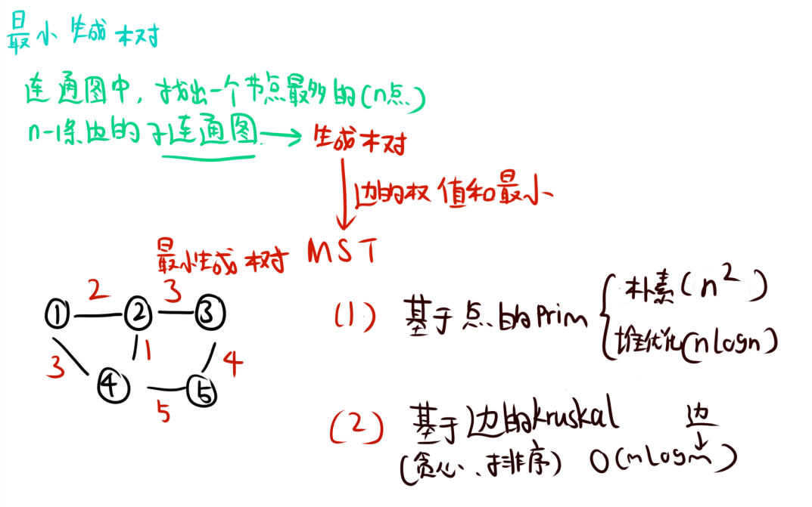

最小生成树的实现有两种方法:
- 基于点的Prim算法
- 基于边的Kruskal算法

### Prim算法


- 朴素算法

1. 对于一个无向图，我们选择一个点作为起点，一般选点1。（方便枚举）
2. 我们用一个数组dist[]来记录所有点到起点的距离，初始化为正无穷。
3. 我们用一个bool数组st[]来记录这个点是否已经被加入到生成树中。
4. 我们用一个循环，每次循环中找到**不在生成树**中的距离起点**最近**的点，将这个点加入到生成树中。


5. 当这个点加入进去，我们需要更新dist[]数组，将这个点的所有邻边的距离起点的距离更新一下。并且这个点的dist[]=0。

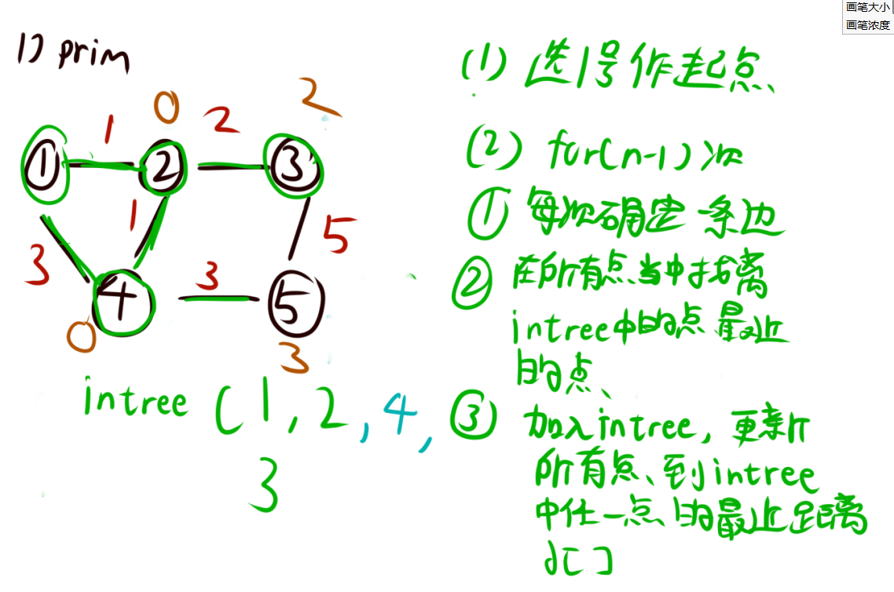


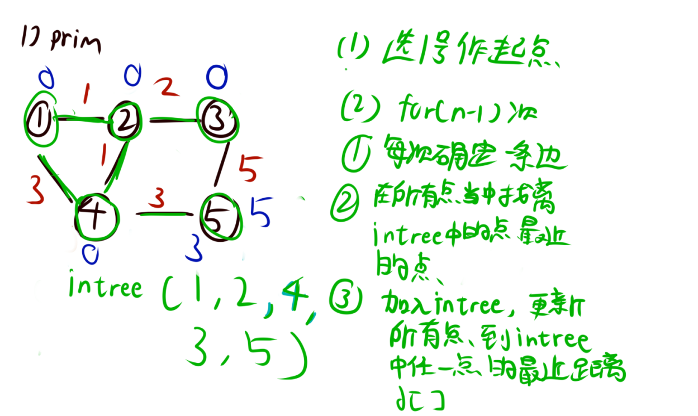


根据这个思路，我们可以写出朴素的Prim算法。时间复杂度为$O(n^2)$。

```cpp
#include <bits/stdc++.h>
using namespace std;
const int N = 1e3 + 9;  //朴素算法能处理的范围很小
typedef long long ll;

ll a[N][N], d[N];
bitset<N> intree;

int main()
{
    ios::sync_with_stdio(0);
    cin.tie(0);
    cout.tie(0);
    int n, m;
    cin >> n >> m;
    memset(a, 0x3f, sizeof(a));
    memset(d, 0x3f, sizeof(d));
    for (int i = 1; i <= n; i++)
    {
        a[i][i] = 0;  //自己到自己的距离为0
    }
    for (int i = 1; i <= m; i++)
    {
        ll u, v, w;
        cin >> u >> v >> w;
        a[u][v] = min(a[u][v], w);  //用邻接表存无向图
        a[v][u] = min(a[v][u], w);
    }
    ll ans = 0;
    for (int i = 1; i <= n; i++)
    {
        int u = 1; // u就是我们要找的那个距离intree中的点最近的那个点,一开始就从1开始。
        for (int j = 1; j <= n; j++)
        {
            if (intree[u] || (!intree[j] && d[j] < d[u]))
            {
                u = j;
            }
        }
        if (i != 1)
            ans += d[u];   // 我们要把所有的权值加起来，但是第一个点是没有权值的，所以我们要特判一下。
        intree[u] = true;
        d[u] = 0;

        for (int j = 1; j <= n; j++)  // 每次生成树进入一个点都更新dist[]数组
        {
            if (intree[j])
                continue;

            d[j] = min(d[j], a[u][j]);
        }
    }
    cout << ans << "\n";
    return 0;
}
```

### 例题1

[P72 【模板】最小生成树](https://www.starrycoding.com/problem/72)

分析：

题目的数据范围在$10^5$，所以我们用朴素的Prim算法是不能过的。我们该如何优化呢，观察循环，我们可以发现，我们每次循环中都要找到**不在生成树**中的距离起点**最近**的点，这个点我们可以用一个优先队列来维护，每次取出堆顶元素即可。这样我们就可以将时间复杂度优化到$O(nlogn)$。（和dijkstra很像）

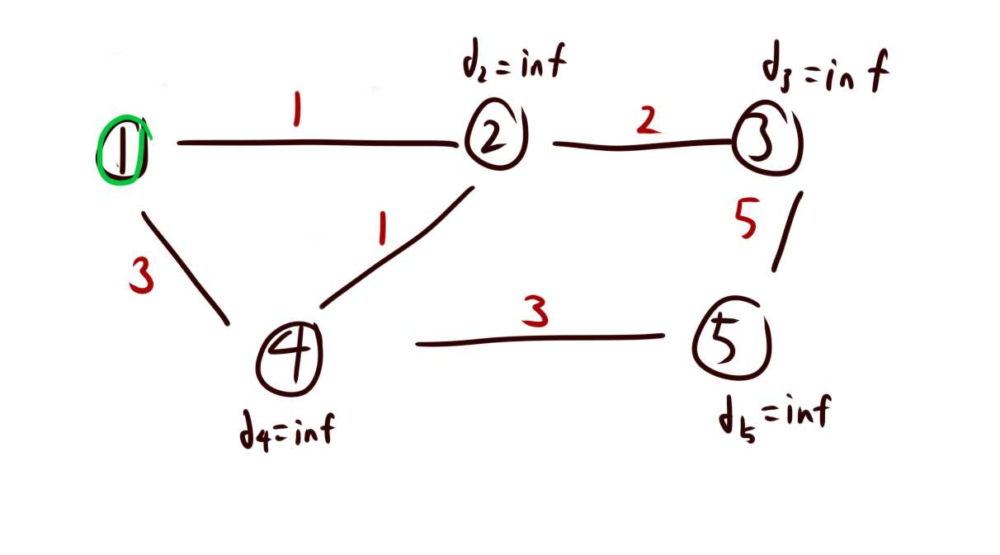

至于我们该如何入队，我们可以用一个循环来实现，每次循环中，我们将这个点的**所有邻点的距离起点的距离更新一下**。并且这个点的dist[]=0。假如邻点的dist[]变化了，那么他就**有可能成为最近点**，直接将他入队即可。


之后我们就用优先队列来帮我们判断最近点。


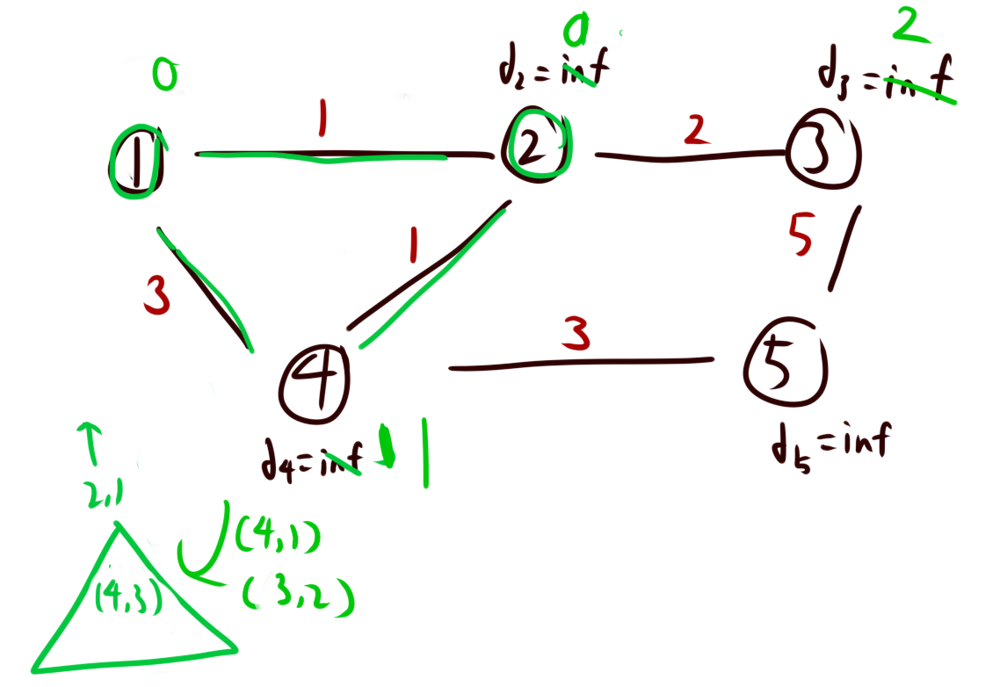


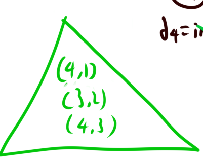


```cpp
#include <bits/stdc++.h>
using namespace std;
const int N = 1e5 + 9;
typedef long long ll;

struct node
{
    ll x;
    ll w;
    bool operator<(const node &b) const // 权值最小的优先，如果权值相同，那么用编号区分，编号小大无所谓
    {
        return w == b.w ? x < b.x : w > b.w;
    }
};

vector<vector<node>> g(N, vector<node>());

bitset<N> intree;

ll d[N];

int main()
{
    ios::sync_with_stdio(0);
    cin.tie(0);
    cout.tie(0);
    int n, m;
    cin >> n >> m;
    memset(d, 0x3f, sizeof(d));
    for (int i = 1; i <= m; i++)
    {
        ll u, v, w;
        cin >> u >> v >> w;
        g[u].push_back({v, w});
        g[v].push_back({u, w});
    }
    ll ans = 0;
    priority_queue<node> pq;
    pq.push({1, 0});
    d[1] = 0;

    while (pq.size())
    {
        ll u = pq.top().x; // 取出来的点是距离当前intree中的点最近的一个
        pq.pop();
        if (intree[u])
        {
            continue;
        }
        intree[u] = true;
        ans += d[u];
        d[u] = 0;

        // 枚举所有出边
        for (auto &edge : g[u])
        {
            ll y = edge.x;
            ll w = edge.w;
            if (!intree[y] && w < d[y])  //我们要取的是最小的权值，大的就不用入队了，并且已经在生成树的点也是肯定不能进的.
            {
                d[y] = w;
                pq.push({y, d[y]});
            }
        }
    }
    for (int i = 1; i <= n; i++)  // 最后判断一下是否所有的点都在生成树中,如果有一个点不在生成树中，那么就不构成生成树了，输出-1。
    {
        if (!intree[i])
        {
            ans = -1;
            break;
        }
    }
    cout << ans << "\n";
    return 0;
}
```

### Kruskal算法

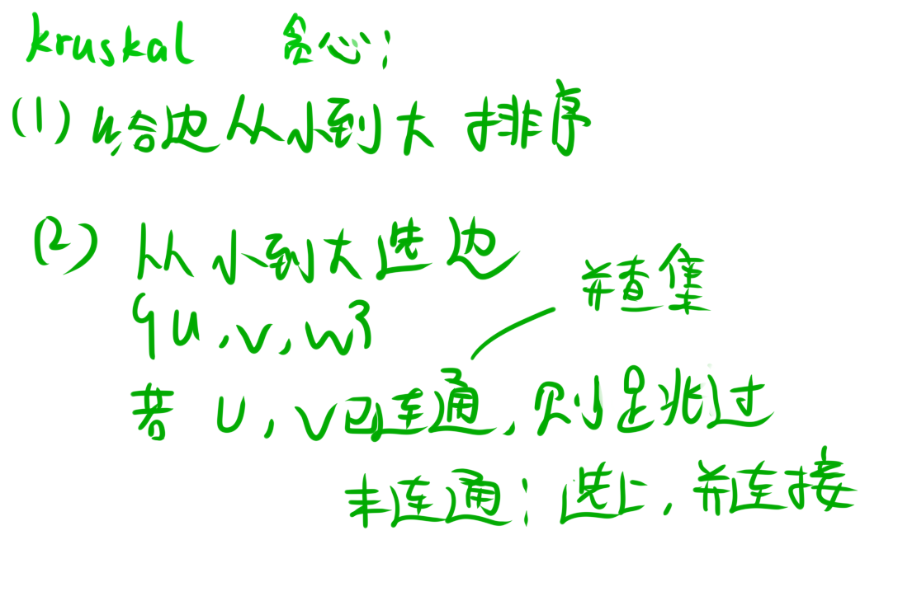

kruskal算法是基于边的算法，它的思想是**根据权值从小到大**将边进行联通（用并查集），如果这条边的两个点已经联通了，那么这条边就不能加入到生成树中。

这种算法就是一种贪心的算法，它的时间复杂度为$O(mlogm)$。m指的是边的数量。

下面演示一下kruskal算法的过程：

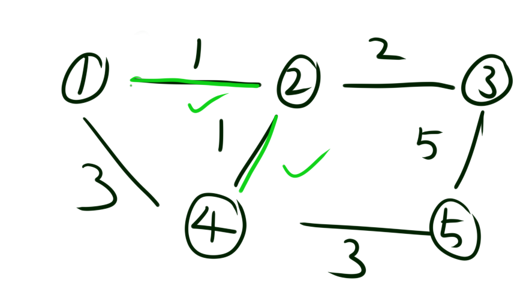

首先我们将所有的边按照权值从小到大排序。然后我们从**权值最小**的边开始，将这条边的**两个点进行联通**。如图是**将1和2联通**。接着再将2和4联通。就这样一直进行下去。直到所有的点都联通。


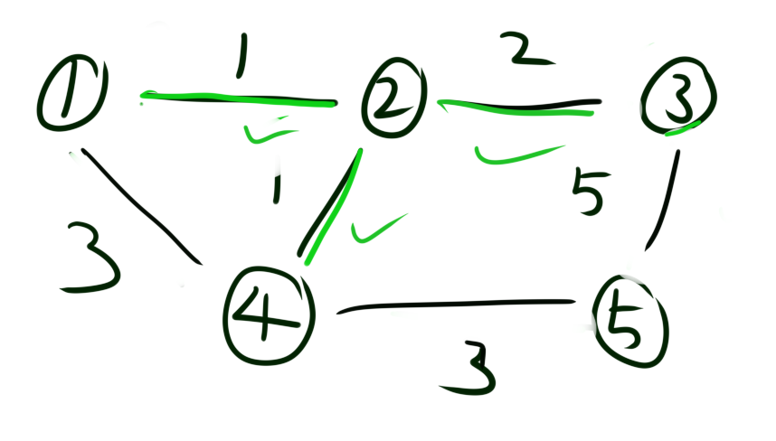


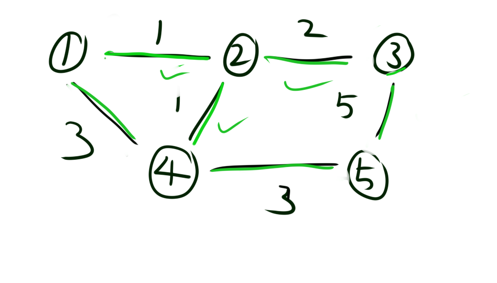


### 例题2

[P72 【模板】最小生成树](https://www.starrycoding.com/problem/72)


```cpp
#include <bits/stdc++.h>
using namespace std;
const int N = 1e5 + 9;
typedef long long ll;

struct node
{
    ll u;
    ll v;
    ll w;
    bool operator<(const node &b) const // 权值最小的优先，如果权值相同就用编号区分，编号小大无所谓
    {
        if (w != b.w)
        {
            return w < b.w;
        }
        if (u != b.u)
        {
            return u < b.u;
        }
        return v < b.v;
    }
};
ll pre[N];  // 并查集

ll root(ll x)
{
    if (pre[x] == x)
    {
        return x;
    }
    else
    {
        ll root_x = root(pre[x]);
        pre[x] = root_x;
        return root_x;
    }
}

void merge(ll x, ll y)
{
    pre[root(x)] = root(y);
}

int main()
{
    ios::sync_with_stdio(0);
    cin.tie(0);
    cout.tie(0);
    int n, m;
    cin >> n >> m;
    for (int i = 1; i <= n; i++)
    {
        pre[i] = i;
    }
    vector<node> es;  // 用vector来存边，方便排序
    for (int i = 1; i <= m; i++)
    {
        ll u, v, w;
        cin >> u >> v >> w;
        es.push_back({u, v, w});
    }
    ll ans = 0;
    sort(es.begin(), es.end());
    for (auto &e : es)
    {
        ll u = e.u;
        ll v = e.v;
        ll w = e.w;
        if (root(u) == root(v))  // 如果两个点已经联通了，那么这条边就不能加入到生成树中
        {
            continue;
        }
        merge(u, v);  // 将这两个点联通
        ans += w;     // 权值累加
    }
    for (int i = 1; i <= n - 1; i++)
    {
        if (root(i) != root(i + 1))  // 最后判断一下是否所有的点都在生成树中,如果有一个点不在生成树中，那么就不构成生成树了，输出-1。
        {
            ans = -1;
            break;
        }
    }
    cout << ans << "\n";
    return 0;
}
```

### 总结

通常来说，我们更倾向使用kruskal算法，因为他实现很简单


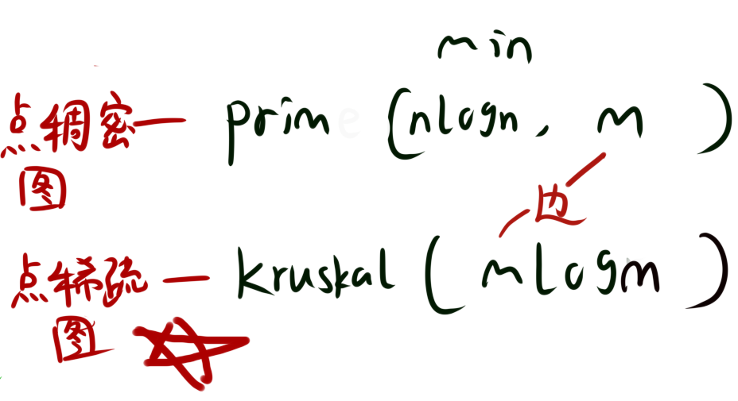


prim算法更适用于稠密图，kruskal算法更适用于稀疏图。

稠密图就是点的数量少，边的数量很多，那么一个点的邻边就很多，prim适合这种情况。

稀疏图就是点的数量多，边的数量少，那么一个点的邻边就很少，kruskal适合这种情况。


## 质因数分解

质数是指在**大于1**的**自然数**中，除了**1和它本身**以外不再有其他**因数**的自然数。

对于质数，我们要掌握:
- 质数的判断
- 筛法


### 质数的判断

对于一个数n，我们只需要判断它是否能被$2\sim \sqrt{n}$中的数整除即可。如果能被整除，那么就不是质数。

```cpp
bool isprime(int n)     //质数判断
{
    if (n < 2)
    {
        return false;
    }
    for (int i = 2; i <= n / i; i++)
    {
        if (n % i == 0)
        {
            return false;
        }
    }
    return true;
}
```

### 因子分解

在讲质因数分解前，我们先讲一下因子分解。

[P16 【模板】求N的所有因子](https://www.starrycoding.com/problem/16)

分析：

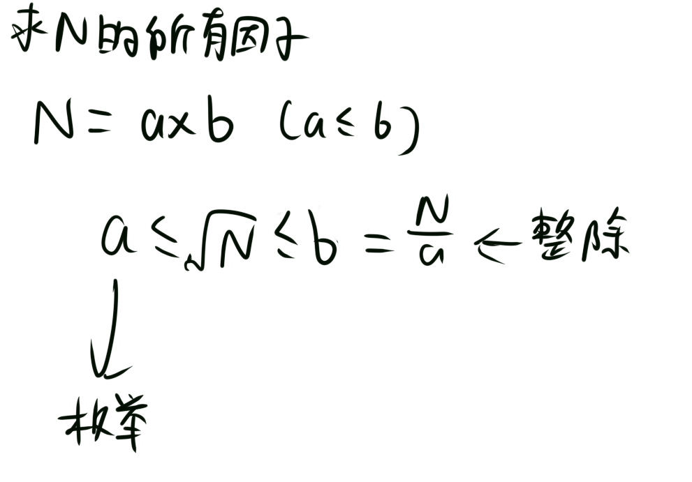


由图，我们假设一个数$N=a\times b$，那么a和b就是N的因子。

不妨设$a\leq b$，那么我们可以得到$a\leq \sqrt{N}\leq b$。

其中$b=N/a$。

那么我们只要枚举$a$，找出其中整除$N$的数即可。假如这个数为$i$,那么$b=N/i$。

我们可以用一个vector来存因子，最后排序输出即可。

注意枚举范围为$1\sim \sqrt{N}$。


```cpp
#include <bits/stdc++.h>
using namespace std;
typedef long long ll;
int main()
{
    ll n;
    cin >> n;
    vector<ll> v;
    for (ll i = 1; i <= n / i; i++)
    {
        if (n % i == 0)
        {
            // n与n/i两个因子
            v.push_back(i);
            if (i != n / i)
            {
                v.push_back(n / i);
            }
        }
    }
    sort(v.begin(), v.end());
    for (auto &i : v)
    {
        cout << i << " ";
    }
    cout << "\n";
    return 0;
}
```

### 例题

[P17 【模板】求N的所有质因子](https://www.starrycoding.com/problem/17)


分析：

对于求N的质因子，我们可以将N分解为多个质因子的乘积。

例如：$12=2\times 2\times 3$

所以我们只要从**2开始枚举，判断能否整除**，如果可以整除，那么就将这个质因子加入到vector中，并且**将N持续除以这个数，直到N不能再被这个数整除**。如此才会**保证**N是由多个质因子的乘积组成的。


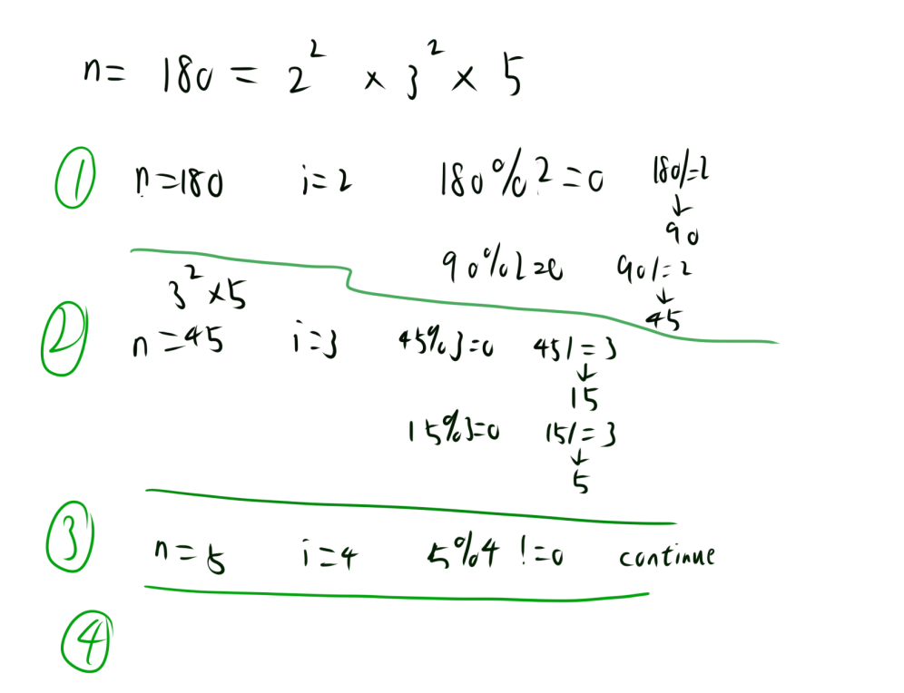


为何这样枚举得到的因子**一定是质数**呢？


我们可以用一个反证法来证明。


假如我们枚举到一个数$i$，但是$i$不是质数，那么$i$就可以被分解为多个质因子的乘积。即$i=a*b$为一个合数.**既然$n$能被$i$整除，那么$n$也一定能被$a$和$b$整除**。

但是我们的枚举是从**2开始的**，所以$i$**的因数一定会先于i被枚举到**，假设这个**先被枚举到的因数为$a$,$n$一定会被$a$整除**,然后a就会被**除光**,除**剩下的$n$就不再包含了$a$了**，此时再枚举到$i$，$n$也不会再被$i$整除了。

```cpp
#include <bits/stdc++.h>
using namespace std;
typedef long long ll;
int main()
{
    ll n;
    cin >> n;
    vector<ll> v;
    for (ll i = 2; i <= n / i; i++) // 枚举所有质因子 i肯定要从2开始
    {
        if (n % i != 0)
        {
            continue;
        }
        // i为一个质因子
        v.push_back(i);
        while (n % i == 0)
        {
            n /= i; // n除去所有i
        }
    }
    if (n > 1)
    {
        v.push_back(n); // 如果n>1,最后n他自己就是一个质因子
    }
    sort(v.begin(), v.end());
    for (auto &i : v)
    {
        cout << i << " ";
    }
    cout << "\n";
    return 0;
}
```


