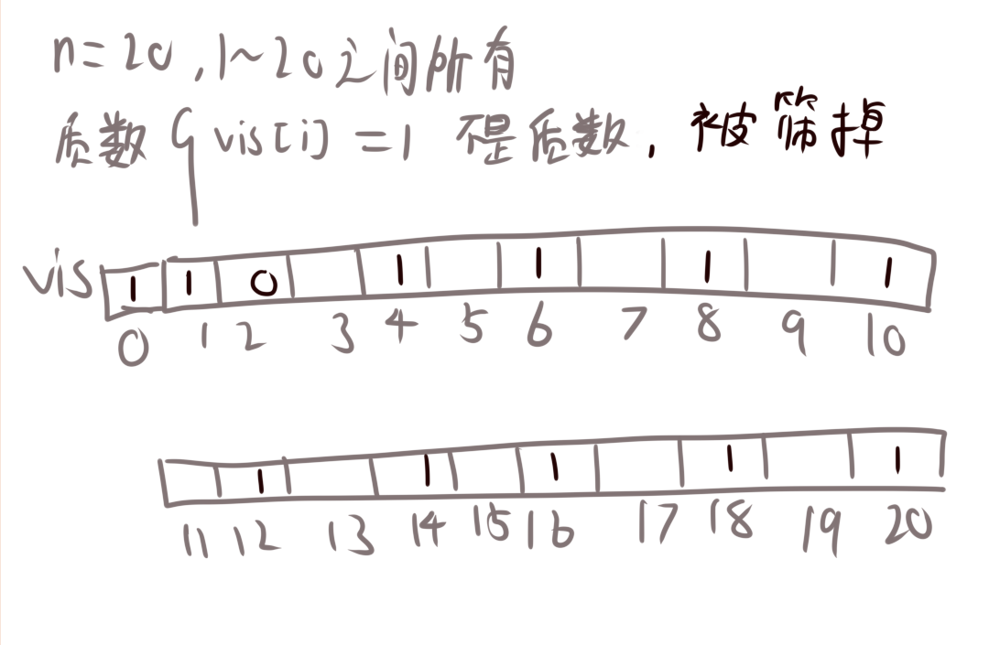
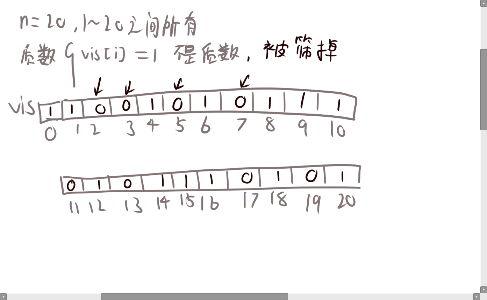
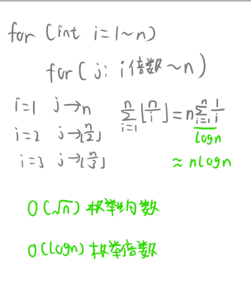
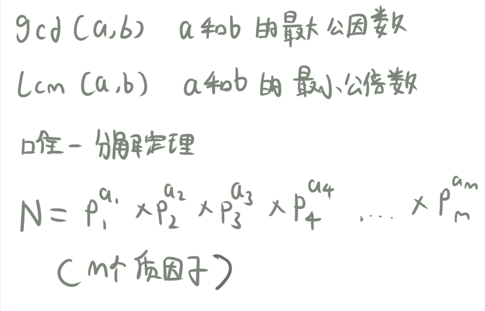
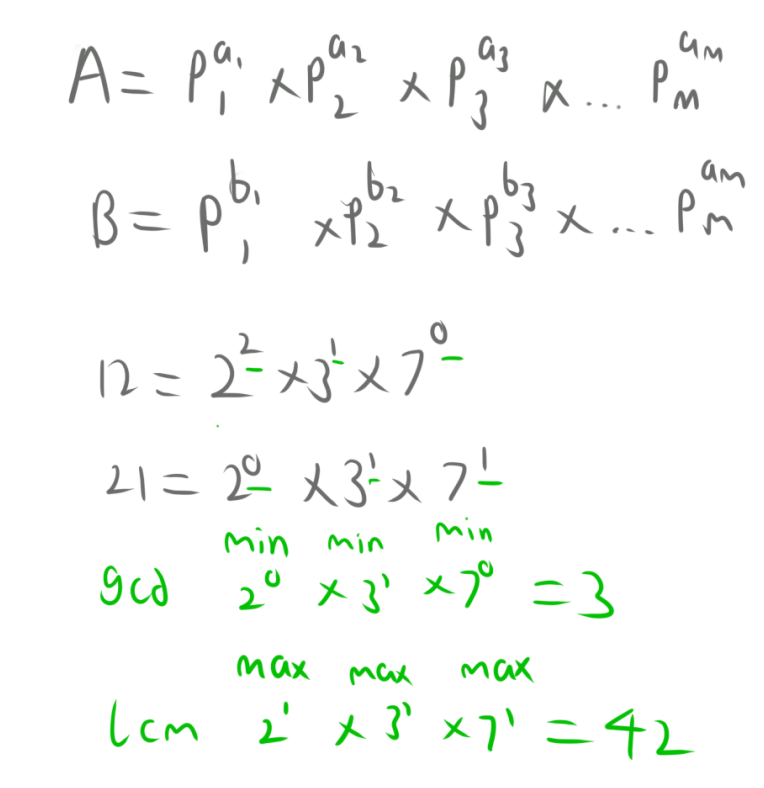
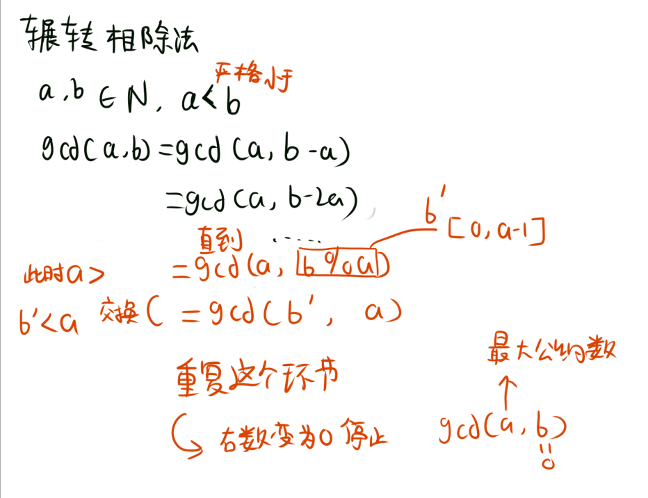
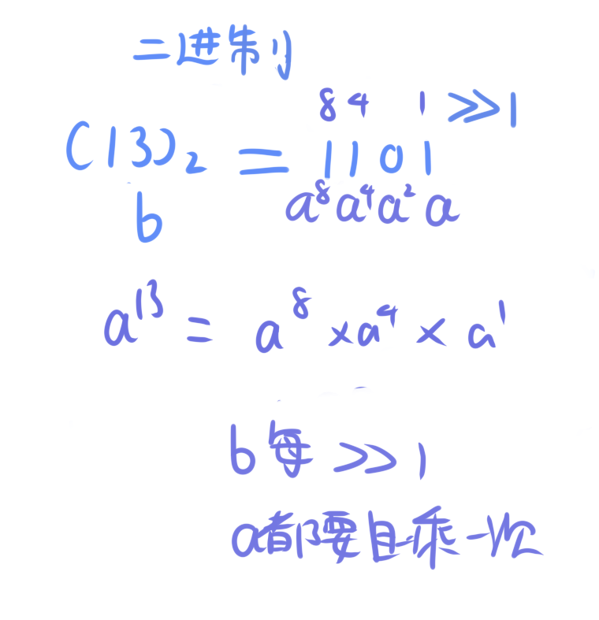
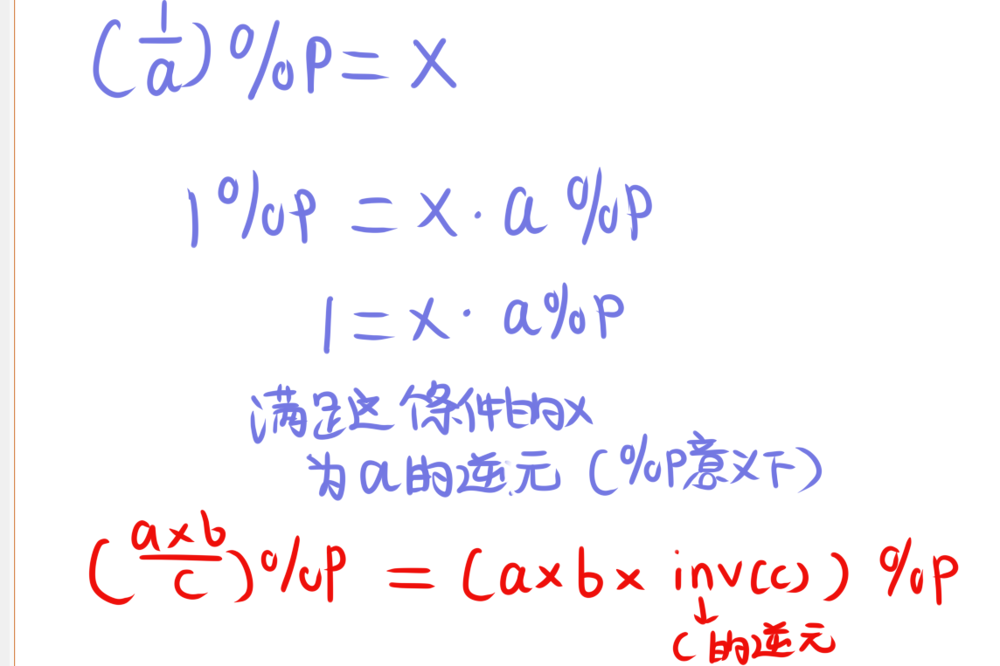
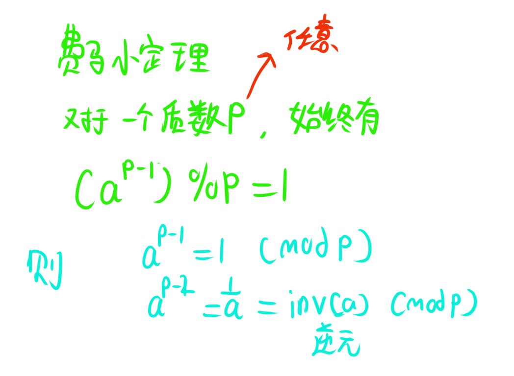
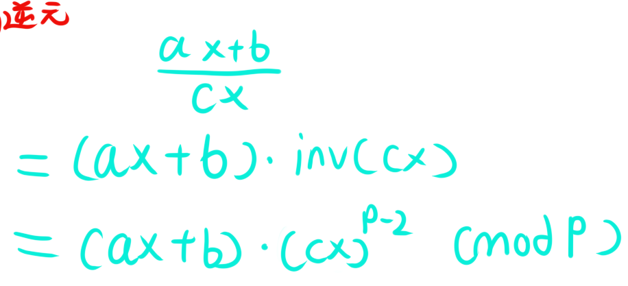

# 前言

**学习网站**:[Starrycoding](https://www.starrycoding.com/)

**常用算法wiki**:[OI wiki](https://oi-wiki.org/)


## 埃式筛

埃式筛是一种用于快速找到一定范围内所有质数的算法。它的基本思想是从2开始，将每个质数的倍数都标记成合数，直到筛完所有小于等于n的数。

具体来说，算法的步骤如下：

1. 初始化一个vis数组，将所有元素标记为0,刚开始我们认为所有数都是质数。而1代表不是质数。然后我们初始化将0，1标记为1。
2. 从2开始判断是不是质数，如果是质数，就将它的倍数都标记为1.
3. 然后我们判断下一个数是不是质数，如果是质数，就将它的倍数都标记为1.




最终vis数组中为0的数就是质数。





### 例题

[P43 【模板】埃氏筛法](https://www.starrycoding.com/problem/43)

```cpp
#include <bits/stdc++.h>
using namespace std;
const int N = 2e6 + 9;
bitset<N> vis;

int main()
{
    ios::sync_with_stdio(0);
    cin.tie(0);
    cout.tie(0);
    int n;
    cin >> n;
    vis[0] = true;
    vis[1] = true;
    for (int i = 2; i <= n; i++)
    {
        if (!vis[i])
        {
            for (int j = i * 2; j <= n; j += i)  // 从i的2倍开始，每次加i
            {
                vis[j] = true;
            }
        }
    }
    for (int i = 2; i <= n; i++)
    {
        if (!vis[i])
        {
            cout << i << " ";
        }
    }
    cout << "\n";
    return 0;
}
```

我们可以分析下这个算法的时间复杂度。



如图，我们可以看到，埃式筛**枚举倍数**的方法使得这个循环的时间复杂度为$O(n\log n)$。于是总共就是$O(n\log\log n)$。

顺带一提，枚举倍数我们也可以优化，将循环改为这样：

```cpp
for (int i = 2; i <= n; i++)
    {
        if (!vis[i])
        {
            for (ll j = 1ll*i * i; j <= n; j += i)
            {
                vis[j] = true;
            }
        }
    }
```

初始化j为i的平方，不会影响结果（我们可以自己代数字看一下，假设i很大，那么在到i之前，$2\times i$,$3\times i$,$4\times i$等倍数肯定已经在枚举到$2,3$等数的时候被标记过了）。

最终代码就是:

```cpp
#include <bits/stdc++.h>
using namespace std;
const int N = 2e6 + 9;
typedef long long ll;
bitset<N> vis;

int main()
{
    ios::sync_with_stdio(0);
    cin.tie(0);
    cout.tie(0);
    int n;
    cin >> n;
    vis[0] = true;
    vis[1] = true;
    for (int i = 2; i <= n; i++)
    {
        if (!vis[i])
        {
            for (ll j = 1ll*i * i; j <= n; j += i)
            {
                vis[j] = true;
            }
        }
    }
    for (int i = 2; i <= n; i++)
    {
        if (!vis[i])
        {
            cout << i << " ";
        }
    }
    cout << "\n";
    return 0;
}
```


## gcd和lcm

gcd是最大公因数，lcm是最小公倍数。



关于gcd和lcm，我们首要要知道一个定理，叫做**惟一分解定理**

该定理断言：任何一个**大于1的整数n**都可以**分解成若干个素因数的连乘积**，如果不计各个素因数的顺序，那么这种分解是**惟一**的

$$N={p_1}^{a_1} \times {p_2}^{a_2} \times {p_3}^{a_3} \times {p_4}^{a_4} ....\times {p_m}^{a_m} $$

其中$p_i$是素数，$a_i$是正整数。

而gcd和lcm也与这个定理有关。



如图，将两个数的质因数分解，保证他们的因子全部相同，那么他们的gcd就是这些因子的最小值乘积，而lcm就是这些因子的最大值乘积。

同时，我们可以发现$gcd(a,b)\times lcm(a,b)=a\times b$。

于是，我们得出了gcd与lcm的关系，那么我们只要求出gcd或lcm，另一个就可以通过公式得出。

通常，我们会使用**辗转相除法**来求gcd。然后再得出lcm。





辗转相除法的代码如下：

```cpp
#include <bits/stdc++.h>
using namespace std;
typedef long long ll;

ll gcd(ll a, ll b)
{
    if (b == 0)
    {
        return a;
    }
    else
    {
        return gcd(b, a % b);
    }
}
```

### 例题

[P65 【模板】gcd和lcm](https://www.starrycoding.com/problem/65)

```cpp
#include <bits/stdc++.h>
using namespace std;
typedef long long ll;

ll gcd(ll a, ll b)
{
    if (b == 0)
    {
        return a;
    }
    else
    {
        return gcd(b, a % b);
    }
}

ll lcm(ll a, ll b)
{
    return (a / gcd(a, b)) * b;  // 注意这里要先除再乘，防止溢出
}

void solve()
{
    ll a, b;
    cin >> a >> b;
    cout << gcd(a, b) << " " << lcm(a, b) << "\n";
}

int main()
{
    ios::sync_with_stdio(0);
    cin.tie(0);
    cout.tie(0);
    int t;
    cin >> t;
    while (t--)
    {
        solve();
    }
}
```

## 快速幂

快速幂是一种用于计算幂运算的算法，它可以在$O(\log n)$的时间复杂度内计算出$a^n$的值。

快速幂的基本思想是将幂运算转化为二进制数的形式，然后利用二进制数的性质来计算幂运算。



如图，假设我们要计算$a^n$，我们可以将n转化为二进制数，然后将二进制数转化为幂运算的形式。

例如，$a^7$可以转化为$a^4\times a^2\times a^1$。

7的二进制为111，我们对应只要有1就乘上a，并且数字a每次都要自乘，这样就可以得到$a^7$。


```cpp
ll qmi(ll a, ll b, ll c)
{
    ll res = 1;
    while (b != 0)
    {
        if (b & 1) // 如果b的二进制最后一位为1
        {
            res = res * a;
        }
        a = a * a; // 每次循环a都要翻倍
        b >>= 1;
    }
    return res;
}
```

需要注意的是，假如题目有运用快速幂，那么题目**绝对是要取模**的，因为出题人肯定要想办法避免数据溢出。

这里要指出取模运算对于$+-\times$这三种运算是封闭的，也就是说，$(a+b)\%m=(a\%m+b\%m)\%m$，$(a\times b)\%m=(a\%m\times b\%m)\%m$。

我们可以看出在**最终结果需要取模**时，我们可以将**每一步都取模，却不会影响最终结果**。

### 例题

[P66 【模板】快速幂](https://www.starrycoding.com/problem/66)

```cpp
#include <bits/stdc++.h>
using namespace std;
typedef long long ll;

ll qmi(ll a, ll b, ll c)
{
    ll res = 1;
    while (b != 0)
    {
        if (b & 1) // 如果b的二进制最后一位为1
        {
            res = res * a % c;
        }
        a = a * a % c; // 每次循环a都要翻倍
        b >>= 1;
    }
    return res;
}

void solve()
{
    ll a, b, c;
    cin >> a >> b >> c;
    cout << qmi(a, b, c) << "\n";
}

int main(void)
{
    ios::sync_with_stdio(0);
    cin.tie(0);
    cout.tie(0);
    int t;
    cin >> t;
    while (t--)
    {
        solve();
    }
    return 0;
}
```


## 乘法逆元

乘法逆元是数论里的知识





假设一个方程为$\frac{1}{a} \bmod b = x$

我们可以将其转化为$x\times a \bmod b = 1$。

其中的**这个$x$为a的逆元($\bmod b$ 意义下)**。

即

$$\frac{a\times b}{c} \mod d = (a\times b \times inv(c)) \mod d$$

其中的$inv(c)$为c的逆元。

需要注意的是，这个逆元绝对是要有取模参与的。

接着我们还要知道**费马小定理**。



费马小定理告诉我们

当$p$为**质数**时（**任意**一个质数都行），始终有

$$a^{p-1} \bmod p = 1$$

则有 

$$a^{p-1}  \equiv 1 \pmod{p} $$

$$a \times a^{p-2} \equiv 1 \pmod{p} $$

$$a^{p-2} \equiv \frac{1}{a}  \pmod{p} $$

$$a^{p-2} \equiv inv(a) \pmod{p} $$

所以，我们就可以用**快速幂加上取模来求逆元**了（很明显，要求逆元题目就会规定一个**质数来让你取模**,常见的有$998244353$,$1e9+7$）

### 例题

[P44 【模板】乘法逆元](https://www.starrycoding.com/problem/44)

分析:



如图，我们可以把

$$\frac{a\times x + b}{c\times x} $$

转化为

$$(a\times x +b) \times (c\times x)^{p-2} \bmod p$$


如此就可以求出题目的函数值，并且不会**数据溢出**

假如不用这种方法，有**除法存在**会导致我们没法使用**取模**来使数据不溢出

代码如下：


```cpp
#include <bits/stdc++.h>
using namespace std;
typedef long long ll;
const ll p = 998244353;

ll qmi(ll a, ll b)
{
    ll res = 1;
    while (b != 0)
    {
        if (b & 1) // 如果b的二进制最后一位为1
        {
            res = res * a % p;
        }
        a = a * a % p; // 每次循环a都要翻倍
        b >>= 1;
    }
    return res;
}

ll inv(ll x)
{
    return qmi(x, p - 2);
}

ll f(ll x, ll a, ll b, ll c)
{
    return ((a * x % p + b) % p) * inv(c * x % p) % p;
}

void solve()
{
    ll a, b, c, q;
    cin >> a >> b >> c >> q;
    while (q--)
    {
        ll x;
        cin >> x;
        cout << f(x, a, b, c) << "\n";
    }
}

int main(void)
{
    ios::sync_with_stdio(0);
    cin.tie(0);
    cout.tie(0);
    int t;
    cin >> t;
    while (t--)
    {
        solve();
    }
    return 0;
}
```