# 前言
**学习网站**:https://www.starrycoding.com/


前缀和是一种重要的预处理，能大大降低查询的时间复杂度，而差分则是一种和前缀和相对的策略。

## 前缀和
前缀和预处理可以帮助我们在$O(1)$的时间复杂度内求出$a$数组中任意区间$[l,r]$的和，即$a_l+a_{l+1}+a_{l+2}+...+a_r$，而不需要每次都遍历一遍区间，这**大大提高了查询的效率**。

前缀和通常用数组来实现,假设我们有一个数组a，那么我们可以用数组b来表示a的前缀和，即


$$b_1=a_1,b_2=a_1+a_2,b_3=a_1+a_2+a_3....$$


如此循环，直到加到$b_n$，那么$b_n$就是**a的所有元素之和**
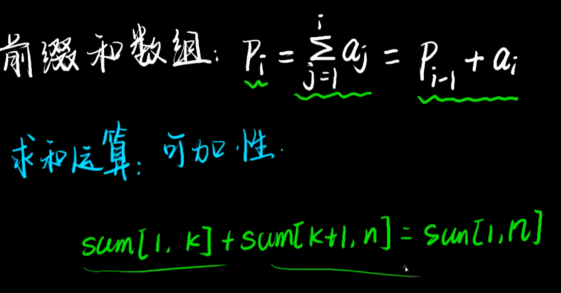


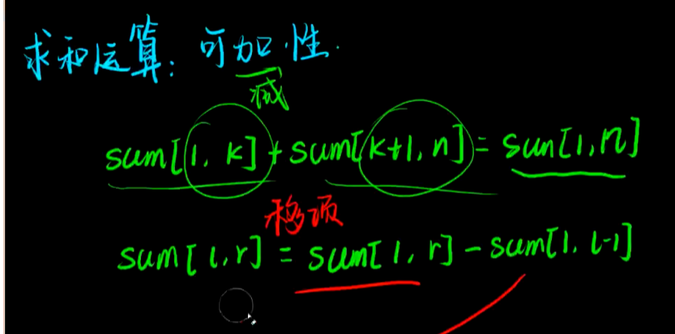


一维前缀和题目:https://www.starrycoding.com/problem/7


模板:
```cpp
#include <bits/stdc++.h>
using namespace std;
typedef long long ll;
int main(void)
{
    ios::sync_with_stdio(0);
    cin.tie(0);
    cout.tie(0);
    int t, n, q;
    cin >> t;
    while (t--)
    {
        vector<ll> arr(100010);
        vector<ll> sum(100010);
        cin >> n >> q;
        for (int i = 1; i <= n; i++)
        {
            cin >> arr[i];
        }
        sum[1] = arr[1];
        for (int i = 2; i <= n; i++)
        {
            sum[i] = sum[i - 1] + arr[i]; // 前缀和处理
        }
        int l = 0, r = 0;
        while (q--)
        {
            cin >> l >> r;
            ll res = sum[r] - sum[l - 1];
            cout << res << '\n';
        }
    }
    return 0;
}
```

**补充：二维前缀和**
二维前缀和思想和一维的一致，只不过我们需要二维数组来实现，并且初始化也会有所不同


二维前缀和题目:https://www.starrycoding.com/problem/15


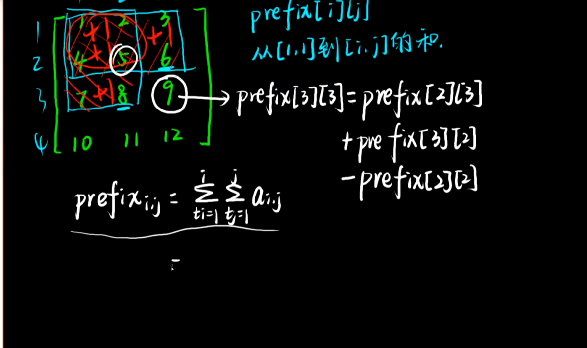


如图即为二维前缀和的初始化（少加了$a_{3,3}$），我们假设一个二维数组a，我们用二维数组b来表示a的二维前缀和，即

$$b_{3,3}=b_{2,3}+b_{3,2}-b_{2,2}+a_{3,3}$$

这涉及了一点**递归（递推）的思想**（可以自己从1，1开始推一下）

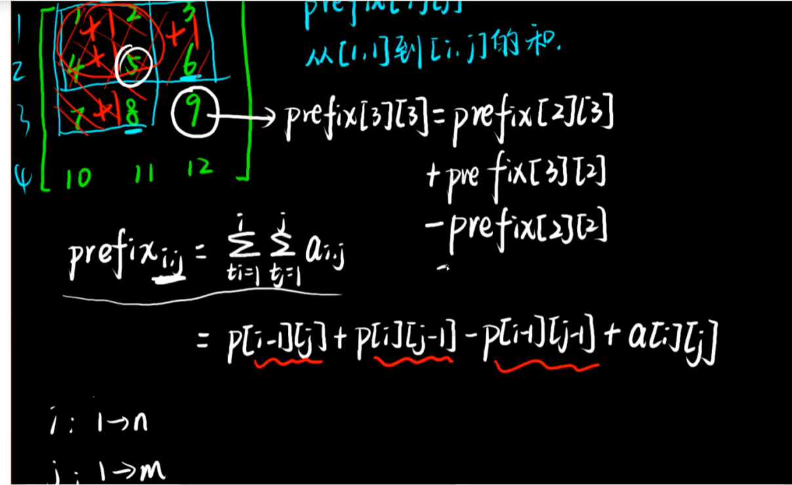


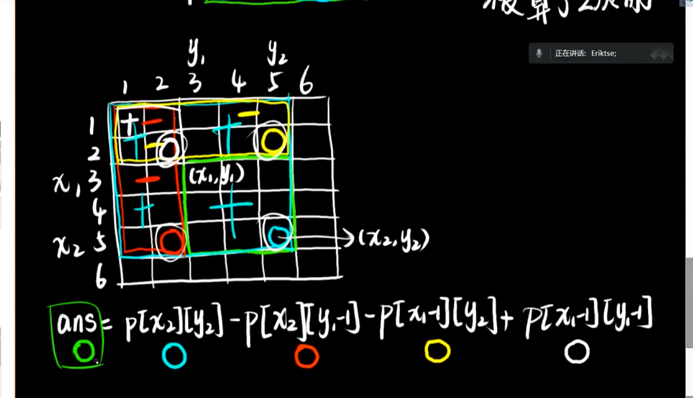

模板:
```cpp
#include <bits/stdc++.h>
using namespace std;
typedef long long ll;
const int N = 1200;
int g[N][N];
ll prefix[N][N];

int main(void)
{
    ios::sync_with_stdio(0);
    cin.tie(0);
    cout.tie(0);
    int n, m, q;
    cin >> n >> m >> q;
    for (int i = 1; i <= n; i++)
    {
        for (int j = 1; j <= m; j++)
        {
            cin >> g[i][j];
        }
    }
    for (int i = 1; i <= n; i++)
    {
        for (int j = 1; j <= m; j++)
        {
            prefix[i][j] = prefix[i - 1][j] + prefix[i][j - 1] - prefix[i - 1][j - 1] + g[i][j];
        }
    }
    int x_l, y_l, x_r, y_r;
    while (q--)
    {
        cin >> x_l >> y_l >> x_r >> y_r;
        ll res = 0;
        res = prefix[x_r][y_r] + prefix[x_l - 1][y_l - 1] - prefix[x_r][y_l - 1] - prefix[x_l - 1][y_r];
        cout << res << '\n';
    }
    return 0;
}
```

## 差分
差分的作用是在$O(n)$ (n为**修改**数值次数)的时间复杂度内，将$a$数组中$[l,r]$区间的所有数加上一个数$c$，而不需要每次都遍历一遍区间，这同样也是一种预处理从而增加效率的方式。
需要注意的是**通过差分实现区间修改，是一种静态维护**,也就是说我们只能在**修改完才能询问**，而无法**边修改边询问**。

假设我们有一个数组a，用数组b来表示a的差分，即

$$b_1=a_1,b_2=a_2-a_1,b_3=a_3-a_2....$$

这里我们可以发现一个规律，如果**得出b数组的前缀和**,那么就有


$$b_1+b_2+...b_i=a_1+a_2-a_1+...a_i-a_{i-1}$$
即


$$b_1+b_2+...b_i=a_i$$

我们由此得出差分的性质就是可以通过**差分的前缀和**来得到原数组的其中**一个元素**。
基于差分的这个性质，我们就可以用差分来实现**静态的区间修改**


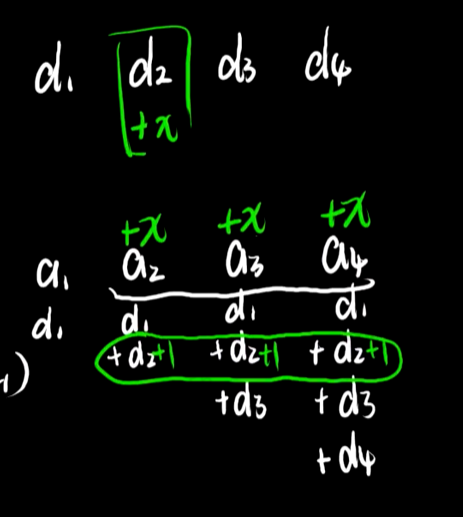

如果我们给差分数组d中的$d_2$加上一个数$x$,那么**用前缀和还原时**，就会发现**从$a_2$开始所有的数都加上了$x$**
那假如我们要给$[2,3]$区间加上一个数$x$呢？


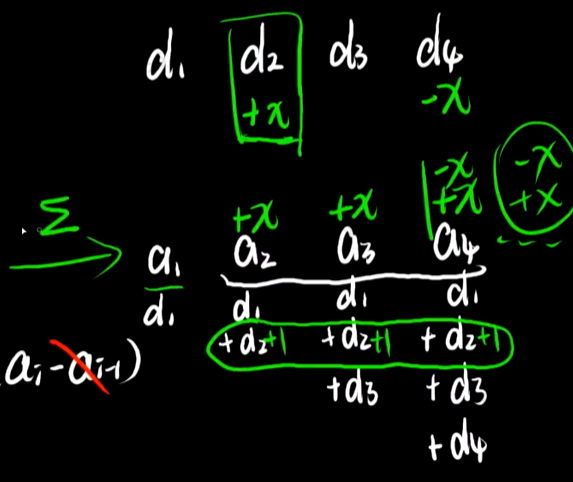

如图，只要在$d_2$加上$x$，在$d_4$减去$x$即可
由此，我们得出了**差分的区间修改**的公式
若想修改$[l,r]$区间的数，只需在**差分数组**上做如下操作
$$d_l+=x,d_{r+1}-=x$$

此时，我们再回过头看开头时我们是如何**表示差分的**,就可以发现其实他们也**遵循了这个修改区间的公式**,只不过他们的区间很小,是$[1,2]$,$[2,3]$,$[3,4]$...以此类推下去。
**注**:一维差分数组可以直接用$d_i=a_i-a_{i-1}$来表示，而二维差分数组我们一般用上面的**公式**来**初始化**


一般来说，差分题目在修改完**区间**后，就会询问**区间和**，所以还会需要再进行一次**前缀和**

一维差分题目:https://www.starrycoding.com/problem/8
模板:
```cpp
#include <bits/stdc++.h>
using namespace std;
typedef long long ll;
const int N = 1e5 + 9;
ll arr[N];
ll differ[N];
ll prefix[N];
int main()
{
    ios::sync_with_stdio(0);
    cin.tie(0);
    cout.tie(0);
    int n, p, q;
    ll x = 0, l = 0, r = 0;
    cin >> n >> p >> q;

    for (int i = 1; i <= n; i++)
    {
        cin >> arr[i];
    }
    for (int i = 1; i <= n; i++)
    {
        differ[i] = arr[i] - arr[i - 1]; // 差分处理
    }

    while (p--)
    {
        cin >> l >> r >> x;
        differ[l] += x;
        differ[r + 1] -= x; // 修改区间
    }

    for (int i = 1; i <= n; i++)
    {
        arr[i] = arr[i - 1] + differ[i]; // 通过差分还原数组，并且数据经过修改
    }
    for (int i = 1; i <= n; i++)
    {
        prefix[i] = prefix[i - 1] + arr[i]; // 前缀和
    }

    while (q--)
    {
        cin >> l >> r;
        ll res = 0;
        res = prefix[r] - prefix[l - 1];
        cout << res << '\n';
    }
    return 0;
}
```

**补充：二维差分**
二维差分的特点就如前面所说，我们**初始化**需要使用**公式**才会更有助于理解
二维差分题目:https://www.starrycoding.com/problem/50


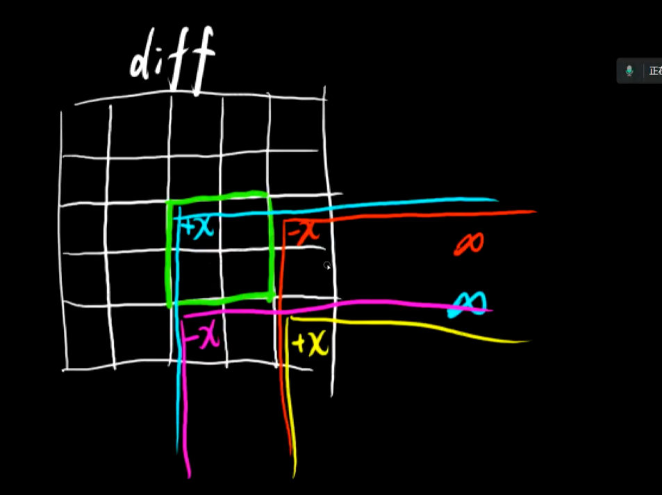
由图，我们先假设**我们已经初始化了一个二维差分数组**，图上这些**格子内部便是坐标点**,现在我们要给$[2,2]$到$[4,4]$区间加上一个数$x$
就应该把$d_{2,2}$加上$x$，$d_{4+1,2}-=x$,$d_{2,4+1}-=x$,$d_{4+1,4+1}+=x$

同理，我们**初始化也可以如此操作**

那么我们就可以得出二维差分的区间修改公式
假设我们修改的区间为$[x_1,y_1],[x_2,y_2]$
则有以下**公式**
$$d_{x_1,y_1}+=x,d_{x_2+1,y_1}-=x,d_{x_1,y_2+1}-=x,d_{x_2+1,y_2+1}+=x$$

模板:
```cpp
#include <bits/stdc++.h>
using namespace std;
const int N = 1100;
int arr[N][N];
int differ[N][N];
int prefix[N][N];

int main(void)
{
    ios::sync_with_stdio(0);
    cin.tie(0);
    cout.tie(0);
    int n, m, q;
    cin >> n >> m >> q;
    for (int i = 1; i <= n; i++)
    {
        for (int j = 1; j <= m; j++)
        {
            cin >> arr[i][j];
        }
    }
    for (int i = 1; i <= n; i++)
    {
        for (int j = 1; j <= m; j++)
        {
            differ[i][j] += arr[i][j];     // 这里差分初始化用的原理和下面一样
            differ[i + 1][j] -= arr[i][j]; // 和下面不一样的是因为就只要一个格子变，所以左上右下的坐标都是(i,j)
            differ[i][j + 1] -= arr[i][j];
            differ[i + 1][j + 1] += arr[i][j];
        }
    }
    int a, b, c, d, v;
    while (q--)
    {
        cin >> a >> b >> c >> d >> v;
        differ[a][b] += v;
        differ[a][d + 1] -= v;
        differ[c + 1][b] -= v;
        differ[c + 1][d + 1] += v;
    }
    for (int i = 1; i <= n; i++)
    {
        for (int j = 1; j <= m; j++)
        {
            arr[i][j] = arr[i - 1][j] + arr[i][j - 1] - arr[i - 1][j - 1] + differ[i][j];
        }
    }

    for (int i = 1; i <= n; i++)
    {
        for (int j = 1; j <= m; j++)
        {
            cout << arr[i][j] << " ";
        }
        cout << '\n';
    }

    return 0;
}
```


## 好题解析
**涉及**:?运算符的应用,最大子段和

题目[p35.鼠鼠我鸭](https://www.starrycoding.com/problem/35)

分析：题目将重量分为两种类型，一种可以算进答案，一种不行，并且，我们可以使用一次操作来**变更一段区间$[l,r]$的类型**，我们可以用一个**bool数组**来记录，0代表不行，1代表可以,既然要求最大值，那么我们可以先把**未改变时的答案**求出来,接着再求**更改时的增加量**。

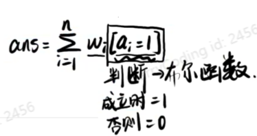

如图，想要实现这个功能可以运用？运算符(不过此题也可以直接乘以bool数组来实现)


接着，观察题目不难发现，**更改后的答案绝对是要>=未改变时的答案**的，所以我们只需要**比较更改后的增加量**和**0**的大小即可。
此时要求出这个增加量，我们可以先初始化一个**全变更的数组（偏移量数组）**，接着在这个数组中**求出最大子段和**即可。


这里有**两种求最大子段和的方法**:
1. 前缀和求法


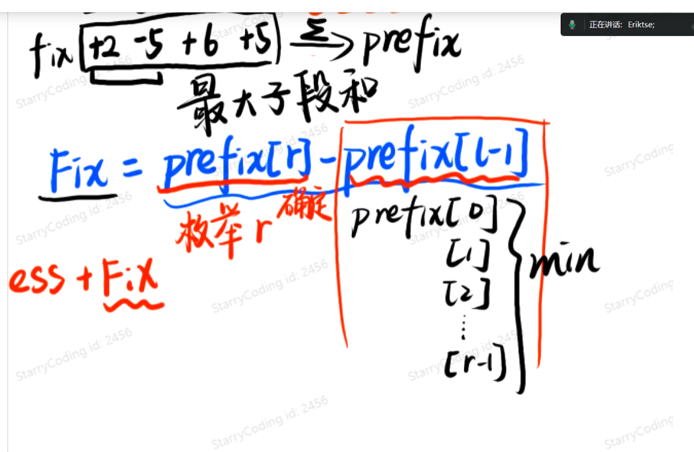

我们将偏移量数组求前缀和，然后用$prefix_r-prefix_{l-1}$来求出最大子段和（要使***fix***最大，就要使$prefix_{l-1}$在区间$[0,r-1]$为**确定的最小值**,然后再枚举$prefix_r$即可）

```cpp
ll minn = 0;
// minn默认为0是因为prefix[]中的元素从1开始，而我们要找prefix[l-1]的最小值是可以超出下标的，
// 所以绝对会找到prefix[0]，则minn可以取0
for (int i = 1; i <= n; i++)
    {
        prefix[i] = prefix[i - 1] + a[i] * (w[i] ? -1 : 1);
    }
ll fix = 0;
for (int i = 1; i <= n; i++) // 求偏移量的最大字段和方法(使用前缀和)
    {
        fix = max(fix, prefix[i] - minn);
        minn = min(minn, prefix[i]);
    }
```


2. 贪心求法

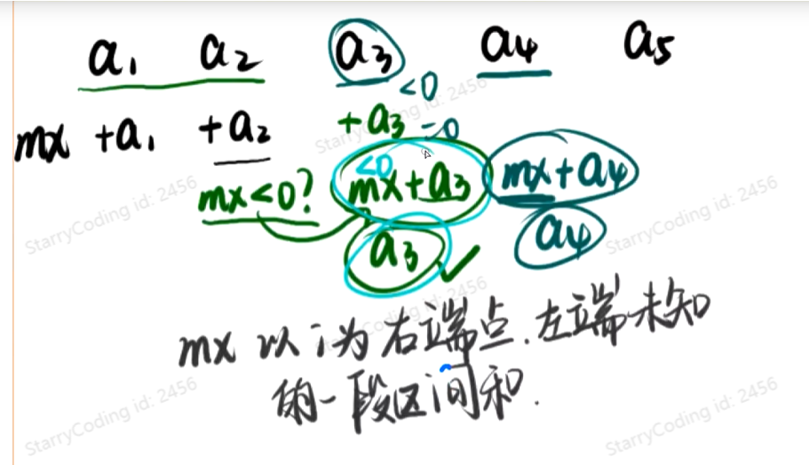


如果mx<0,则将其重置为0,然后再加上a[i]即可,最后再用mx更新答案即可。
思想：**如果当前的字段和为负数，那么下一次加数字时，我们选择重置为0再加绝对会比直接加的数字大**
```cpp
ll mx = 0;
for (int i = 1; i <= n; i++)
{
    mx = max(0ll, mx + a[i] * (w[i] ? -1 : 1));
}
```


题目答案:
```cpp
#include <bits/stdc++.h>
using namespace std;
typedef long long ll;
const int N = 1e5 + 9;
ll a[N];
bool w[N];
ll prefix[N];
int n;
int main(void)
{
    ios::sync_with_stdio(0), cin.tie(0), cout.tie(0);
    int t;
    cin >> t;
    while (t--)
    {
        cin >> n;
        for (int i = 1; i <= n; i++)
        {
            cin >> w[i];
        }
        for (int i = 1; i <= n; i++)
        {
            cin >> a[i];
        }
        ll sum = 0;
        ll ess = 0;
        ll minn = 0; // minn默认为0是因为prefix[]中的元素从1开始，而我们要找prefix[l-1]的最小值是可以超出下标的，
                     // 所以绝对会找到prefix[0]，则minn可以取0
        for (int i = 1; i <= n; i++)
        {
            ess += a[i] * w[i];
        }
        for (int i = 1; i <= n; i++)
        {
            prefix[i] = prefix[i - 1] + a[i] * (w[i] ? -1 : 1);
        }
        ll fix = 0;
        for (int i = 1; i <= n; i++) // 求偏移量的最大字段和方法(使用前缀和)
        {
            fix = max(fix, prefix[i] - minn);
            minn = min(minn, prefix[i]);
        }
        ll ans = ess + fix;
        cout << ans << '\n';
    }
}

```