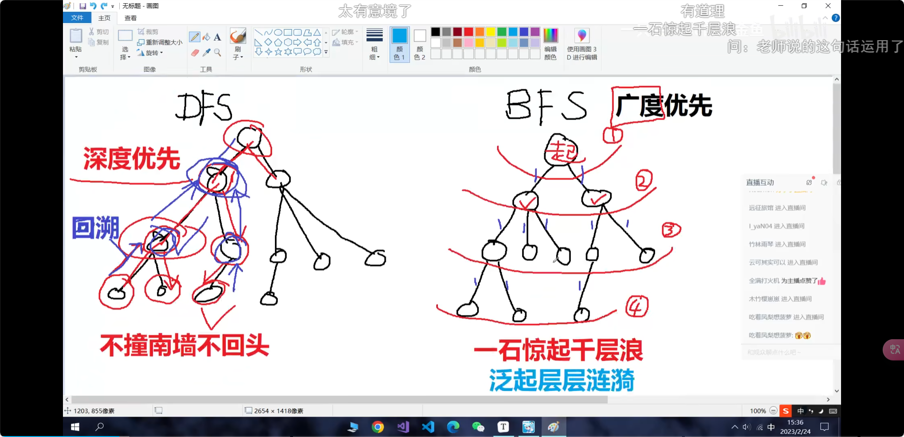

# 搜索专题
搜索算法，包括深度优先搜索和广度优先搜索，从起点开始，逐渐扩大寻找范围，直到找到需要的答案为止。

严格来说，搜索算法也算是一种暴力枚举策略，但是其算法特性决定了效率比直接的枚举所有答案要高，因为搜索可以跳过一些无效状态，降低问题规模。在算法竞赛中，如果选手无法找到一种高效求解的方法（比如贪心、递推、动态规划、公式推导等），使用搜索也可以解决一些规模较小的情况；而有的任务就是必须使用搜索来完成，因此这是相当重要的策略。


学习视频链接:[DFS正确入门方式 | DFS + 递归与递推习题课(上) | 一节课教你爆搜!](https://www.bilibili.com/video/BV1N24y1W7q4/)
***

## 深度优先搜索
### 深度优先搜索的特性：
- 搜索过程中会沿着一条路径一直走到底，直到不能走为止，然后退回到上一个节点，继续搜索。
- 搜索使用到的数据结构是栈，可以使用递归实现，草稿时可以画出一个树状结构来辅助理解。
- 根据树状结构图，我们可以得出搜索的两个基本点，一个是位置有多少，一个是每个位置上有多少中选择
- 空间复杂度大概就是o(h),h为树高

### 深度优先搜索具有三种基本形式：
#### 指数级枚举
- 对于一个位置，有若干种选择，他能选择其中的任何一种，接着下一个位置同样能选择其中的任何一种，不会因为已选择位置的增加而使方案选择变少，若有n个位置，每个位置有m种选择，则总方案数为m^n。时间复杂度大概就是o（m^n）。
- 题型
  1. 迷宫问题和洪水填充模型，但这类问题得数据量很小才能用dfs，更好的方法是用bfs。
  2. 一些简单的指数级枚举递归题目，比如[P2036 PERKET][PERKET]|[P2089 烤鸡][烤鸡]
- 指数级枚举的代码模板
```cpp
void dfs(int x)//x表示当前位置,一般从1开始
{
    if(x>n) //n代表位置的总数
    {
        //根据题目做一些操作
        return;
    }
    for(int i=1;i<=m;i++)//m代表每个位置能选择m种方案
    {
        arr[x]=1; //一般会开个数组代表当前位置的选择,1代表选择，0代表未考虑
        dfs(x+1);
        arr[x]=0; //代表恢复
    }
    //如果题目只有两种选择，选或者不选，也可以不用for
    //选
    arr[x]=1;
    dfs(x+1);
    arr[x]=0;
    //不选
    arr[x]=2;
    dfs(x+1);
    arr[x]=0;
}
```
以P2036 PERKET为例:
```cpp
#include <bits/stdc++.h>
using namespace std;
struct pos
{
    int bitter;
    int sour;
};
struct pos a[20];
int st[20];
int n;
int minn = 1e9;
void dfs(int x);
int main(void)
{
    cin >> n;
    for (int i = 1; i <= n; i++)
    {
        cin >> a[i].sour >> a[i].bitter;
    }
    dfs(1);
    cout << minn << "\n";
    return 0;
}
void dfs(int x)
{
    if (x > n)
    {
        bool flag = false;
        int sum = 0;
        int mut = 1;
        for (int i = 1; i <= n; i++)
        {
            if (st[i] == 1)
            {
                sum += a[i].bitter;
                mut *= a[i].sour;
                flag = true;
            }
        }
        if (flag)
        {
            minn = min(minn, abs(sum - mut));
        }
        return;
    }
    st[x] = 1; // 1代表选，2代表不选,0代表未考虑
    dfs(x + 1);//这一题只有两种选择，所以直接这样
    st[x] = 0;

    st[x] = 2;
    dfs(x + 1);
    st[x] = 0;
}
```
#### 排列型枚举
- 对于一个位置，有若干种方案选择，他选择了一种，接着下一个位置就只能选择剩下的方案，方案因此逐次递减
- 题型
  1. N皇后问题（简单的版本是棋盘问题）

分析：

1.将行视为位置，列视为选择，画出递归树

2.使用排列枚举方式进行枚举，能够实现每行每列只放一个棋子

3.使用一个一维数组来记录对于列的选择情况

棋盘问题[acwing1114 棋盘问题][棋盘问题]的代码模板：
```cpp
#include <bits/stdc++.h>
using namespace std;
const int N = 15;
char g[N][N];
bool st[N];  // 记录已经选过的列
int n, m;    // n为几阶方阵，m为棋数目
int res = 0; // 记录方案数

void dfs(int x, int cnt); // x代表第几行，从第一行开始，每个位置有n种选择，并且是排列枚举，
// 根据st数组来判断这一列（即选择）是否已经被选过,cnt代表已经选了几个棋子

int main(void)
{
    while (scanf("%d%d", &n, &m) != EOF)
    {
        if (n == -1 && m == -1)
        {
            break;
        }
        cin.ignore();
        for (int i = 0; i < n; i++)
        {
            scanf("%s", g[i]);
        }
        res = 0;
        dfs(0, 0);
        cout << res << "\n";
    }
    return 0;
}

void dfs(int x, int cnt)
{
    if (cnt == m)
    {
        res++;
        return;
    }
    if (x > n - 1)
    {
        return;
    }
    for (int i = 0; i < n; i++)
    {
        if (!st[i] && g[x][i] == '#')
        {
            st[i] = true;
            dfs(x + 1, cnt + 1);
            st[i] = false;
        }
    }
    dfs(x + 1, cnt); // 表示这行我们不放棋子，直接进入下一行
}
```

八皇后问题：

**题面**：

会下国际象棋的人都很清楚：皇后可以在横、竖、斜线上不限步数地吃掉其他棋子。如何将8个皇后放在棋盘上（有8 × 8个方格），使它们谁也不能被吃掉！这就是著名的八皇后问题。

对于某个满足要求的8皇后的摆放方法，定义一个皇后串a与之对应,a有8个数字，第i个数表示第i行的皇后所处的位数。已经知道8皇后问题一共有92组解。

现给出一个数b，要求输出第b个合法的八皇后串。串的排序按照字典序从小到大.
```cpp
#include <bits/stdc++.h>
using namespace std;
const int N = 105;
bool col[N];     // 存储列状态
bool ls[N];      // 存储左对角线状态
bool rs[N];      // 存储右对角线状态，由于右对角线可能有负数，所以整体平移
int arr[N];      // 记录每行选了哪一列
int ans[100][N]; // 记录答案
void dfs(int x); // x代表当前到第几行
int cnt = 1;
int main(void)
{
    int k, b;
    cin >> k;
    dfs(1);
    while (k--)
    {
        cin >> b;
        for (int i = 1; i <= 8; i++)
        {
            cout << ans[b][i];
        }
        cout << "\n";
    }
    return 0;
}

void dfs(int x)
{
    if (x > 8)
    {
        for (int i = 1; i <= 8; i++)
        {
            ans[cnt][i] = arr[i];
        }
        cnt++;
        return;
    }

    for (int i = 1; i <= 8; i++)
    {
        if (!col[i] && !ls[i + x] && !rs[i - x + 8])
        {
            col[i] = true;
            ls[i + x] = true;
            rs[i - x + 8] = true;
            arr[x] = i;
            dfs(x + 1);
            col[i] = false;
            ls[i + x] = false;
            rs[i - x + 8] = false;
            arr[x] = 0;
        }
    }
}
```
**分析**：
1. 为何不用**二维数组**记录斜对角线？因为二维数组记录更适用于不会有**回溯记录**的情况，这题由于dfs会回溯很多次，所以用二维数组会大幅度增加**时间复杂度**，所以我们使用**一维数组**来记录。
2. rs数组记录右对角线时，因为右对角线可能有负数，所以整体平移，使得右对角线的范围为>=1
3. 如何表示**左斜角线**和**右斜角线**？假设皇后在（2、4），对于（1，3）、（3，5）、（4、6）这些在右斜线上的点，都有**y-x=定值**，同理，左斜线为**x+y=定值**。于是，就可以得出
> 左斜角线：ls[i+j]=1;
> 
> 右斜角线：rs[i-j+n]=1; n即为行数，此处为8

- 排列型枚举的代码模板
```cpp
int st[N]; //N代表位置的总数所能填写的最大值
void dfs(int x)// x代表当前位置，一般从1开始
{
    if(x>n)
    {
        //根据题目做一些操作
        return;
    }
    for(int i=1;i<=m;i++)//m代表每个位置能选择m种方案
    {
        if(!st[i])
        {
            st[i]=1;
            arr[x]=1;
            dfs(x+1);
            arr[x]=0; //恢复
            st[i]=0;
        }
    }
}
```
#### 组合型枚举
- 对于一个位置，有若干种方案选择，他选择了一种，接着下一个位置能选择的方案必须大于上一个位置选择的方案，这里的大于是指字典序，所以这类题会与数字和字母有关
- 例题[P1025][数的划分]
- 代码模板（以P1025为例）
```cpp
#include <bits/stdc++.h>
using namespace std;
// 组合枚举
void dfs(int x, int start, int sum); // x代表从位置几开始枚举，start代表枚举数字的起点
int n, k;
int res = 0;
int main(void)
{
    cin >> n >> k;
    dfs(1, 1, 0);
    cout << res << "\n";
    return 0;
}
void dfs(int x, int start, int sum)
{
    if (x > k)
    {
        if (sum == n)
        {
            res++;
        }
        return;
    }
    for (int i = start; sum + (k - x + 1) * i <= n; i++)
    {
        dfs(x + 1, i, sum + i);
    }
}
/*注意，这题如果不进行剪枝操作，会TLE，sum+(k-x+1)*i<=n是剪枝操作
这说的是，如果当前的和加上剩下的数大于n
那么就没有必要继续枚举了
因为我们的位置是要全选完的
所以这种情况绝对最后数会大于n，直接剪枝*/
```

```cpp
void dfs(int x,int start)//x代表从位置几开始枚举，start代表枚举数字的起点
{
    if(x>n)
    {
        //根据题目做一些操作
        return;
    }
    for(int i=start;i<=m;i++)//m代表每个位置能选择m种方案
    {
        arr[x]=i;
        dfs(x+1,i+1); /*如果是要求下一个选的数大于等于上一个选的数
        那么可以dfs（x+1，i）*/
        arr[x]=0; //恢复
    }
}
```
***

## 广度优先搜索
### 广度优先搜索的特性：
- 用于**图的查找**算法（要求能用**图表示出问题的关联性**）
- BFS可以用于解决两类问题：
  1. 从A出发是否存在到达B的路径 DFS也可求
  2. 从A出发到达B的**最短**路径 DFS如果数据少也可以考虑
- BFS是一种用**空间换时间**的算法，空间复杂度大概为o（2^h），h代表树的高度，2为每次分出来的支数，以二叉树为例
- BFS使用的数据结构是**队列**，可以使用STL中的queue来实现
- 画出一个树状结构图，每一层都会有若干个节点，每个节点又会有若干个分支，bfs的思路就是从根节点（或者其他节点）开始，访问先访问其直接相连的子节点，若子节点不符合，再访问其子节点的子节点，按级别顺序（一层一层）依次访问，直到访问到目标节点
  1. 起始：将起点（源点，树的根节点）放入队列中
  2. 扩散：从队列中取出队头的结点，将它的相邻结点放入队列，不断重复这一步
  3. 终止：当队列为空时，说明我们遍历了所有的结点，整个图都被搜索了一遍
- 这种搜索方法，形象点说就像一个**水波纹**，从源点开始，**一层一层的扩散**，直到扩散到终点
- 通过**队列**实现广度优先搜索，那么队列就具有**二段性[^3]**，以及**单调性[^4]**
- 对于所有**边长度相同**的情况，比如地图的模型，bfs第一次遇到目标点，此时就一定是从根节点到目标节点的最短路径（因为每一次所有点都是向外扩张一步，你先遇到，一定就最短）。但是，如果是**加权边**[^1]的话就会出问题了，bfs传回的是经过**边数**最少的解，但是因为加权了，这个解到根节点的距离不一定是最短的。比如1000+1000是只有两段，1+1+1+1有4段，由于**BFS返回的是经过边数最少的解**，所以会返回1000+1000的解，此时我们要采用**dijkstra最短路算法**[^2]解决**加权路径的最短路**问题。

### 题型
1. 迷宫问题
2. 多元BFS
3. 染色问题
4. flood fill 找**连通块**
5. 有**外界干扰**的迷宫问题
6. 双向广搜
7. 状态压缩
8. 双端队列广搜


### 例题：
#### 迷宫问题
**例题acwing844**.走迷宫是经典模板题，然而要钱，所以题目平替用[P1746][离开中山路]

因为都是一个思想，所以我们贴上acwing844的代码

```cpp
#include <bits/stdc++.h>
using namespace std;
typedef pair<int, int> PII;
#define x first
#define y second
const int N = 110;
int g[N][N];
int n, m;
int dis[N][N]; // 存储每个点到起点的距离
int dx[] = {-1, 0, 1, 0};
int dy[] = {0, 1, 0, -1}; // 向量数组，四个方向 上右下左
queue<PII> q;             // 存坐标
int bfs(int x1, int y1);
int main(void)
{
    cin >> n >> m;
    for (int i = 1; i <= n; i++)
    {
        for (int j = 1; j <= m; j++)
        {
            cin >> g[i][j];
        }
    }
    int res = bfs(1, 1);
    cout << res << "\n";
    return 0;
}
int bfs(int x1, int y1)
{                                
    // 使用队列模拟广度优先搜索,从起点开始
    memset(dis, -1, sizeof(dis)); // 初始化为-1，-1代表与起点不连通，即是1的位置
    q.push({x1, y1});
    dis[x1][y1] = 0; // 起始点为0
    while (q.size())
    {
        PII t = q.front(); // 取出队头
        q.pop();           // 弹出
        for (int i = 0; i < 4; i++)
        {
            int a = t.x + dx[i]; // 上右下左
            int b = t.y + dy[i];
            if (a < 1 || a > n || b < 1 || b > m) // 越界
                continue;
            if (g[a][b] != 0)
                continue;
            if (dis[a][b] > 0)
                continue;
            q.push({a, b}); 
        /* 入队，根据上右下左，满足的条件的进去
        然后以上右下左的顺序出队
        假设入队了一个右的，一个下的，
        右的先出队就把右的下一个能入队的入队，然后下的再出队
        这样就保证了广度优先而不是深度优先,
        即一层一层的出队，而不是一条路走到黑*/
            dis[a][b] = dis[t.x][t.y] + 1; 
            // 保证了距离是前一个能走的点的距离+1
            if (a == n && b == m)
                return dis[n][m];
        }
    }
    return dis[n][m];
}
```
代码分析、一些常用的习惯：
1. 向量数组，如果我们要遍历四个方向，我们可以使用向量数组来遍历，这样可以减少代码量并且简洁，假如有斜上方向就是八个了，一般来说以上右下左的方式看，并且我们规定x指向下方，y指向右方（数学中的坐标系顺时针转90°）
2. #define pair<int,int> PII ，这样就可以使用PII来代替pair<int,int>，可以简洁一些
3. memset，用于初始化数组，第一个参数是数组名，第二个参数是要赋的值，第三个参数是要赋的值的类型，系统用字节数量来判断，所以用sizeof（）
4. 队列实现bfs，为何用队列？**正如以上所说，我们需要一层层去遍历到所有结点，那么相邻结点的访问顺序如何确定呢？因此我们就需要一个数据结构去存储和操作，需要使先遍历到的结点先被存储，直到当前层都被存储之后，按照存储的先后顺序，先被存储的结点也会被先取出来，继续遍历他的子节点-->综上所述，需要一种特点为先进先出的数据结构，也就是队列**

**例题**:[P1443 马的遍历](https://www.luogu.com.cn/problem/P1443)

**题目分析**：

这一题与普通迷宫问题不同的是**方向向量数组要变化**，总共有八种方向选择，并且，这一题如果**用STL会有样例过不了**，**如果确定思路没错，实现代码正确，但是会超时的话，我们就要自己手写队列。**
```cpp
#include <bits/stdc++.h>
using namespace std;
typedef pair<int, int> PII;
const int N = 450;
int dis[N][N];
int n, m, x, y;
int tt = 0, hh = 0;
int dx[] = {-2, -1, 1, 2, 2, 1, -1, -2};
int dy[] = {1, 2, 2, 1, -1, -2, -2, -1};
PII q[N * N];
void bfs(int x1, int y1);
int main(void)
{
    cin >> n >> m >> x >> y;
    bfs(x, y);
    for (int i = 1; i <= n; i++)
    {
        for (int j = 1; j <= m; j++)
        {
            cout << dis[i][j] << " ";
        }
        cout << "\n";
    }
    return 0;
}
void bfs(int x1, int y1)
{
    memset(dis, -1, sizeof(dis));
    q[0] = {x1, y1};
    dis[x1][y1] = 0;
    while (hh <= tt)
    {
        PII t = q[hh++];
        for (int i = 0; i < 8; i++)
        {
            int a = t.first + dx[i];
            int b = t.second + dy[i];
            if (a < 1 || a > n || b < 1 || b > m)
                continue;
            if (dis[a][b] >= 0)
                continue;
            dis[a][b] = dis[t.first][t.second] + 1;
            q[++tt] = {a, b};
        }
    }
}
```
**手写队列的要点**：
1. 队列的初始化：tt=-1，hh=0 **tt即队尾，hh为队头，题目tt=0是因为我们已经初始化进去一个坐标了，队列里本来就有一个**
2. 入队：q[++tt]={a,b}
3. 出队：auto t=q[hh++];
4. 判空：while(hh<=tt)  **若是hh>tt就说明队列为空**


#### 多元BFS

**例题**：[p1332血色先锋队](https://www.luogu.com.cn/problem/P1332)

**题目分析**：

题目中瘟疫源，即**bfs的起点**有好几个，此时就要想到，bfs的思想是**一层一层的遍历**，把起点也算**一层**，那么我们就需要把所有的起点都入队，自然就能实现多元bfs。
```cpp
#include <bits/stdc++.h>
using namespace std;
typedef pair<int, int> PII;
const int N = 550;
queue<PII> q;
int dis[N][N];
int n, m, a, b, c, d;
int dx[] = {-1, 0, 1, 0};
int dy[] = {0, 1, 0, -1};

void bfs(void);

int main(void)
{
    memset(dis, -1, sizeof(dis));
    cin >> n >> m >> a >> b;
    for (int i = 0; i < a; i++)
    {
        int x1, y1;
        scanf("%d%d", &x1, &y1);
        q.push({x1, y1});
        dis[x1][y1] = 0;
    }
    bfs();
    for (int i = 1; i <= b; i++)
    {
        scanf("%d%d", &c, &d);
        printf("%d\n", dis[c][d]);
    }
    return 0;
}

void bfs(void)
{
    while (q.size())
    {
        PII t = q.front();
        q.pop();
        for (int i = 0; i < 4; i++)
        {
            int x = t.first + dx[i];
            int y = t.second + dy[i];
            if (x < 1 || x > n || y < 1 || y > m)
                continue;
            if (dis[x][y] >= 0) /*不需要额外条件判断
            画个图就能发现不会出现一个格子上第一次的距离会比第二次
            的距离大的情况。第一次标记得到的距离一定会是最小
            */
            {
                continue;
            }
            dis[x][y] = dis[t.first][t.second] + 1;
            q.push({x, y});
        }
    }
}
```
#### 染色问题

**例题**: [P1162 填涂颜色](https://www.luogu.com.cn/problem/P1162)

**题目分析**：

此题要把1围成的一个圈内的0都变为2，那么如何判定圈内0和圈外0呢？我们可以用一个**二维状态数组**，首先用**bfs**把圈外的0都标记为true，然后在主函数中遍历一遍地图，把为0并且状态数组为false的换为2即可。**但是，这类问题要注意边界问题**，**我们一般起点以（1，1）开始，但是若是坐标（1，1）的点就是1，就不对了。并且，也有可能会出现最上面一些0，中间是一块1圈，最下面还有0，这种情况普通bfs也够不到那些下面的0。**

因此，我们可以把地图**扩大一圈**，假设地图边界为**1--n**，那我们就可以搜索**0--n+1**，这样就保证了可以把所有圈外的0标记为true，之后输出的时候再用**1-n**输出即可。

```cpp
#include <bits/stdc++.h>
using namespace std;
typedef pair<int, int> PII;
const int N = 40;
int g[N][N];
int dx[] = {-1, 0, 1, 0};
int dy[] = {0, 1, 0, -1};
queue<PII> q;
bool st[N][N];

void bfs(int x1, int y1);
int n;
int main(void)
{
    scanf("%d", &n);
    for (int i = 1; i <= n; i++)
    {
        for (int j = 1; j <= n; j++)
        {
            scanf("%d", &g[i][j]);
        }
    }
    bfs(0, 0);
    for (int i = 1; i <= n; i++)
    {
        for (int j = 1; j <= n; j++)
        {
            if (g[i][j] == 0 && st[i][j] == false)
            {
                g[i][j] = 2;
            }
        }
    }
    for (int i = 1; i <= n; i++)
    {
        for (int j = 1; j <= n; j++)
        {
            printf("%d ", g[i][j]);
        }
        printf("\n");
    }
    return 0;
}

void bfs(int x1, int y1)
{
    q.push({x1, y1});
    st[x1][y1] = true;
    while (q.size())
    {
        PII t = q.front();
        q.pop();
        for (int i = 0; i < 4; i++)
        {
            int a = t.first + dx[i];
            int b = t.second + dy[i];
            if (a < 0 || a > n + 1 || b < 0 || b > n + 1)
                continue;
            if (g[a][b] == 1)
                continue;
            if (st[a][b] == true)
                continue;
            st[a][b] = true;
            q.push({a, b});
        }
    }
}
```
#### flood fill 连通块问题

**例题**:[P1451求细胞数量](https://www.luogu.com.cn/problem/P1451)

**题目分析**:

这一题要找非0数字的**联通块**数，所谓联通块，就是指**图中一块都是相同类型的点**，本题中**连通块的定义为沿连通块数字上下左右若还是连通块数字则为同一连通块**,那么我们确定了方向向量是**四个方向**（有时会是8个方向）,要确定一个连通块，我们就可以分两个步骤，第一步是**找到一个连通块的起始点**，第二步是**从这个起始点开始bfs把所有符合条件的点标记为true**，然后**连通块数++**。如此循环直到所有符合条件点被标记为true，循环结束。**标记为true是为了第一步找到的起始点还在以及搜过的连通块中**。
```cpp
#include <bits/stdc++.h>
using namespace std;
const int N = 110;
typedef pair<int, int> PII;
char g[N][N];
bool st[N][N];
queue<PII> q;
int dx[] = {-1, 0, 1, 0};
int dy[] = {0, 1, 0, -1};
int n, m;
int res = 0;
void bfs(int x1, int y1);
int main(void)
{
    scanf("%d%d", &n, &m);
    while (getchar() != '\n')
    {
        continue;
    }
    for (int i = 1; i <= n; i++)
    {
        scanf("%s", g[i] + 1);
    }
    for (int i = 1; i <= n; i++)
    {
        for (int j = 1; j <= m; j++)
        {
            if (g[i][j] != '0' && st[i][j] == false)
            {
                bfs(i, j);
                res++;
            }
        }
    }
    printf("%d\n", res);
    return 0;
}

void bfs(int x1, int y1)
{
    q.push({x1, y1});
    st[x1][y1] = true;
    while (q.size())
    {
        PII t = q.front();
        q.pop();
        for (int i = 0; i < 4; i++)
        {
            int a = t.first + dx[i];
            int b = t.second + dy[i];
            if (a < 1 || a > n || b < 1 || b > m)
            {
                continue;
            }
            if (g[a][b] == '0')
            {
                continue;
            }
            if (st[a][b] == true)
            {
                continue;
            }
            q.push({a, b});
            st[a][b] = true;
        }
    }
}
```
**小技巧**：若要从g[1][1]开始输入字符串，可以用g[i]+1。

#### 有外界干扰的迷宫问题

**例题**:[P2895 Meteor Shower S](https://www.luogu.com.cn/problem/P2895) 天降陨石

**题目分析**:

这一题是一道迷宫问题，求出起点到终点的最短路径，**但在不同时间段会有陨石干扰，即到达某点的时间不能超过陨石到达的时间**。

那么，我们就能分析出什么点是能走的：

**1.该点始终都没有被陨石砸到**

**2.该点未被走过**

**3.贝蒂走到该点的时间小于陨石砸到该点的时间**

那么，我们可以开两个二维数组，一个**预处理记录所有陨石砸到某点的时间**，一个**在bfs用于记录贝蒂走到某点的时间**

最短时间在哪找到？**这个点始终不会被陨石砸到**，只要找到第一个这个点就是最短时间了

并且，这一题要关注到**陨石砸下的位置是可能重复的**，所以我们要取**所有陨石砸下的时间的最小值**

```cpp
#include <bits/stdc++.h>
using namespace std;
typedef pair<int, int> PII;
queue<PII> qt;
const int N = 350;
int g[N][N];   // 记录了陨石砸在地图上的坐标以及时间点,0代表没被砸到,大于0代表被砸到的时间点
int tim[N][N]; // 记录了每个点到起点需要的时间
// 如何判断一个点是否可以走，dis[x][y]>=g[x][y] 说明不能走
int dx[] = {-1, 0, 1, 0};
int dy[] = {0, 1, 0, -1};
int m;
int bfs(int x1, int y1);
int main(void)
{
    scanf("%d", &m);
    memset(g, 0x3f, sizeof(g));
    for (int i = 1; i <= m; i++)
    {
        int a, b, c;
        scanf("%d%d%d", &a, &b, &c);
        g[a][b] = min(g[a][b], c);
        for (int j = 0; j < 4; j++)
        {
            int p = a + dx[j];
            int q = b + dy[j];
            if (p < 0 || p > 301 || q < 0 || q > 301)
            {
                continue;
            }
            g[p][q] = min(g[p][q], c);
        }
    }
    int res = bfs(0, 0);
    printf("%d\n", res);
    return 0;
}

int bfs(int x1, int y1)
{
    qt.push({x1, y1});
    tim[x1][y1] = 0;
    while (qt.size())
    {
        PII t = qt.front();
        qt.pop();
        for (int i = 0; i < 4; i++)
        {
            int a = t.first + dx[i];
            int b = t.second + dy[i];
            if (a < 0 || b < 0)
            {
                continue;
            }
            if (tim[a][b])
            {
                continue;
            }
            if (tim[t.first][t.second] + 1 >= g[a][b])
            {
                continue;
            }
            tim[a][b] = tim[t.first][t.second] + 1;
            qt.push({a, b});
            if (g[a][b] > 1e9)
            {
                return tim[a][b];
            }
        }
    }
    return -1;
}
```
**小技巧**：memset(数组名，0x3f,sizeof(数组名))，可以把数组初始化为无穷大，因为memset是按字节赋值的.
4个字节均为0x3f时，0x3f3f3f3f的十进制是1061109567，也就是10^ 9级别的（和0x7fffffff一个数量级），而一般场合下的数据都是小于10^9的，所以它可以作为无穷大使用而不致出现数据大于无穷大的情形。（如果数据远大于1e9就不行了） 
> void memset(void *s, int ch, size_t n);
> 
> 函数解释：
> 
> 将s中前n个字节 （typedef unsigned int size_t ）用 ch  
> 
> 替换并返回 s 。 其实这里面的ch就是ascii为ch的字符；
> 
> 将s所指向的某一块内存中的前n个 字节的内容全部设置为ch指定的ASCII值

#### 双向广搜（满足条件可以使用的优化）
与普通的BFS不同，双向BFS维护的**队列中分别有起点搜索出的点和终点搜索出的点**，两个点的搜索交替进行。同时，用**数组**或是**哈希表**记录当前的搜索情况，给从两个方向拓展的节点以**不同的标记**。当某点被**两种标记**同时标记时，搜索结束

**使用条件**：当起点和终点状态**已知**，则可以使用

**优点**：可以**减少时间**

**缺点**：必须确定**起点和终点**，在对状态进行标记时往往涉及状态的**压缩**

**例题**:[P1746离开中山路][离开中山路] 

运用**数组**的双向广搜

```cpp
#include <bits/stdc++.h> //双向广搜优化
using namespace std;
const int N = 1100;
typedef pair<int, int> PII;
int n;
char g[N][N];
int dist[N][N];
int vis[N][N];
queue<PII> qt;
int a, b, c, d;
int dx[] = {-1, 0, 1, 0};
int dy[] = {0, 1, 0, -1};

int bfs(void);
int main(void)
{
    cin >> n;
    cin.ignore();
    for (int i = 1; i <= n; i++)
    {
        scanf("%s", g[i] + 1);
    }
    cin >> a >> b >> c >> d;
    int res = bfs();
    cout << res << "\n";
    return 0;
}

int bfs(void)
{
    memset(dist, -1, sizeof(dist)); // dist存（i，j）到起点的距离
    memset(vis, -1, sizeof(vis));   // vis[i][j]表示(i,j)的标记 1是起点开始搜，2是终点开始搜

    dist[a][b] = 0;
    dist[c][d] = 0;
    vis[a][b] = 1, vis[c][d] = 2;
    qt.push({a, b});
    qt.push({c, d});
    while (qt.size())
    {
        PII t = qt.front();
        qt.pop();
        for (int i = 0; i < 4; i++)
        {
            int x = t.first + dx[i];
            int y = t.second + dy[i];
            if (x < 1 || x > n || y < 1 || y > n)
                continue;
            if (g[x][y] != '0')
                continue;
            if (vis[x][y] + vis[t.first][t.second] == 3) // 说明此时有个交点，起点与终点的搜索相遇
            {
                return dist[x][y] + dist[t.first][t.second] + 1;
            }
            if (dist[x][y] >= 0)
            {
                continue;
            }
            dist[x][y] = dist[t.first][t.second] + 1; // 拓展队头的子节点
            if (vis[x][y] == -1)                      // vis为-1就说明这个点没有被拓展过，那么就根据上一个点的vis进行标记
            {
                vis[x][y] = vis[t.first][t.second];
            }
            qt.push({x, y});
        }
    }
    return -1;
}
```
**例题二**：[p1379 八数码难题](https://www.luogu.com.cn/problem/P1379) 

运用**哈希表**的双向广搜，并且运用了**状态压缩**的方法

**题目分析**:

根据题目，我们可以画出**搜索树**，但是问题是**如何表示状态呢**，用二维数组表示状态会十分麻烦，不过题目给了我们提示，使用**一维的字符串**，这就是**状态压缩，将二维降维为一维**,同时，我们可以用**哈希表**记录**状态是否被访问过**，还有，这题给出了**起点和终点，所以我们还可以双向广搜（双向广搜作为一个优化的办法，如果题目数据不大，可以不用，毕竟代码量多容易错）**

**状态压缩**：首先，我们要明确**用一维字符串进行状态的存储**，**假如要进行变换，那就要用二维数组进行**，所以，我们要解决**一维变二维和二维变一维**的问题


题目中规定了矩阵是**3*3**的，那么，用一维数组**下标**来表示**二维数组**的**行和列**，就是**一维数组下标/3-->行,一维数组下标%3-->列(注意这里以(0,0)开头)**


题目只要求移动0，所以我们就可以找到0的位置(string.find('0')),然后再表示即可
若要将二维下标转为一维，则是**一维下标=二维行下标*3+二维列下标**.


**哈希表**：**哈希表**其实就是stl中的**map**或**unordered_map**容器，我们把**每次的状态**作为**key-键**，变换次数**作为值**，这样就可以**记录状态是否被访问过**

**双向广搜**：这里要注意的就是记录情况要用**哈希表**

**无优化的代码**：

```cpp
#include <bits/stdc++.h>
using namespace std;

string end1 = "123804765";       // 状态压缩
unordered_map<string, int> dist; // 哈希表
queue<string> q;
int dx[4] = {-1, 0, 1, 0};
int dy[4] = {0, 1, 0, -1}; // 上下左右四个方向

int bfs(string start);

int main()
{
    string start;
    cin >> start;

    int res = bfs(start);
    cout << res << "\n";
    return 0;
}

int bfs(string start)
{
    q.push(start);
    dist[start] = 0;

    while (q.size())
    {
        auto t = q.front();
        q.pop();

        if (t == end1)
        {
            return dist[t];
        }

        int distance = dist[t]; // 取出当前状态的距离

        // 一维数组下标转换为二维数组下标（找到0的位置-->一维数组下标-->二维数组下标）
        int ta = t.find('0');
        int tx = ta / 3; // 实现字符串转换为3*3的矩阵（这个矩阵是从(0,0)开始的)
        int ty = ta % 3; // tx第几行，ty第几列
        for (int i = 0; i < 4; i++)
        {
            int a = tx + dx[i];
            int b = ty + dy[i];
            if (a < 0 || a >= 3 || b < 0 || b >= 3)
                continue;
            int temp = a * 3 + b; // 实现二维数组下标转换为一维数组下标
            swap(t[ta], t[temp]);
            // 如果这个状态没有出现过，则加入队列，并计算距离
            if (!dist.count(t)) // count函数 看map中有没有key值为t的元素，如果有则返回1，没有则返回0
            {
                dist[t] = distance + 1;
                q.push(t);
            }
            swap(t[ta], t[temp]); // 恢复现场,为下个方向做准备
        }
    }
    return -1;
}

```

**使用双向广搜的代码**:
```cpp
#include <bits/stdc++.h>
using namespace std;
string end1 = "123804765";
unordered_map<string, int> dist;
unordered_map<string, int> st; // 1代表起点标记，2代表终点标记
queue<string> q;
int dx[4] = {-1, 0, 1, 0};
int dy[4] = {0, 1, 0, -1};

int bfs(string start);

int main(void)
{
    string start;
    cin >> start;
    int res = 0;
    if (start == end1)
    {
        cout << 0 << "\n";
        return 0;
    }
    res = bfs(start);
    cout << res << "\n";
    return 0;
}

int bfs(string start)
{
    q.push(start);
    dist[start] = 0;
    st[start] = 1;
    q.push(end1);
    dist[end1] = 0;
    st[end1] = 2;
    while (q.size())
    {
        auto t = q.front();
        q.pop();
        int flag = st[t];       // 取出当前状态的标记
        int distance = dist[t]; // 取出当前状态的距离
        int ta = t.find('0');
        int tx = ta / 3;
        int ty = ta % 3;
        for (int i = 0; i < 4; i++)
        {
            int c = tx + dx[i];
            int d = ty + dy[i];
            if (c < 0 || c >= 3 || d < 0 || d >= 3)
                continue;
            int temp = c * 3 + d;
            swap(t[ta], t[temp]);
            if (st[t] + flag == 3)
            {
                return dist[t] + distance + 1;
            }
            if (!dist.count(t))
            {
                dist[t] = distance + 1;
                st[t] = flag;
                q.push(t);
            }
            swap(t[ta], t[temp]);
        }
    }
    return 0;
}

```
**注意事项**：
1. 关于map与unordered_map，他们区别在于**map会对键值进行排序，按照字典序从小到大**，unordered_map是**无序的**
2. 关于map.count(t)函数，**如果map中存在key值为t的函数，则返回1，否则返回0，注意由于map和unordered_map具有互异性，所以才只返回1，这可以用来判断状态是否被访问过**
3. map与unordered_map在未被访问时是没有默认值的，而一旦有涉及到map[t]的操作时，就会**自动创建一个key值为t的元素**，并**赋予默认值**，所以在使用map时，如果要判断状态是否被访问过，就不能直接用map[t]，而是要用map.count(t)

#### 状态压缩

**状态压缩**的目的是将一个二维的状态**转为一维**，这样记录状态**会十分方便**，涉及到状态压缩一般就会使用**字符串和哈希表**

**例题**：[P2730 [USACO3.2] 魔板 Magic Squares](https://www.luogu.com.cn/problem/P2730)

**题目分析**:

这题的难点有三个，第一个是**如何表示状态**，第二个是**如何输出到达目标状态使用的所有基本操作**，第三个是**如何实现这三种基本操作**

1. **状态表示**：这题是一个2*4的**矩阵**，显然我们可以用状态压缩表示状态，关键是如何进行三种基本操作。
2. **如何输出到达目标状态使用的所有基本操作**：首先我们要知道如何记录到达一个状态所用的基本操作，我们可以用**哈希表**记录，那么键为**当前状态**，并且，我们还可以再记录上一个状态，方便输出，值就为pair<char,string>-->**first为基本操作，second为上一个状态**,如此只要从目标状态开始，不断地**回溯到起点**，就可以**得到逆序的基本操作表**，再**反转函数**用一下就好了
3. **如何实现这三种基本操作**：这题的三种基本操作，就是**中心顺时针旋转**，**最后一列迁移到第一列**，**上下交换**，这三种操作把涉及到了大部分**元素**，所以我们**无法像八数码那样部分的转换**，因此**我们开一个二维数组专门进行**，我们可以用一个get1函数实现一维变二维，再用一个get2函数实现二维变一维。然后再用3个函数分别实现这三种基本操作。
```cpp
#include <bits/stdc++.h>
using namespace std;
unordered_map<string, int> dist;               // 存到当前状态需要几步
unordered_map<string, pair<char, string>> pre; // 存从哪一个状态转移过来，而且要存A还是B还是C操作
queue<string> q;
char g[10][10];
// 把一维字符串转为二维数组
void set1(string t)
{
    for (int i = 0; i < 4; i++)
    {
        g[0][i] = t[i];
    }
    for (int i = 3, j = 4; i >= 0; i--, j++)
    {
        g[1][i] = t[j];
    }
}

// 把二维数组转换为一维字符串
string get1()
{
    string res;
    for (int i = 0; i < 4; i++)
    {
        res += g[0][i];
    }
    for (int i = 3; i >= 0; i--)
    {
        res += g[1][i];
    }
    return res;
}

int bfs(string start, string end1);
string move0(string t);
string move1(string t);
string move2(string t);

int main(void)
{
    int x;
    string start, end1;
    for (int i = 1; i <= 8; i++) //考虑到题目中有空格，所以要把数字转换为字符
    {
        cin >> x;
        end1 += x + '0';
    }
    for (int i = 1; i <= 8; i++)
    {
        start += i + '0';
    }
    int res = bfs(start, end1);
    cout << res << "\n";

    string res2;
    while (end1 != start)
    {
        res2 += pre[end1].first; // 这样得出的是逆序的操作表
        end1 = pre[end1].second;
    }

    reverse(res2.begin(), res2.end()); // 反转，使用迭代器
    if (res2.size())
    {
        cout << res2 << "\n";
    }
    return 0;
}

int bfs(string start, string end1)
{
    q.push(start);
    dist[start] = 0;
    while (q.size())
    {
        auto t = q.front();
        q.pop();
        if (t == end1) // 假如基础状态就是目标状态的情况这个if会被使用
        {
            return dist[end1];
        }
        string m[3];
        m[0] = move0(t);
        m[1] = move1(t);
        m[2] = move2(t);

        for (int i = 0; i < 3; i++)
        {
            string s = m[i];
            if (!dist.count(s))
            {
                dist[s] = dist[t] + 1;
                pre[s] = {char(i + 'A'), t}; //(用哪个操作过来的，变换后的串)
                if (s == end1)
                {
                    return dist[end1];
                }
                q.push(s);
            }
        }
    }
    return -1;
}

string move0(string t) // A变换
{
    set1(t);
    for (int i = 0; i < 4; i++)
    {
        swap(g[0][i], g[1][i]);
    }
    return get1();
}

string move1(string t) // B变换
{
    set1(t);
    // 通过交换实现
    for (int i = 3; i >= 1; i--)
    {
        swap(g[0][i], g[0][i - 1]);
        swap(g[1][i], g[1][i - 1]);
    }
    return get1();
}

string move2(string t) // C变换
{
    set1(t);
    // 把中间四个数中左上角的数存起来，然后直接转一圈
    char temp = g[0][1];
    g[0][1] = g[1][1];
    g[1][1] = g[1][2];
    g[1][2] = g[0][2];
    g[0][2] = temp;
    return get1();
}
```

#### 双端队列广搜
与普通广搜不同的是，**双端队列广搜**使用的容器是**deque双端队列**
**使用条件**：**状态只有两种，保证单调性**

**例题**:[P4554 小明的游戏](https://www.luogu.com.cn/problem/P4554)

**题目分析**:

根据题目，**想要花费最少就要先走完所有费用0的格子**,**然后再走费用为1的格子**，我们把费用0和费用1的格子视为两种**状态**，那么就符合了**队列的两段性**，但是如果只是普通队列，我们没办法使**费用0的格子先全部走完，再走费用1的格子**，这时我们可以用**双端队列，将费用0的格子从队头入队，费用1的格子从对尾入队**，这样就可以使**费用0的格子全部走完再走费用1**
```cpp
#include <bits/stdc++.h>
using namespace std;
typedef pair<int, int> PII;
const int N = 510;
char g[N][N];
int dis[N][N];
int n, m;
int x, x2, y, y2;
deque<PII> q;
int dx[] = {-1, 0, 1, 0};
int dy[] = {0, 1, 0, -1};

int bfs(int x, int y);
int main(void)
{
    while (cin >> n >> m, n || m)
    {
        for (int i = 0; i < n; i++)
        {
            scanf("%s", g[i]);
        }
        memset(dis, -1, sizeof(dis));
        q.clear();
        cin >> x >> y >> x2 >> y2;
        int res = bfs(x, y);
        cout << res << "\n";
    }
    return 0;
}

int bfs(int x, int y)
{
    q.push_back({x, y});
    dis[x][y] = 0;
    while (q.size())
    {
        PII t = q.front();
        q.pop_front();
        char ch = g[t.first][t.second];
        for (int i = 0; i < 4; i++)
        {
            int a = t.first + dx[i];
            int b = t.second + dy[i];
            if (a < 0 || a >= n || b < 0 || b >= m)
                continue;
            if (dis[a][b] >= 0)
            {
                continue;
            }
            if (g[a][b] == ch)
            {
                dis[a][b] = dis[t.first][t.second] + 0; // 状态不会变
                q.push_front({a, b});
            }
            if (g[a][b] != ch)
            {
                dis[a][b] = dis[t.first][t.second] + 1; // 状态会增加
                q.push_back({a, b});
            }
            if (a == x2 && b == y2)
            {
                return dis[x2][y2];
            }
        }
    }
    return -1;
}
```

## 搜索总结
**深度优先搜索**的关键词：
1. **一条路走到黑**
2. **回溯**
3. **栈**
4. **剪枝**

**广度优先搜索**的关键词：
1. **水波纹，一层一层**
2. **不存在回溯，可以使用额外的数据结构进行记录以实现回溯**
3. **队列**
4. **图，迷宫，最短路**


## 额外知识补充
**曼哈顿距离**:

曼哈顿距离（Manhattan Distance）是由十九世纪的赫尔曼·闵可夫斯基所创词汇 ，是种使用在几何度量空间的几何学用语，用以**标明两个点在标准坐标系上的绝对轴距总和**。

**曼哈顿距离——两点在南北方向上的距离加上在东西方向上的距离，即d(i,j)=|xi-xj|+|yi-yj|。（横平竖直的距离）**

**还有一种常用距离是欧几里得距离**，**欧几里得距离——两点在欧几里得空间中的距离，即d(i,j)=sqrt((xi-xj)^2+(yi-yj)^2)。（斜着的距离）**


[棋盘问题]: https://www.acwing.com/problem/content/1116/
[PERKET]: https://www.luogu.com.cn/problem/P2036
[烤鸡]: https://www.luogu.com.cn/problem/P2089
[数的划分]: https://www.luogu.com.cn/problem/P1025
[离开中山路]: https://www.luogu.com.cn/problem/P1746
[^1]: 加权边的意思是给**边长度赋值**，原本**边长度都默认为1**，**结果加权边给他们赋不同的值**，100，500，600这样子
[^2]: dijkstra算法可以在图论的相关学习中学到
[^3]: 任何时刻，队列中**最多存在两种状态**
[^4]: 前一段状态为**x**，后一段状态为**x+1**