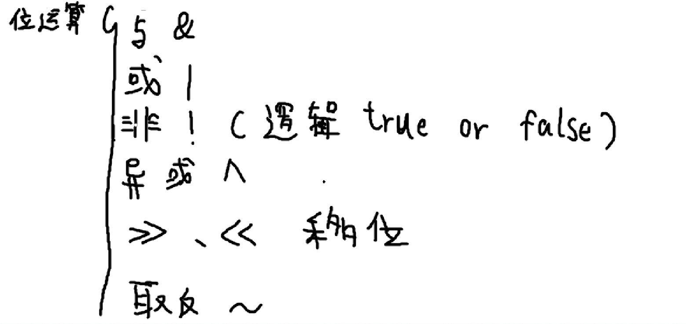
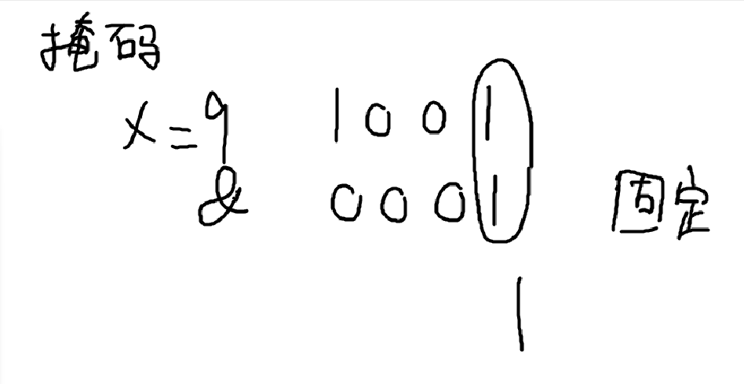
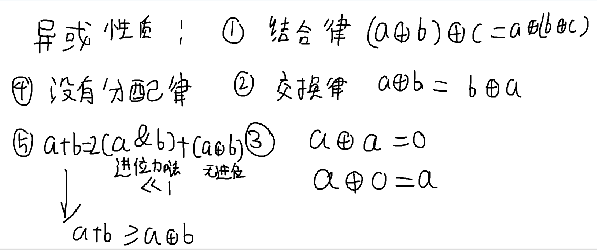
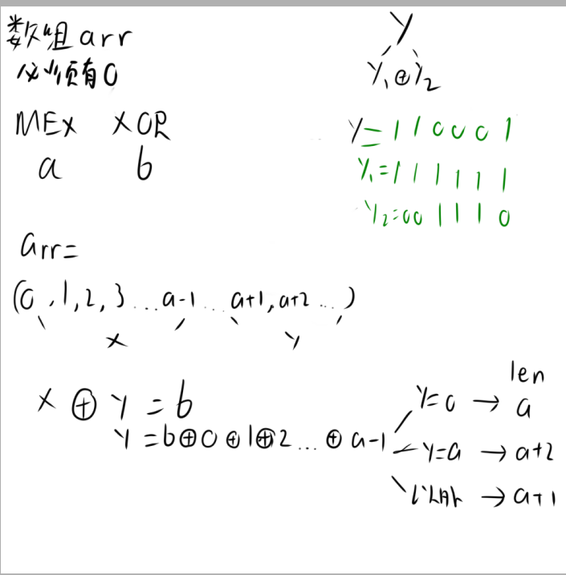
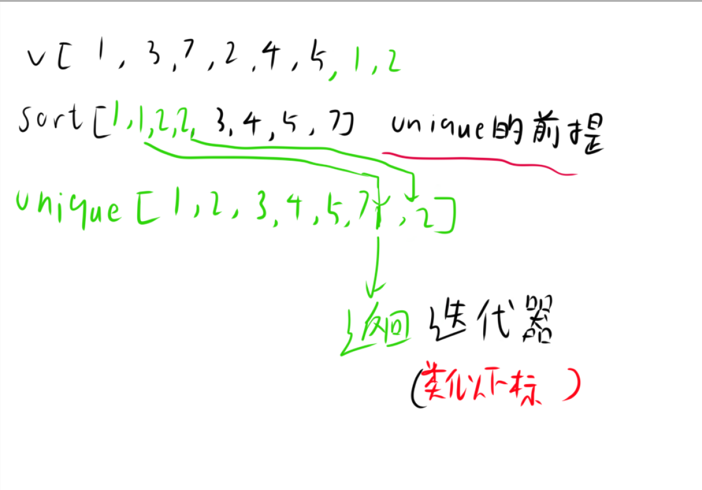
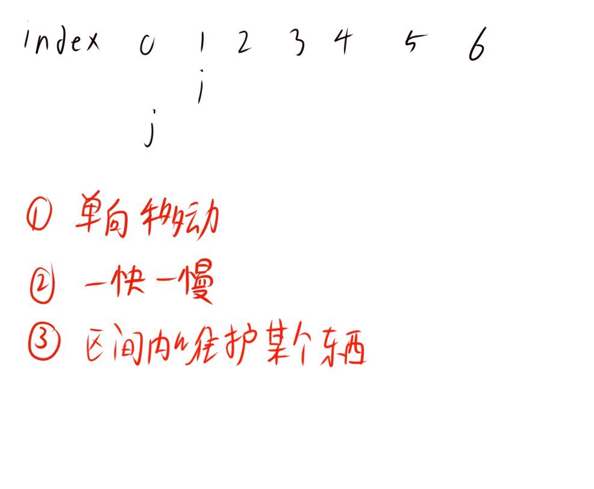
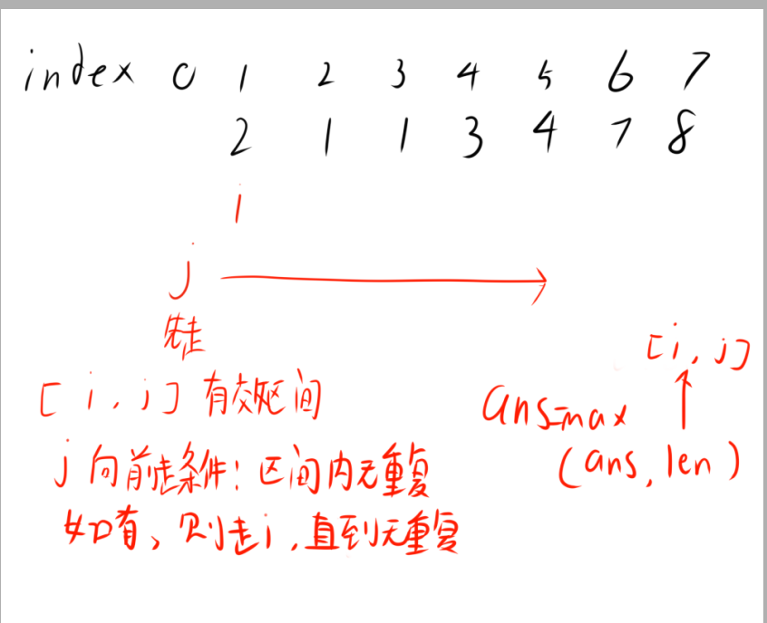
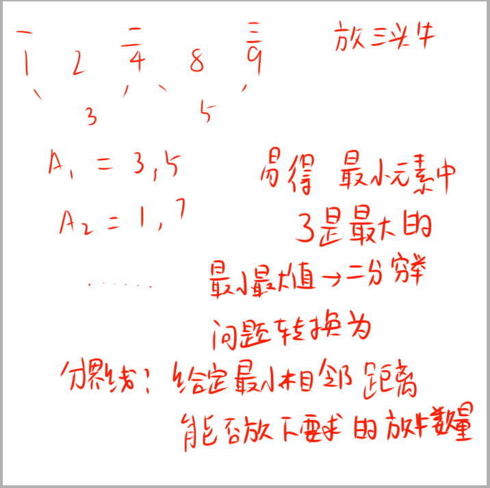
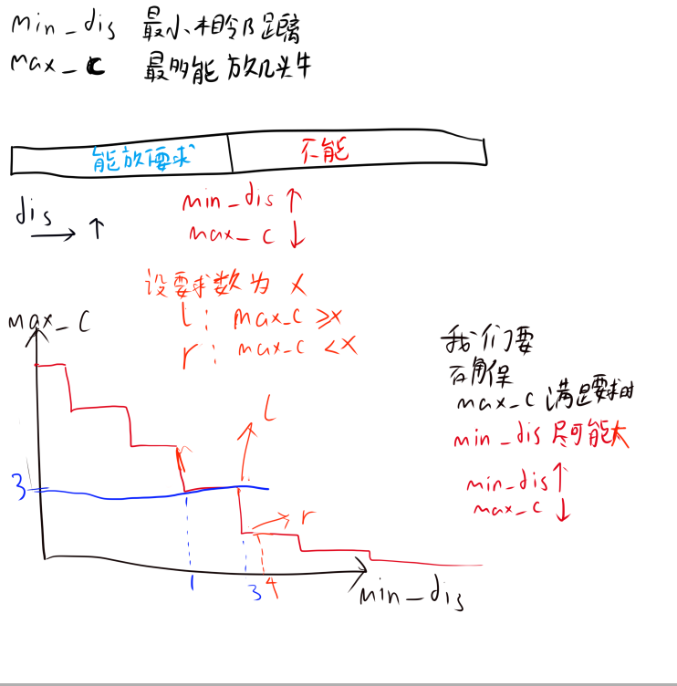

# 前言
**学习网站**:[Starrycoding](https://www.starrycoding.com/)

本篇文章涉及位运算，排序，双指针，二分.

## 位运算




如图，位运算有这几种操作,比较常出现的是**异或**和**与**。

**与**的应用：作为掩码来使用。
如000111 & 000001= 000001，这样就可以取出最后一位。



**异或**的性质:




注：因为异或满足结合律，所以异或运算可以进行类似**前缀和**的**预处理**


### 例题

[P51 二进制中1的个数](https://www.starrycoding.com/problem/51)

分析：朴素算法就是把数字转成二进制，然后统计1的个数，实现的话我们就可以用**掩码**来实现。

```cpp
#include <bits/stdc++.h>
using namespace std;
const int N = 2e5 + 10;
typedef long long ll;

ll f(int x)
{
    ll res = 0;
    while (x > 0)
    {
        if (x & 1 == 1)
            res++;
        x >>= 1;
    }
    return res;
}

int main(void)
{
    ios::sync_with_stdio(0);
    cin.tie(0);
    cout.tie(0);
    int n, x;
    cin >> n;
    for (int i = 1; i <= n; i++)
    {
        cin >> x;
        cout << f(x) << ' ';
    }
    cout << '\n';
    return 0;
}
```

[P52 我们需要0](https://www.starrycoding.com/problem/52)

分析：
这题定义了$b_i=a_i⊕x$，并且要使得$b_1⊕b_2⊕...⊕b_n=0$
那么我们把$b_1⊕b_2⊕...⊕b_n$拆开，那么就可以转化成$a_1⊕a_2⊕...⊕a_n⊕x⊕x⊕...⊕x=0$ （运用了交换律）
这里再运用异或的性质，即$x⊕x=0$，那么就可以转化成

$$a_1⊕a_2⊕...⊕a_n⊕x=0$$

$$a_1⊕a_2⊕...⊕a_n⊕x=x⊕x$$

$$a_1⊕a_2⊕...⊕a_n⊕x⊕x=x⊕x⊕x$$

$$a_1⊕a_2⊕...⊕a_n=x$$

所以我们就能得到x了，也知道x是必定存在且唯一的

```cpp
#include <bits/stdc++.h> //运用异或性质+结合律,a^b^c=a^(b^c)+交换律,a^b^a=a^a^b=0^b=b
using namespace std;     // 异或性质：a^a=0,a^0=a
const int N = 1e3 + 10;
typedef long long ll;
ll arr[N];

int main(void)
{
    ios::sync_with_stdio(0);
    cin.tie(0);
    cout.tie(0);
    int t, n;
    cin >> t;
    while (t--)
    {
        cin >> n;
        for (int i = 1; i <= n; i++)
        {
            cin >> arr[i];
        }
        int res = 0;
        for (int i = 1; i <= n; i++)
        {
            res ^= arr[i];
        }
        cout << res << '\n';
    }
}
```

[P53 Mex and Xor](https://www.starrycoding.com/problem/53)

分析:
根据题目定义
MEX值是指：**最小的不存在于该数组之中的非负整数**。
例：$a=[0,3,2,2]$,则$MEX(a)=1$。

XOR值是指：数组中的所有元素做异或运算的结果。
例:$a=[3,5,5]$,则$XOR(a)=3⊕5⊕5=3$。

**给定了MEX值与XOR值**，我们要求出满足这两值的非负整数数组的**最小长度**。因为**长度最小**，可以认为**arr数组必须具有有序性，以及互异性**.

假设MEX值为a，XOR值为b,假设**有序**数组为$arr=[0,1,2,3,4,5...a-1,a+1,a+2,a+3...]$

我们可以发现arr被分成了两部分，一部分是$[0,a-1]$，将这部分设为$x$,因为我们的arr要保证最小长度，所以这部分值是**确定**的,另一部分是$[a+1....]$，将这部分设为$y$

则有

①.$x⊕y=b$

②.$y=x⊕b$

根据y的值不同我们就可以得到不同的数组长度结果，所以接下来我们开始分类讨论

1.y=0时，那么就说明**x=b**，此时数组长度就为**a**

2.y=a时，因为我们不能有a，所以要把a拆成两个数（不难发现，一个数字**a必定能拆成两个数的异或**）,所以此时数组长度就为**a+2**

3.y!=a且y!=0时，此时数组长度就为**a+1**





```cpp
#include <bits/stdc++.h> //异或运算，异或前缀和
using namespace std;
const int N = 2e5 + 9;
int prexor[N];
void solve()
{
    int len = 0;
    int a, b;
    cin >> a >> b;
    int y = prexor[a - 1] ^ b;
    if (y == 0)
    {
        len = a;
    }
    else if (y == a)
    {
        len = a + 2;
    }
    else
    {
        len = a + 1;
    }
    cout << len << '\n';
}

int main(void)
{
    ios::sync_with_stdio(0);
    cin.tie(0);
    cout.tie(0);
    int t;
    cin >> t;
    for (int i = 1; i <= 2e5; i++)
    {
        prexor[i] = prexor[i - 1] ^ i;
    }
    while (t--)
    {
        solve();
    }
    return 0;
}
```

注：此处[1,a-1]的值要用**异或前缀和**来预处理。


## 排序

[模板一](https://www.starrycoding.com/problem/54)

**通过排序去重**（类似set）
```cpp
#include <bits/stdc++.h> //运用排序，动态数组，unique实现去重
using namespace std;     // 另一种去重办法使用set
vector<int> a;

int main(void)
{
    ios::sync_with_stdio(0);
    cin.tie(0);
    cout.tie(0);
    int n;
    cin >> n;
    for (int i = 1; i <= n; i++)
    {
        int x;
        cin >> x;
        a.push_back(x);
    }
    sort(a.begin(), a.end());
    a.erase(unique(a.begin(), a.end()), a.end()); // unique函数实际是把重复的数移到后面去了
    // 最终函数会返回不重复的数的最后一个位置的后一个位置(迭代器),然后我们再用erase函数删除后面的数即可
    // unique函数只能把相邻的重复数删除，所以我们需要先排序
    // unique返回的是迭代器
    for (auto &i : a)
        cout << i << '\n';
    return 0;
}
```





[模板二](https://www.starrycoding.com/problem/55)

**使用了比较器的排序**
```cpp
#include <bits/stdc++.h>
using namespace std;
const int N = 2e5 + 9;

struct book
{
    int a, b, c;
} p[N];

bool cmp(struct book a, struct book b) // 自定义比较器 以降序为例，如果你要降序，那么a>b就要返回true,否则返回false
{
    if (a.a != b.a)
    {
        return a.a > b.a;
    }
    if (a.b != b.b)
    {
        return a.b > b.b;
    }
    return a.c > b.c;
}

int main(void)
{
    ios::sync_with_stdio(0);
    cin.tie(0);
    cout.tie(0);
    int n;
    cin >> n;
    for (int i = 1; i <= n; i++)
    {
        cin >> p[i].a >> p[i].b >> p[i].c;
    }
    sort(p + 1, p + n + 1, cmp);
    for (int i = 1; i <= n; i++)
    {
        cout << p[i].a << ' ' << p[i].b << ' ' << p[i].c << '\n';
    }
    return 0;
}
```

比较器函数返回值是 bool 类型，传参是需要比较的两个元素。记我们**要定义**的该比较操作为$⋆$

**若$a⋆b$，则比较器函数应当返回true**

**若$a!⋆b$，则比较器函数应当返回false**


[模板三](https://www.starrycoding.com/problem/56)

**桶排序**
```cpp
#include <bits/stdc++.h>
using namespace std;
const int N = 3e6 + 10;
int arr[N];

int main(void)
{
    int n;
    cin >> n;
    for (int i = 1; i <= n; i++)
    {
        int x;
        cin >> x;
        arr[x]++;
    }
    for (int i = 0; i <= 2e5; i++)
    {
        for (int j = 0; j < arr[i]; j++)
        {
            cout << i << " ";
        }
    }
    cout << '\n';
    return 0;
}
```

## 双指针





如图，我们可以看到双指针的**核心**就是i,j的移动,我们以具体题目来解释

[P36 最长连续不重复子序列](https://www.starrycoding.com/problem/36)

分析：
根据题目，我们要找出数组中**最长的无重复的子序列**,用双指针来实现



由图，我们区间内维护的是无重复子序列的长度，那么我们j的移动条件就是**区间内无重复**，i的移动条件就是**区间内有重复**，并且每当我们的j+1是重复时，就可以对ans进行max判断.

如何判断区间内有重复呢？我们可以使用**桶**来实现

```cpp
#include <bits/stdc++.h>
using namespace std;
const int N = 1e5 + 9;
typedef long long ll;
int arr[N], c[N];
void solve(void)
{
    int n;
    ll maxx = -1;
    cin >> n;
    memset(arr, 0, sizeof(int) * n + 1); // 初始化数组
    for (int i = 1; i <= n; i++)
    {
        cin >> arr[i];
    }
    for (int i = 1; i <= n; i++)
    {
        c[arr[i]] = 0; // 初始化桶
    }
    for (int i = 1, j = 0; i <= n; i++)
    {
        while (j < n && !c[arr[j + 1]])
        {
            j++;
            c[arr[j]]++;
        }
        maxx = max(maxx, j - i + 1ll);
        c[arr[i]]--;
    }
    cout << maxx << '\n';
}
int main(void)
{
    ios::sync_with_stdio(0);
    cin.tie(0);
    cout.tie(0);
    int t;
    cin >> t;
    while (t--)
    {
        solve();
    }
    return 0;
}

```


## 二分


[二分讲解](https://www.bilibili.com/video/BV1fA411z7ru)


[模板](https://www.starrycoding.com/problem/57)

```cpp
#include <bits/stdc++.h>
using namespace std;
const int N = 2e5 + 9;
typedef long long ll;
int arr[N];
int n, q, x;
bool check(ll mid)
{
    return arr[mid] < x;
}
void solve(void)
{
    cin >> x;
    ll l = 0, r = n + 1, mid = 0;
    while (l + 1 != r)
    {
        mid = (l + r) / 2;
        if (check(mid))
        {
            l = mid;
        }
        else
        {
            r = mid;
        }
    }
    if (arr[r] == x)
    {
        cout << r << " ";
    }
    else
    {
        cout << -1 << " ";
    }
}
int main(void)
{
    ios::sync_with_stdio(0);
    cin.tie(0);
    cout.tie(0);
    cin >> n >> q;
    for (int i = 1; i <= n; i++)
    {
        cin >> arr[i];
    }
    while (q--)
    {
        solve();
    }
    cout << '\n';
    return 0;
}
```

使用条件：**答案具有单调性**

关键词: **最大最小值**，**最小最大值**

求最小要找**答案的下界**，求最大要找**答案的上界**

以l，r作为两个指针来理解
1. 建模：**确立蓝红区域**（分界线）
2. 确定check（）函数（根据分界线来写 分界线左边的数字都有什么性质，右边又有什么性质）
3. 确定**返回r还是l**
4. 套用模板
5. 二分一次只能出一个答案（r或l）
6. l，r初始值是**开区间的左右端点**,以数组下标0开头的话，l=-1，r=N（如果l，r代表**数字**的话，就是**答案数据范围的左右端点**）


### 例题

[P37 进击的奶牛](https://www.starrycoding.com/problem/37)

分析：
**最近距离**就是指**相邻的两头牛的距离**，这个距离越大越好

也就是说我们假设所有相邻距离集合为A，**最大的相邻距离为max**,那么A必须满足

**任选A中一个元素**，都**大于等于max**,则此max为**最小最大值** (所有种的A中的**最小元素**的集合中的**最大值**)




对样例分析，我们可以得出二分**分界线**：给定最小相邻距离，能否放下要求放的牛数量





由图，我们知道了**最小相邻距离**与**能放下的牛数量**的关系，那么我们就可以用**二分**来实现了。并且，由于left左端是$(max)_c>=x$的,left会不断**右移**直到下一个值不会大于等于x,所以left会是**最小最大值**。

（同理，我们能知道假如right是$(max)_c<=x$的话，right会不断**左移**直到**right左边的值大于x**,最终会得到$r=1$,并非所求值）

```cpp
#include <bits/stdc++.h>
using namespace std;
typedef long long ll;
const int N = 2e5 + 9;
int n, c;
int arr[N];
bool check(ll mid)
{
    int j = 1;
    int cnt = 1; // 注意这里牛已经在第一个位置放了一头了
    for (int i = 1; i <= n; i++)
    {
        if (arr[i] - arr[j] >= mid)
        {
            cnt++;
            j = i;
        }
    }
    return cnt >= c;
}
int main(void)
{
    ios::sync_with_stdio(0);
    cin.tie(0);
    cout.tie(0);
    cin >> n >> c;
    for (int i = 1; i <= n; i++)
    {
        cin >> arr[i];
    }
    sort(arr + 1, arr + n + 1);
    ll l = 0, r = 1e9 + 10, mid = 0;
    while (l + 1 != r)
    {
        mid = (l + r) / 2;
        if (check(mid))
        {
            l = mid;
        }
        else
        {
            r = mid;
        }
    }
    cout << l << '\n';
    return 0;
}
```

