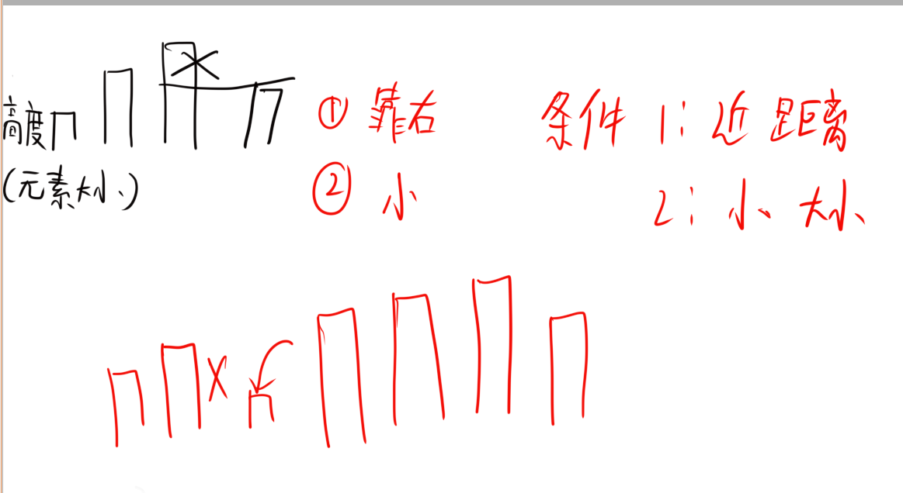
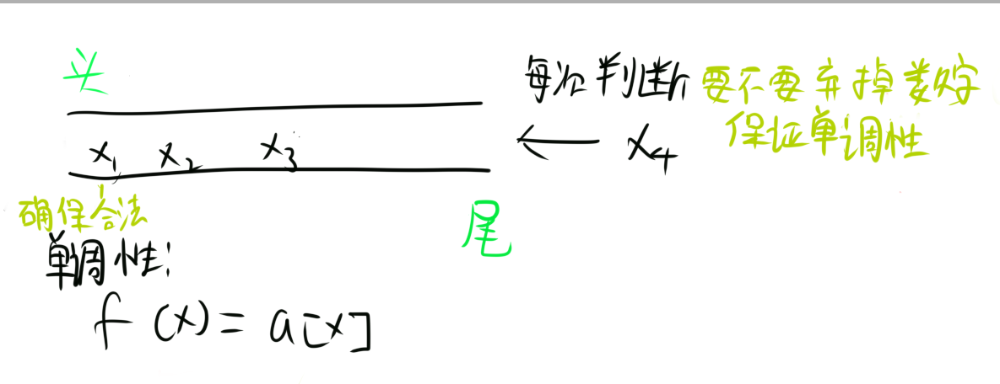
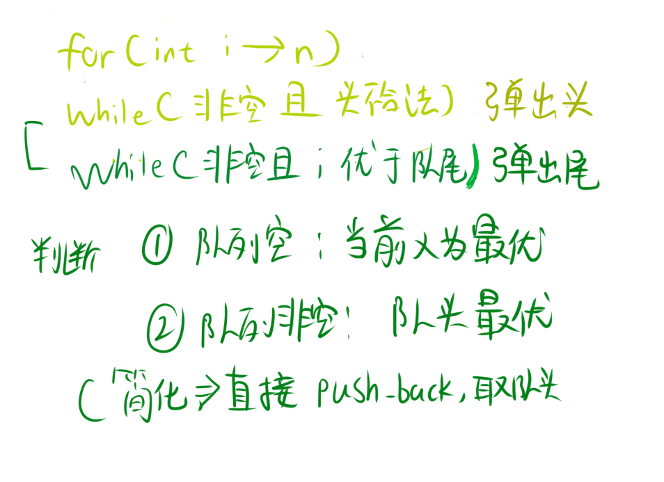
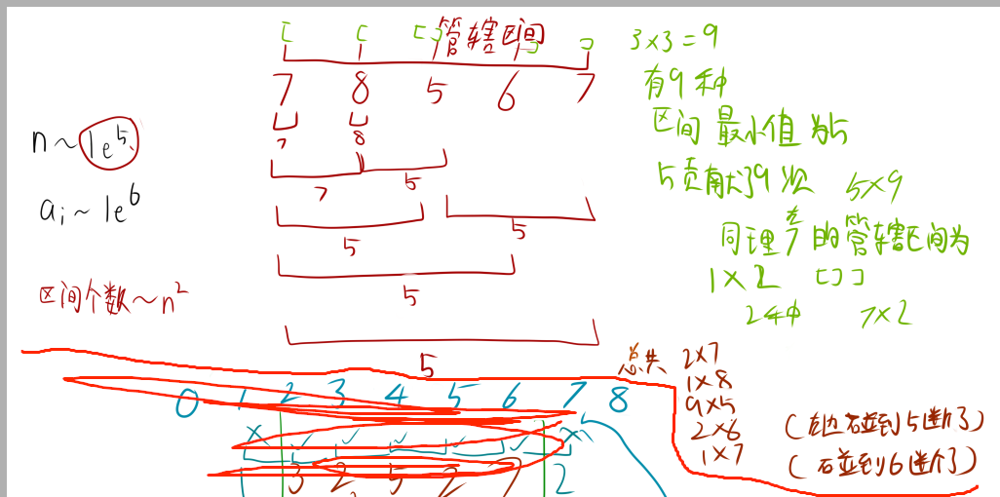
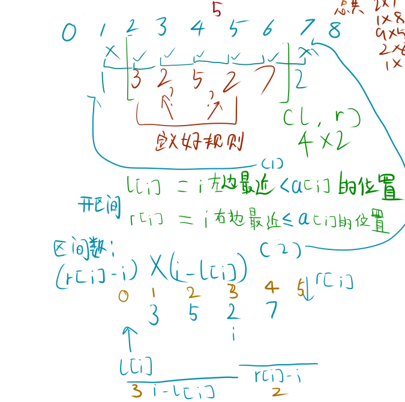

# 前言

**学习网站**:[Starrycoding](https://www.starrycoding.com/)


## 单调栈

何为单调栈？顾名思义，单调栈即满足单调性的栈结构。与单调队列相比，其只在一端进行进出。

将一个元素插入单调栈时，为了维护栈的单调性，需要在保证将该元素插入到栈顶后整个栈满足单调性的前提下弹出最少的元素。

所以可以看出假如有元素要插入，这个元素**一定是要插入进去的**，但是假如插入进去后会**破坏**栈的单调性，那么就要先把**栈顶**的元素**弹出**，直到插入的元素不会破坏单调性为止。

需要注意的是，这里的单调性是我们人为定义的，一般来说，我们往单调栈里插入的元素都是**下标**之类的东西，而不是**值**。所以这里的单调性是指一个我们定义的函数$f(x)$的单调性。

接下来我们用一道例题来讲解一下单调栈该如何使用。

[P60 【模板】单调栈](https://www.starrycoding.com/problem/60)

**题面**：给定一个长度为$n$的整数数组$a$，你需要求出每个元素的左边离它最近且比它小的元素。（如果不存在这样的元素，输出$-1$）

单调栈的一个基本应用就是求**左边离它最近且比它小的元素**。（当然改一下方向也是可以的）

**分析**：

首先，根据样例,给出一个数组$a=[7,8,5,6,7]$。

我们先想下如何暴力解决这个问题。

我们可以设置一个数组$l$，用来存储每个元素的左边离它最近且比它小的元素。

我们可以先把$l$数组的所有元素都初始化为$-1$。接下来再用一个二重的循环来寻找每个元素的左边离它最近且比它小的元素。如果找到了，就把$l[i]$的值设为$a[j]$。


```cpp
#include <bits/stdc++.h>
using namespace std;
typedef long long ll;
const int N = 2e5 + 9;
int arr[N], l[N];
int main(void)
{
    ios::sync_with_stdio(0);
    cin.tie(0);
    cout.tie(0);
    int n;
    cin >> n;
    for (int i = 1; i <= n; i++)
    {
        cin >> arr[i];
    }
    memset(l, -1, sizeof(l));
    for (int i = 1; i <= n; i++)
    {
        for (int j = i; j >= 1 && l[i] == -1; j--)
        {
            if (arr[j] < arr[i])
            {
                l[i] = arr[j];
            }
        }
    }
    for (int i = 1; i <= n; i++)
    {
        cout << l[i] << " ";
    }
    return 0;
}
```

当然，这样绝对会TLE，时间复杂度是$O(n^2)$的。

那么我们就要想下如何优化了。

我们再用个例子理解一下，给出一个数组$a=[6,7,8,1,5,4,3]$。

6左边没有比它小的元素，所以输出$-1$。

7左边比它小的元素是6，所以输出6。

8左边比它小的元素是7，所以输出7。

1左边没有比它小的元素，所以输出$-1$。

接下来5，4，3输出的都是1.

假设一下我们当前元素为i，通过观察我们可以发现，首先对于i要输出的元素的判断有两个条件，一个是**距离**，一个是**大小**。

例子中，对于数字5，4，3而言，数字1和前面的6，7，8相比，不仅**距离更优秀**，大小也更**优秀**，所以我们完全可以无视6，7，8。只管数字1后面有没有在距离或者大小上更优秀的数字就可以了。





既然如此，我们可以用单调栈来模拟这个过程。

```cpp
#include <bits/stdc++.h>
using namespace std;
typedef long long ll;
const int N = 2e5 + 9;
int arr[N], l[N];
int main(void)
{
    ios::sync_with_stdio(0);
    cin.tie(0);
    cout.tie(0);
    int n;
    cin >> n;
    for (int i = 1; i <= n; i++)
    {
        cin >> arr[i];
    }
    stack<int> stk; // 栈内存放下标
    for (int i = 1; i <= n; i++)
    {
        while (stk.size() && arr[stk.top()] >= arr[i])
        {
            stk.pop();
        }

        if (stk.size())
        {
            // 栈非空
            l[i] = stk.top();
        }
        else
        {
            // 栈空
            l[i] = -1;
        }
        // 将当前元素下标push进去
        stk.push(i);
    }
    for (int i = 1; i <= n; i++)
    {
        cout << (l[i] == -1 ? -1 : arr[l[i]]) << " ";
    }
    return 0;
}
```

```cpp
stack<int> stk; // 栈内存放下标
    for (int i = 1; i <= n; i++)
    {
        while (stk.size() && arr[stk.top()] >= arr[i])
        {
            stk.pop();
        }

        if (stk.size())
        {
            // 栈非空
            l[i] = stk.top();
        }
        else
        {
            // 栈空
            l[i] = -1;
        }
        // 将当前元素下标push进去
        stk.push(i);
    }
```
**分析**：

我们用while函数确保栈顶元素始终要**小于等于**当前要插入的元素。（**当前插入的元素在距离上更优秀，大小上不会**）

如果栈顶元素大于当前要插入的元素，那么就把栈顶元素弹出直到小于为止。（当前插入的元素**在距离上更优秀，大小上也更优秀**，就不需要栈顶元素了）

接下来一个if函数来分类讨论，栈空时，就代表**当前元素左边没有比它小的元素**，则l[]为-1。栈非空时，栈顶元素就是距离最优还小于等于当前元素的元素，所以l[]为栈顶元素**下标**。

最后我们把当前元素下标push进去。


## 单调队列

顾名思义，单调队列的重点分为「单调」和「队列」。

「单调」指的是元素的「规律」——递增（或递减）。（和单调栈一样，递增递减是最简单的单调性，我们传入单调队列的元素一般是下标，下标的单调性是无意义的，更要注意其相关函数的单调性）

「队列」指的是元素只能从队头和队尾进行操作。

单调队列和单调栈差不多，区别是单调队列的**队头和队尾都可以进行操作**。


单调队列最经典的应用是**滑动窗口**。

我们直接用一个例题来看看怎么用单调队列。

[P61 滑动窗口](https://www.starrycoding.com/problem/61)

**题面**：

给定一个长度为$n$的整数数组$a$，以及一个长度为$k$的滑动窗口。窗口中只能看到$k$个元素），它从数组的最左边，每次向右移动一个位置，直到移动到最右边。

你需要回答出滑动窗口在每个位置时，窗口中的最大值和最小值。


首先，我们可以用单调队列来模拟这个滑动窗口，然后分两次，一次求最大值，一次求最小值。

我们要先求最大值，所以我们要维护一个**单调递减**的队列。那么我们就要保证队尾元素始终要**大于等于**当前要插入的元素。（这里由于区间的限制，我们队列内肯定是插入下标的，所以我们要比较的是下标对应的元素）

接着，我们要保证单调队列的**长度**始终要**小于等于**$k$。那么就要确保队头元素始终要**大于等于**$i-k$。（$i$是当前要插入的元素的下标,$[i-k+1,i]$）

然后，我们判断一下，如果要输出元素了，而当前队列为空，那么当前要插入的元素就是最优的，否则就是队头元素最优了。简化一下，其实就是**push当前元素进队尾，然后输出队头元素**。




最终，我们可以得到如下流程:





那么开始输出答案的时候就是i>=k的时候，从这个时候开始，**每次循环都会输出一个最优秀的值**。

```cpp
#include <bits/stdc++.h>
using namespace std;

const int N = 2e5 + 9;

int a[N];

int main(void)
{
    int n, k;
    cin >> n >> k;
    for (int i = 1; i <= n; i++)
    {
        cin >> a[i];
    }
    deque<int> dq;

    // 求最大
    for (int i = 1; i <= n; i++)
    {
        // 以i为右端点，大小为k的区间，[i-k+1,i]
        // 队头合法性
        while (dq.size() && dq.front() <= i - k)
        {
            dq.pop_front();
        }
        // 队尾优越性
        while (dq.size() && a[dq.back()] <= a[i])
        {
            dq.pop_back();
        }
        dq.push_back(i);

        if (i >= k)
        {
            cout << a[dq.front()] << " ";
        }
    }
    cout << "\n";

    dq = deque<int>(); // 清空

    // 求最小
    for (int i = 1; i <= n; i++)
    {
        // 以i为右端点，大小为k的区间，[i-k+1,i]
        // 队头合法性
        while (dq.size() && dq.front() <= i - k)
        {
            dq.pop_front();
        }
        // 队尾优越性
        while (dq.size() && a[dq.back()] >= a[i])
        {
            dq.pop_back();
        }
        dq.push_back(i);

        if (i >= k)
        {
            cout << a[dq.front()] << " ";
        }
    }
    cout << "\n";
    return 0;
}
```


## 附加题

[P62 求和](https://www.starrycoding.com/problem/62)

**题面**：

给定一个大小为$n$的整数序列$a$（下标从$1$开始），你需要求出该序列所有子区间最小值的和，即

$$\sum_{i=1}^{n} \sum_{j=i}^{n} min(a_i,a_{i+1},...,a_j)$$

分析:

这题要求出该序列所有子区间最小值，然后再将他们加起来。如果暴力做的话，就是用循环找出每个子区间，然后再找出每个子区间的最小值，然后再将他们加起来。但是这样做的话，时间复杂度是$O(n^2)$的，会TLE。

那么该如何优化呢？

这题算是一种数字贡献的题目。




如图，我们可以看出，给定数组$a=[7,8,5,6,7]$，对于数字$5$，有好几个子区间包含它,我们可以把它看成是一个**贡献**。那么有几个子区间包含它，它就会贡献几次。那我们要如何计算出有几个子区间包含它呢？我们可以看它的**管辖区间**，就是看他左边有几个比它大的数字，右边有几个比它大的数字，然后将这两个**个数**相乘，就是他包含的子区间个数了。注意**5自己也是算的**。并且**假如碰到了小于它的数字，就要停止**。

那么我们来看对于5，他左边有7，8，5大于等于他，右边有，5，6，7大于等于他，所以它包含的子区间个数是3*3=9个。这**9个子区间最小值都是5，5贡献了9次**。同理我们可以得到其他数字的贡献次数。如此我们就可以得出答案了。

那么我们要如何实现找出每个数字的管辖区间呢？



我们给定一个数组$a=[1,3,2,5,2,7,2]$，这里我们还能发现按刚才做法找管辖区间会发现相等的情况，那么我们要如何处理呢？

我们可以直接定义好规则:

我们用一个数组$l[i]$来表示数字$a[i]$左边有几个**大于等于**它的数字,用一个数组$r[i]$来表示数字$a[i]$右边有几个比它大（**严格大于**）的数字。那么假如遇到了相等的情况，就不可能错误了。

但是**这样的l和r数组的存储**也会有些麻烦,我们可以改为存储下标。

- l[i]表示数字$a[i]$左边最近的**小于**它的数字的**下标**。
- r[i]表示数字$a[i]$右边最近的**小于等于**它的数字的**下标**。

然后要求出左边有几个，**就是($i-l[i]$)个**。右边有几个，**就是($r[i]-i$)个**。

那么这种l和r该如何求呢？显而易见是**单调栈**。


```cpp
#include <bits/stdc++.h>
using namespace std;
typedef long long ll;
const int N = 1e5 + 9;

ll a[N], l[N], r[N];

ll stk[N], top;

int main(void)
{
    int n;
    cin >> n;
    for (int i = 1; i <= n; i++)
    {
        cin >> a[i];
    }

    // 求l[],l[]是i左边最近的<a[i]的值的位置
    for (int i = 1; i <= n; i++)
    {
        while (top && a[stk[top]] >= a[i])
        {
            top--;
        }
        // 判断
        if (!top)
        {
            l[i] = 0; // i左边没有任何数比a[i]还小了,能够一直延申
        }
        else
        {
            l[i] = stk[top];
        }
        // 存放
        stk[++top] = i;
    }

    // 初始化
    top = 0;

    // 求r[],r[]是i右边最近的<=a[i]的值的距离
    for (int i = n; i >= 1; i--)
    {
        while (top && a[stk[top]] > a[i])
        {
            top--;
        }
        // 判断
        if (!top)
        {
            r[i] = n + 1; // i右边没有数小于等于i，可以一直延申
        }
        else
        {
            r[i] = stk[top];
        }
        // 存放
        stk[++top] = i;
    }
    // l[i]和r[i]都是开区间
    ll ans = 0;
    for (int i = 1; i <= n; i++)
    {
        ans += a[i] * (r[i] - i) * (i - l[i]);
    }

    cout << ans << '\n';
    return 0;
}
```


