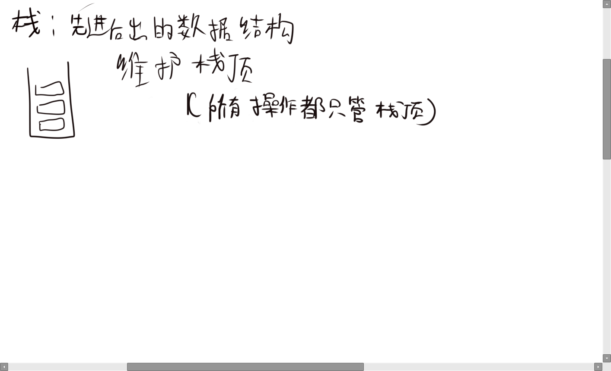
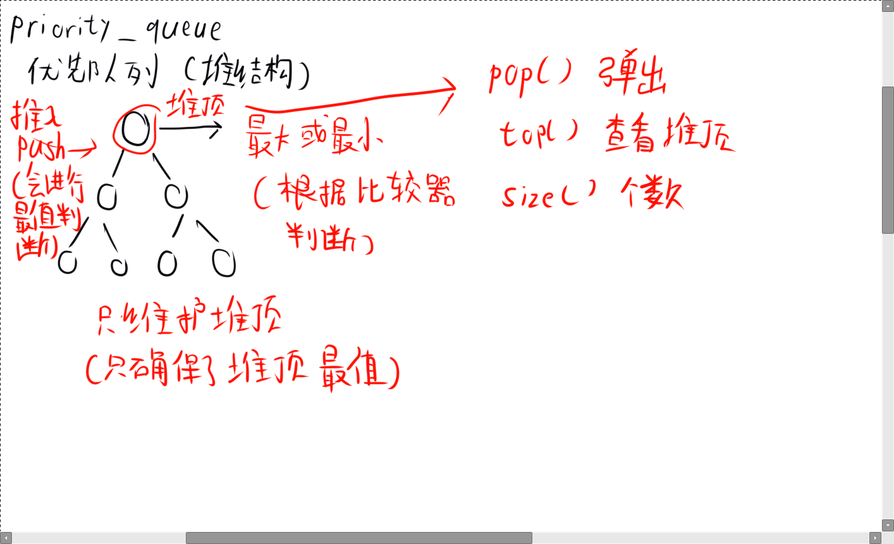
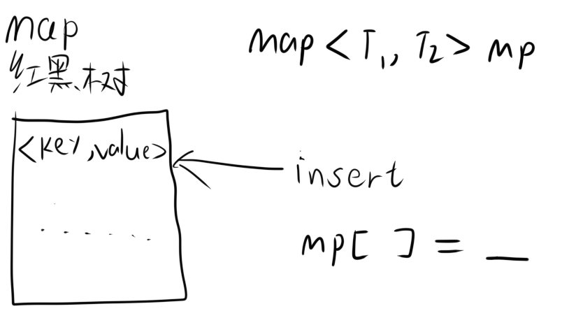
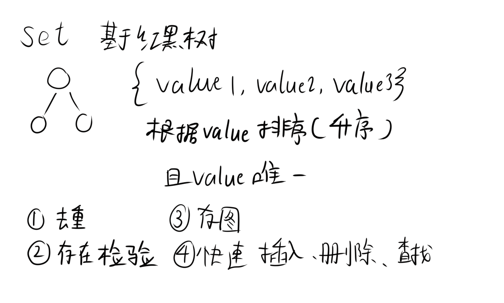
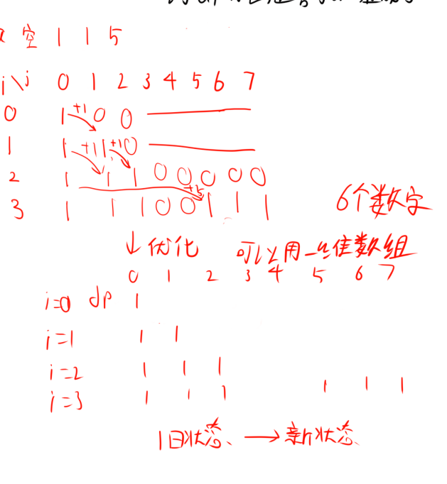
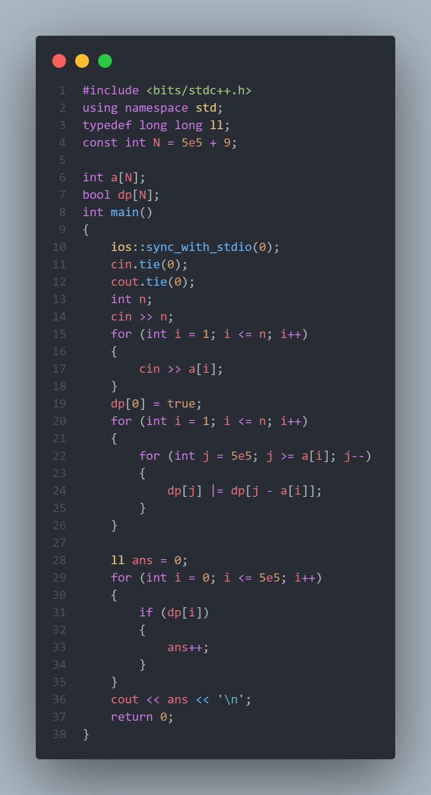
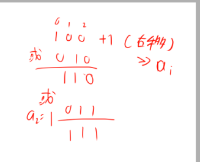

# 前言

**学习网站**:[Starrycoding](https://www.starrycoding.com/)

本篇文章涉及部分STL的使用

**关于使用STL**:[【C++】算法竞赛常用 STL 用法](https://www.bilibili.com/video/BV1L8411y7th/)


## 栈





栈是一种先进后出的数据结构。

栈的操作都是**只管栈顶的**。

| 作用          | 用法          | 示例        |
| --------- | ----------- | ------------- |
| 构造      | `stack<类型> stk` | `stack<int> stk;`    |
| 进栈      | `.push(元素)`     | `stk.push(1);`       |
| 出栈      | `.pop()`          | `stk.pop();`         |
| 取栈顶    | `.top()`          | `int a = stk.top();` |
| 判空      | `.empty()`        | `if(stk.empty())`    |
| 取栈大小  | `.size()`         | `int n = stk.size();` |

栈**没有clear操作**。


### 例题

[P38 火车轨道](https://www.starrycoding.com/problem/38)


分析: 

火车按照顺序进入火车站,**火车站是先进去的车最后出来的**,所以我们可以用**栈**来模拟火车的进出。

要使出栈口是升序的，也就是说要让出站口以$1,2,3....$的顺序排列。我们可以用一个变量来记录当前出站口的火车编号，然后每次**判断栈顶的火车编号是否和当前出站口的火车编号相同**，如果相同就出栈，否则就入栈,而且这个判断应该是**重复的**。

最终当所有编号都判断完了之后，如果栈为空，就说明出站口的火车编号是$1,2,3....$的升序排列，否则就说明出站口的火车编号不是升序排列。

```cpp
#include <bits/stdc++.h>
using namespace std;
const int N = 1e5 + 9;

int arr[N];
stack<int> stk;

int main(void)
{
    ios::sync_with_stdio(0);
    cin.tie(0);
    cout.tie(0);
    int n;
    cin >> n;
    for (int i = 1; i <= n; i++)
    {
        cin >> arr[i];
    }
    int cnt = 1;
    for (int i = 1; i <= n; i++)
    {
        stk.push(arr[i]);
        while (stk.size() && stk.top() == cnt)
        {
            stk.pop();
            cnt++;
        }
    }
    if (stk.size())
    {
        cout << "No" << '\n';
    }
    else
    {
        cout << "Yes" << '\n';
    }
    return 0;
}
```

**注意**：**对栈顶进行操作时可能会有空栈的情况**，所以要先判断栈是否为空。


## 优先队列



优先队列是用堆实现的。
优先队列的所有操作都是针对**堆顶的**。
优先队列会确保**堆顶的元素是最大/最小的**。(通过比较器更改最大最小，默认是最大)
| 作用          | 用法          | 示例        |
| --------- | ----------- | ------------- |
|  构造      | `priority_queue<类型,容器,比较器> pq`    |   略    |
| 进队      | `.push(元素)`     | `pq.push(1);`       |
| 出队      | `.pop()`          | `pq.pop();`         |
| 取队顶    | `.top()`          | `int a = pq.top();` |
| 判空      | `.empty()`        | `if(pq.empty())`    |
| 取队列大小  | `.size()`         | `int n = pq.size();` |


### 例题

[P58 小e的菜篮子](https://www.starrycoding.com/problem/58)

```cpp
#include <bits/stdc++.h>
using namespace std;
typedef long long ll;

int main(void)
{
    ios::sync_with_stdio(0);
    cout.tie(0);
    cin.tie(0);
    int q;
    ll sum = 0;
    priority_queue<ll> pq; // 默认是大根堆
    cin >> q;
    while (q--)
    {
        int n;
        cin >> n;
        if (n == 1)
        {
            ll x;
            cin >> x;
            pq.push(x);
            sum += x;
        }
        if (n == 2)
        {
            if (pq.size())
            {
                sum -= pq.top();
                pq.pop();
            }
        }
    }

    cout << sum << '\n';
    return 0;
}
```


## map

map是由**红黑树**实现的。可以理解为一堆**有序（默认从小到大）的键值对**。

map还具有**互异性**，即**键(key)不能重复**。



| 作用          | 用法          | 示例        |
| --------- | ----------- | ------------- |
| 构造      | `map<键类型,值类型，比较器> mp`    |   略    |
| 插入      | `.insert({键,值})`     | `mp.insert({1,1});`       |
| 删除      | `.erase(键)`          | `mp.erase(1);`         |
| 查找（返回迭代器）      | `.find(键)`          | `if(mp.find(1)!=mp.end())`         |
| 取键值    | `[键]`          | `int a = mp[1];` |
|判断元素是否存在|`.count(键)`|`if(mp.count(1))`|


### 例题

[P59 气球数量](https://www.starrycoding.com/problem/59)

```cpp
#include <bits/stdc++.h>
using namespace std;
const int N = 110;

void solve()
{
    map<string, int> mp;
    int n;
    cin >> n;
    vector<string> v;
    for (int i = 1; i <= n; i++)
    {
        string s;
        cin >> s;
        if (mp.count(s))
        {
            mp[s]++;
        }
        else
        {
            v.push_back(s);
            mp[s] = 1;
        }
    }
    for (auto &i : v)
    {
        cout << i << " " << mp[i] << '\n';
    }
}

int main()
{
    ios::sync_with_stdio(0);
    cin.tie(0);
    cout.tie(0);
    int t;
    cin >> t;
    while (t--)
    {
        solve();
    }

    return 0;
}
```


## set

set也是由**红黑树**实现的。但他和map不同的是，set**只存储value**。

set最重要的特性是**互异性**，即**值(value)不能重复**。

set还具有**有序性**，即**值(value)是从小到大排序的**（默认，用比较器更改）。



| 作用          | 用法          | 示例        |
| --------- | ----------- | ------------- |
| 构造      | `set<值类型,比较器> st`    |   略    |
| 插入      | `.insert(值)`     | `st.insert(1);`       |
| 删除      | `.erase(值)`          | `st.erase(1);`         |
| 查找（返回迭代器）      | `.find(值)`          | `if(st.find(1)!=st.end())`         |
| 判断元素是否存在|`.count(值)`|`if(st.count(1))`|

**注**：
1. set不能用**下标访问**。
2. set的**迭代器**是**只读**的。这意味着你不能通过迭代器来修改set中的值。只能先删除，再插入。

### 例题

[P54 【模板】排序（1）](https://www.starrycoding.com/problem/54)

```cpp
#include <bits/stdc++.h>
using namespace std;

int main(void)
{
    ios::sync_with_stdio(0);
    cin.tie(0);
    cout.tie(0);
    int n;
    cin >> n;
    set<int> st;
    for (int i = 1; i <= n; i++)
    {
        int x;
        cin >> x;
        st.insert(x);
    }
    for (auto &i : st)
    {
        cout << i << " ";
    }
    return 0;
}

```

## bitset

为了介绍bitset，我们先引入一道例题。

[P39 数的种类](https://www.starrycoding.com/problem/39)

题目:给定$n$个整数，问由这些整数通过“加法”操作，可以组成多少种数字？

分析:

我们根据样例来看，样例给出1 1 5,答案有0,1,2,5,6,7六种数字，说明可以不选数字,得出来就是0.并且，这种加法操作有点涉及动态规划。

这题可以算是一种存在性dp,对于dp的设计思路，要先从方便理解的高维开始，再逐渐优化。

我们先设$dp[i][j]$表示前$i$个数，是否可以组成数字$j$,如果可以，就为1，否则为0。


由图，我们可以看出，$dp[i][j]$可以由$dp[i-1][j]$和$dp[i-1][j-a[i]]$转移过来。

那我们就可以先写出一套二维dp的代码。

```cpp
typedef long long ll;
bool dp[N][N];


void solve()
{
    int n;
    cin>>n;
    for(int i=1;i<=n;i++)
    {
        cin>>a[i];
    }
    dp[0][0]=1;
    for(int i=1;i<=n;i++)
    {
        //复制
        for(j=0;j<=5e3;j++)
        {
            dp[i][j]=dp[i-1][j];
        }
        //转移
        for(int j=a[i];j<=5e3;j++)
        {
            dp[i][j]|=dp[i-1][j-a[i]];
        }
    }
    ll ans =0;
    for(int i=0;i<=5e3;i++)
    {
        if(dp[n][i])
        {
            ans++;
        }
    }
    cout<<ans<<'\n';
}
```

但是，毫无疑问，这样做会导致TLE,我们要把二维设法优化成一维。
观察上述二维dp，我们可以发现其实只需要一维的$dp[j]$进行数次覆盖即可。







最终我们得出完整代码.需要注意的是，这里$j$要从大到小枚举，因为如果从小到大枚举，就会导致$dp[j]$会不断true，导致答案错误。

**不过这样做还是会TLE**，题目真正想要我们使用的是用bitset来做。


我们可以把bitset理解为一个二进制数，我们可以用**下标**来访问**二进制数**的**某一位**。

另外还有**count()函数**可以统计bitset中1的个数。**reset()函数**可以把bitset中的所有位都重置为0。

**bitset的好处**:
他的所有操作都是$O(n/w)$的，其中$w$是bitset的**位数**。(这能极大地减少时间复杂度).

同时，在**用了bitset**后，我们的转移方程也可以进行优化。




我们可以看出dp[j-a[i]]实际上可以是**原来的状态**所有位移$a[i]$位，然后再和**原来的状态**进行或运算。

```cpp
#include <bits/stdc++.h>
using namespace std;
typedef long long ll;
const int N = 5e5 + 9;

int a[N];
int main()
{
    ios::sync_with_stdio(0);
    cin.tie(0);
    cout.tie(0);
    int n;
    cin >> n;
    bitset<N> bs;
    for (int i = 1; i <= n; i++)
    {
        cin >> a[i];
    }
    bs[0] = 1;
    for (int i = 1; i <= n; i++)
    {
        bs |= (bs << a[i]);
    }
    cout << bs.count() << '\n';
    return 0;
}
```

[P51 二进制中1的个数](https://www.starrycoding.com/problem/51)

这道之前讲过的题也可以用bitset轻松解决。

```cpp
#include <bits/stdc++.h>
using namespace std;
const int N = 2e5 + 10;
typedef long long ll;

int main(void)
{
    ios::sync_with_stdio(0);
    cin.tie(0);
    cout.tie(0);
    int n, x;
    cin >> n;
    for (int i = 1; i <= n; i++)
    {
        int x;
        cin >> x;
        cout << bitset<32>(x).count() << '\n';
    }
    cout << '\n';
    return 0;
}
```


## 附加题

**题面**:

给定两个长度为$n$的数组$a,b$,你现在可以给b重新排序。

求下列表达式的最小值和最大值，两个询问相互独立。

$$\sum_{i=1}^{n} a_i\times b_i$$

**输入格式**：

第一行一个整数$n$。($1\leq n\leq 2\times10^5$)

接下来一行$n$个整数表示$a_i$。($1\leq a_i\leq 10^5$)

接下来一行$n$个整数表示$b_i$。($1\leq b_i\leq 10^5$)

**输出格式**：

一行两个整数，分别表示最小值和最大值。


分析：

这题首先要知道一个**贪心性质**：

当两个数组的排序是**同序**时（即**都**从小到大或**都**从大到小），乘积之和**最大**。

当两个数组的排序是**逆序**时（即**最大的数字对最小的数字**），乘积之和**最小**。

我们可以这样理解，由于表达式是相乘的，我们把其中一个数组的数字算作是权重

假设$a_i=1,2,3,4,5$,$b_i=5,4,3,2,1$，把b的数字当作权重

那么假如我们想要让乘积之和最大，我们就应该让$a_i$的**最大**的数字**权重**尽可能高，让$a_i$的**最小**的数字**权重**尽可能低。也就是要**同序**。

而假如我们想要让乘积之和最小，我们就应该让$a_i$的**最小**的数字**权重**尽可能高，让$a_i$的**最大**的数字**权重**尽可能低。也就是要**逆序**。


知道了这个性质，同时我们还知道题目对b的排序是没有要求的，我们把b的数字中**最大的都对到a的数字中最大的**，**最小的都对到a的数字中最小的**，这样就可以保证乘积之和有最大和。

要这么实现就直接对两个数组排序，然后相乘即可。同理也可以得出最小和。

```cpp
#include <bits/stdc++.h>
using namespace std;
typedef long long ll;
const int N = 2e5 + 9;
ll a[N], b[N];

int main(void)
{
    ios::sync_with_stdio(0);
    cin.tie(0);
    cout.tie(0);
    int n;
    cin >> n;
    for (int i = 1; i <= n; i++)
    {
        cin >> a[i];
    }
    for (int i = 1; i <= n; i++)
    {
        cin >> b[i];
    }
    sort(a + 1, a + n + 1);
    sort(b + 1, b + n + 1);
    ll ansMAX = 0, ansMIN = 0;
    for (int i = 1; i <= n; i++)
    {
        ansMAX += a[i] * b[i];
    }
    reverse(b + 1, b + n + 1); // 反转
    for (int i = 1; i <= n; i++)
    {
        ansMIN += a[i] * b[i];
    }
    cout << ansMAX << " " << ansMIN << '\n';
    return 0;
}
```


