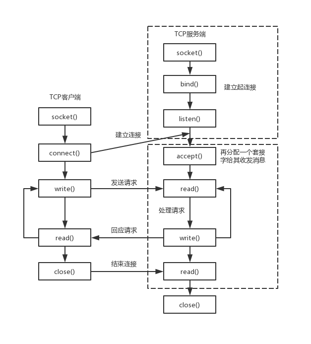

# 网络编程的根基





如图，网络编程的所有基本都是基于这张图的流程,使用的是*TCP协议*进行。

这是一个客户-服务端模式的通信方式，根据计算机网络，我们知道，两台主机的进程想要进行通信，首先要**得知对方的IP地址以及端口号(port)**，在网络编程中，当我们获取到了对方的IP地址以及端口号，我们会使用一个叫*endpoint*的数据结构将这两个玩意进行绑定。

但是之后要怎么做？根据流程图，我们还需要一个最关键的数据结构：**Socket(套接字)**

- **Socket** 是通信的端点，是程序与操作系统之间进行网络通信的接口.它既可以用于创建连接，也可以用于发送和接收数据。

有了这两个数据结构后，我们就可以实现流程图上用于**建立连接**的所有函数，他们分别是

- *socket()*
- *bind()*
- *connect()*
- *accept()*
- *listen()*

此外，由于考虑到代码的模块化，通常我们建立endpoint也会再用一个函数，即*endpoint()*

接下来我们通过具体代码来逐个讲解函数，代码为C++，使用的是Boost的asio库

# endpoint()

首先，由于是客户端-服务器模式，所以客户端与服务器都有各自的建立方式

客户端：

```cpp
int client_end_point() {
	//假设这是一个客户端，他想要建立socket通信，
	//那么他就要根据对方提供的地址与端口建立一个endpoint
	//Socket是实际的通信通道，endpoint来指定要连接的服务器地址和端口
	std::string raw_ip_address = "127.4.8.1";
	unsigned short port_num = 3333;
	//假设给定了对方的端口号，地址
	boost::system::error_code ec;
	auto ip_address = boost::asio::ip::address::from_string(raw_ip_address, ec);
	//将字符串形式的IP地址解析转换为 boost::asio::ip::address 对象
	//转换过程中如果出现错误(如格式不合法),会将错误信息写入到 ec 参数中
	if (ec.value() != 0) {
		// Provided IP address is invalid. Breaking execution.
		std::cout
			<< "Failed to parse the IP address. Error code = "
			<< ec.value() << ". Message: " << ec.message();
		return ec.value();
	}
	//接下来将ip地址与端口号绑定到一起
	boost::asio::ip::tcp::endpoint(ip_address, port_num);
	return 0;
}
```


服务端：

```cpp
int server_end_point() {
	//假设这是一个服务端，那么他的endpoint指定的地址与端口，会在bind之后的listen环节被监听
	unsigned short port_num = 3333;
	auto ip_address = boost::asio::ip::address_v4::any();//服务器经常用这种方式绑定自己的地址
	boost::asio::ip::tcp::endpoint ep(ip_address, port_num); //绑定
	return 0;
}
```


# socket()

socket()函数，就是用于建立一个socket数据结构

其中，客户端只需建立一个socket，但服务端要建立两个socket，分别为 Listening Socket,以及 Communication Socket.

通信套接字的典型操作为read(),write(),属于后续的部分，我们现在主要讲监听套接字

客户端:

```cpp
int create_tcp_socket() {
	//创建socket分为4步，创建上下文iocontext，选择协议，生成socket，打开socket。
	boost::asio::io_context ioc; //创建了上下文
	boost::asio::ip::tcp protocol = boost::asio::ip::tcp::v4(); //选择ipv4协议
	boost::asio::ip::tcp::socket sok(ioc);
	boost::system::error_code ec;
	sok.open(protocol, ec);//用ipv4打开，如果失败就报错
	if (ec.value() != 0) {
		// Failed to open the socket.
		std::cout
			<< "Failed to open the socket! Error code = "
			<< ec.value() << ". Message: " << ec.message();
		return ec.value();
	}

	//在现在的boost库，可以使用更高效的建立方式,看下面的acceptor
	//这两种方法都是可用的，看具体情况使用
}
```

服务端：

```cpp
int create_acceptor_socket() {
	//对于服务端，有两个socket，第二个socket是acceptor，用于接收新的连接
	boost::asio::io_context ioc;
	boost::asio::ip::tcp::socket acceptor(ioc, boost::asio::ip::tcp::endpoint(boost::asio::ip::tcp::v4(),3333));
	//此为boost新版本建立socket方式
	//这种方式直接将建立socket，bind绑定连接一起做了
	return 0;
}
```

由此可见，一个Socket包含了**ip协议(protocol),port,以及上下文(io_context)**，这是绑定完成后的。

# bind()

对于客户端来说，bind相当于connect操作中的一部分

对于服务端来说，bind就是把endpoint与socket进行绑定。

bind函数在旧版本的socket生成方式中使用，新版本有简化版可以直接在构造时将endpoint与socket绑定，**使用哪种方法看具体情况，不一概而论**

使用socket的bind()来绑定

```cpp
int bind_acceptor_socket() {
	//旧版本绑定endpoint与socket的方式
	//这里endpoint和socket都是新生成的
	unsigned short port_num = 3333;
	boost::asio::ip::tcp::endpoint ep(boost::asio::ip::address_v4::any(), port_num);
	boost::asio::io_context ioc;
	boost::asio::ip::tcp::socket acceptor(ioc,ep.protocol());
	boost::system::error_code ec;
	acceptor.bind(ep, ec);
	if (ec.value() != 0) {
		// Failed to bind the acceptor socket. Breaking
		// execution.
		std::cout << "Failed to bind the acceptor socket."
			<< "Error code = " << ec.value() << ". Message: "
			<< ec.message();

		return ec.value();
	}

	return 0;
}
```


# connect()

客户端专属，没啥好说的，使用socket的connect()来连接

```cpp
int connect_to_end() {
	//客户端连接服务器指定的端点进行连接
	std::string raw_ip_address = "127.0.0.1";
	unsigned short port_num = 3333;
	//这里我们直接假设服务器的端点
	try {
		boost::asio::ip::tcp::endpoint
			ep(boost::asio::ip::address::from_string(raw_ip_address),
				port_num);
		boost::asio::io_context ios;
		boost::asio::ip::tcp::socket sock(ios, ep.protocol());
		sock.connect(ep);
	}
	catch (boost::system::system_error &e) {
		std::cout << "Error occured! Error code = " << e.code()
			<< ". Message: " << e.what();

		return e.code().value();
	}
}
```

这里还有一种DNS解析的连接方式，但很少见，只需了解即可

```cpp
int dns_connect_to_end() {
	//如果给到的不是ip地址，而是域名，我们可以使用asio提供的域名解析方法来进行连接
	//不过这种方法不常用，所以了解即可
	std::string host = "llfc.hub";
	std::string port_num = "3333";
	boost::asio::io_context ios;
	boost::asio::ip::tcp::resolver::query resolver_query(host, port_num, boost::asio::ip::tcp::resolver::query::numeric_service);
	//生成一个用于查询的对象
	//生成一个域名解析器
	boost::asio::ip::tcp::resolver resolver(ios);
	try {
		boost::asio::ip::tcp::resolver::iterator it = resolver.resolve(resolver_query);
		boost::asio::ip::tcp::socket sok(ios);
		boost::asio::connect(sok, it);
	}
	catch (boost::system::system_error& e) {
		std::cout << "Error occured! Error code = " << e.code()
			<< ". Message: " << e.what();

		return e.code().value();
	}
}
```


# listen()

当有客户端连接时，服务器需要接收连接，建立监听套接字后，使用listen()方法，开始进行监听


```cpp
int accept_new_connection() {
	const int BACKLOG_SIZE = 30;
	//缓冲队列的容量大小
	//它决定了服务器在短时间内可以处理的最大连接数。
	//缓冲队列用于存储那些已完成三次握手但尚未被服务器程序接受的连接。
	//同样生成一个假设的端点,还有服务端的acceptor，另一个socket
	unsigned short port_num = 3333;
	boost::asio::ip::tcp::endpoint ep(boost::asio::ip::address_v4::any(),
		port_num);
	boost::asio::io_context  ios;
	try {
		boost::asio::ip::tcp::acceptor acceptor(ios, ep.protocol());
		acceptor.bind(ep);
		//传入缓冲队列的大小
		acceptor.listen(BACKLOG_SIZE);

		boost::asio::ip::tcp::socket sock(ios);//用来跟客户端通信
		acceptor.accept(sock);//接收到的新连接让sock来处理

	}
	catch (boost::system::system_error& e) {
		std::cout << "Error occured! Error code = " << e.code()
			<< ". Message: " << e.what();

		return e.code().value();
	}
}
```


# buffer结构


在建立了连接之后，客户端就要开始传输数据了，asio使用了一个名为buffer的数据结构用于传输数据，接下来简单说下他的大致原理。

boost::asio提供了asio::mutable_buffer 和 asio::const_buffer这两个结构，他们是一段连续的空间，首字节存储了后续数据的长度。

asio::mutable_buffer用于写服务，asio::const_buffer用于读服务。但是这两个结构都没有被asio的api**直接使用**。

对于api的buffer参数，asio提出了MutableBufferSequence和ConstBufferSequence概念，他们是由多个asio::mutable_buffer和asio::const_buffer组成的。也就是说boost::asio为了*节省空间*，将*一部分连续的空间组合起来*，作为参数交给api使用。

我们可以理解为MutableBufferSequence的数据结构为`std::vector[asio::mutable_buffer](asio::mutable_buffer)`


每隔vector存储的都是mutable_buffer的地址，每个mutable_buffer的第一个字节表示数据的长度，后面跟着数据内容。  

这么*复杂的结构交给用户使用并不合适*，所以asio提出了*buffer()函数*，该函数接收多种形式的字节流，该函数返回asio::mutable_buffers_1 o或者asio::const_buffers_1结构的对象。

具体来说：
- 如果传递给buffer()的参数是一个只读类型，则函数返回asio::const_buffers_1 类型对象。  
- 如果传递给buffer()的参数是一个可写类型，则返回asio::mutable_buffers_1 类型对象。

asio::const_buffers_1和asio::mutable_buffers_1是asio::mutable_buffer和asio::const_buffer的适配器，提供了符合MutableBufferSequence和ConstBufferSequence概念的接口(*这个适配器涉及到了模板相关知识，具体与SFINAE技术相关,C++20特性concept也是对SFINAE技术的简化*),所以他们可以作为boost::asio的api函数的参数使用。

**简单概括一下，我们可以用buffer()函数生成我们要用的缓存存储数据。**

接下来看下不使用buffer要如何写出符合条件的参数

```cpp
void use_const_buffer()
{
    std::string buf = "hello,world";
    boost::asio::const_buffer asio_buf(buf.c_str(), buf.length()); //第一个是首地址，第二个是长度
    std::vector<boost::asio::const_buffer> buffers_sequence;
    buffers_sequence.push_back(asio_buf);
}
```


这是最原始的写法，我们一般不会用，而是采用buffer函数

以下两个例子来看看buffer函数如何生成以字符串为基底，和以数组为基底的数据结构

```cpp
void use_buffer_str()
{
    boost::asio::const_buffers_1 output_buf = boost::asio::buffer("hello world");
}
```

```cpp
void use_buffer_array()
{
    const size_t BUF_SIZE_BYTES = 20;
    std::unique_ptr<char[]> buf(new char[BUF_SIZE_BYTES]); //new完把首地址传给unique_ptr了
    auto input_buf = boost::asio::buffer(static_cast<void*>(buf.get()), BUF_SIZE_BYTES);
    //第一个告诉buffer这是一个指针，第二个告诉buffer这个指针后续有连续空间，并给出长度
}
```


以上就是buffer函数的基本用法了,其实就是第一个参数传*首地址（指针指向的就是首地址）*，第二个参数传*长度*。（这是比较精细的用法了）

大部分都可以直接传进去，也不用加长度，具体可以去看源码

接下来我们来开始讲解客户端与服务端传输数据，即wirte(),read()部分


